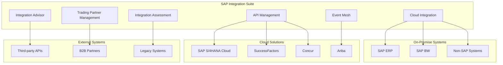

## Introduction

SAP Integration Suite represents a comprehensive Integration Platform as a Service (iPaaS) solution that enables seamless connectivity across hybrid landscapes. This guide explores the complete suite including Cloud Integration, API Management, B2B/EDI capabilities, Event Mesh, and advanced integration patterns for modern enterprise architectures.

## Architecture Overview

### Integration Suite Components



### Integration Patterns

#### Synchronous vs Asynchronous Integration
```xml
<!-- Synchronous Pattern - Direct API Call -->
<route xmlns="http://camel.apache.org/schema/spring">
    <from uri="https4://api.source.com/data"/>
    <to uri="direct:processData"/>
    <to uri="https4://api.target.com/endpoint"/>
</route>

<!-- Asynchronous Pattern - Message Queue -->
<route xmlns="http://camel.apache.org/schema/spring">
    <from uri="jms:queue:inputQueue"/>
    <to uri="direct:processMessage"/>
    <to uri="jms:queue:outputQueue"/>
</route>
```

## Cloud Integration (CPI) Deep Dive

### Integration Flow Development

#### Basic Integration Flow Structure
```xml
<?xml version="1.0" encoding="UTF-8"?>
<bpmn2:definitions xmlns:bpmn2="http://www.omg.org/spec/BPMN/20100524/MODEL"
                   xmlns:camunda="http://camunda.org/schema/1.0/bpmn"
                   xmlns:xsi="http://www.w3.org/2001/XMLSchema-instance">
  
  <bpmn2:process id="CustomerDataSync" isExecutable="true">
    
    <!-- Start Event -->
    <bpmn2:startEvent id="StartEvent_Timer" name="Timer Start">
      <bpmn2:outgoing>SequenceFlow_1</bpmn2:outgoing>
      <bpmn2:timerEventDefinition>
        <bpmn2:timeCycle>0 0 */6 * * ?</bpmn2:timeCycle>
      </bpmn2:timerEventDefinition>
    </bpmn2:startEvent>
    
    <!-- Data Retrieval -->
    <bpmn2:serviceTask id="RetrieveCustomers" name="Retrieve Customers">
      <bpmn2:incoming>SequenceFlow_1</bpmn2:incoming>
      <bpmn2:outgoing>SequenceFlow_2</bpmn2:outgoing>
      <bpmn2:extensionElements>
        <camunda:connector>
          <camunda:inputOutput>
            <camunda:inputParameter name="url">https://api.source.com/customers</camunda:inputParameter>
            <camunda:inputParameter name="method">GET</camunda:inputParameter>
            <camunda:inputParameter name="headers">
              <camunda:map>
                <camunda:entry key="Authorization">Bearer ${oauth_token}</camunda:entry>
                <camunda:entry key="Content-Type">application/json</camunda:entry>
              </camunda:map>
            </camunda:inputParameter>
          </camunda:inputOutput>
          <camunda:connectorId>http-connector</camunda:connectorId>
        </camunda:connector>
      </bpmn2:extensionElements>
    </bpmn2:serviceTask>
    
    <!-- Data Transformation -->
    <bpmn2:scriptTask id="TransformData" name="Transform Data">
      <bpmn2:incoming>SequenceFlow_2</bpmn2:incoming>
      <bpmn2:outgoing>SequenceFlow_3</bpmn2:outgoing>
      <bpmn2:script>
        <![CDATA[
        import com.sap.gateway.ip.core.customdev.util.Message;
        import groovy.json.JsonBuilder;
        import groovy.json.JsonSlurper;

        def Message processData(Message message) {
            def body = message.getBody(String.class);
            def jsonSlurper = new JsonSlurper();
            def sourceData = jsonSlurper.parseText(body);
            
            def transformedData = sourceData.customers.collect { customer ->
                [
                    customerNumber: customer.id,
                    name: customer.firstName + " " + customer.lastName,
                    email: customer.email,
                    address: [
                        street: customer.address?.street,
                        city: customer.address?.city,
                        postalCode: customer.address?.zip,
                        country: customer.address?.country
                    ],
                    lastModified: new Date().format("yyyy-MM-dd'T'HH:mm:ss.SSS'Z'")
                ]
            };
            
            def result = new JsonBuilder(transformedData);
            message.setBody(result.toString());
            
            return message;
        }
        ]]>
      </bpmn2:script>
    </bpmn2:scriptTask>
    
    <!-- Data Validation -->
    <bpmn2:serviceTask id="ValidateData" name="Validate Data">
      <bpmn2:incoming>SequenceFlow_3</bpmn2:incoming>
      <bpmn2:outgoing>SequenceFlow_4</bpmn2:outgoing>
    </bpmn2:serviceTask>
    
    <!-- Send to Target -->
    <bpmn2:serviceTask id="SendToTarget" name="Send to Target System">
      <bpmn2:incoming>SequenceFlow_4</bpmn2:incoming>
      <bpmn2:outgoing>SequenceFlow_5</bpmn2:outgoing>
    </bpmn2:serviceTask>
    
    <!-- End Event -->
    <bpmn2:endEvent id="EndEvent" name="End">
      <bpmn2:incoming>SequenceFlow_5</bpmn2:incoming>
    </bpmn2:endEvent>
    
  </bpmn2:process>
</bpmn2:definitions>
```

#### Advanced Groovy Script for Data Processing
```groovy
import com.sap.gateway.ip.core.customdev.util.Message;
import groovy.json.JsonBuilder;
import groovy.json.JsonSlurper;
import java.text.SimpleDateFormat;
import java.util.concurrent.CompletableFuture;
import java.util.concurrent.ExecutorService;
import java.util.concurrent.Executors;

class AdvancedDataProcessor {
    
    private static final ExecutorService executor = Executors.newFixedThreadPool(10);
    private static final SimpleDateFormat ISO_FORMAT = new SimpleDateFormat("yyyy-MM-dd'T'HH:mm:ss.SSS'Z'");
    
    static Message processLargeDataset(Message message) {
        def body = message.getBody(String.class);
        def jsonSlurper = new JsonSlurper();
        def sourceData = jsonSlurper.parseText(body);
        
        // Parallel processing for large datasets
        def futures = sourceData.records.collect { record ->
            CompletableFuture.supplyAsync({
                return processRecord(record);
            }, executor)
        };
        
        def processedRecords = futures.collect { it.get() };
        
        // Build response with metadata
        def response = [
            metadata: [
                processedCount: processedRecords.size(),
                processedAt: ISO_FORMAT.format(new Date()),
                version: "2.0"
            ],
            data: processedRecords.findAll { it != null }
        ];
        
        message.setBody(new JsonBuilder(response).toString());
        message.setProperty("recordCount", processedRecords.size());
        
        return message;
    }
    
    private static Map processRecord(Map record) {
        try {
            // Validation
            if (!isValidRecord(record)) {
                return null;
            }
            
            // Enrichment
            def enrichedRecord = enrichRecord(record);
            
            // Transformation
            return transformRecord(enrichedRecord);
            
        } catch (Exception e) {
            // Error handling
            return [
                error: true,
                originalId: record.id,
                errorMessage: e.getMessage()
            ];
        }
    }
    
    private static boolean isValidRecord(Map record) {
        return record.id && record.name && record.email?.contains("@");
    }
    
    private static Map enrichRecord(Map record) {
        // Add derived fields
        record.fullName = "${record.firstName} ${record.lastName}".trim();
        record.domain = record.email.split("@")[1];
        record.processedTimestamp = System.currentTimeMillis();
        
        return record;
    }
    
    private static Map transformRecord(Map record) {
        return [
            customerNumber: record.id,
            personalInfo: [
                fullName: record.fullName,
                email: record.email,
                domain: record.domain
            ],
            address: transformAddress(record.address),
            metadata: [
                lastProcessed: ISO_FORMAT.format(new Date(record.processedTimestamp)),
                source: "CPI_INTEGRATION"
            ]
        ];
    }
    
    private static Map transformAddress(Map address) {
        if (!address) return null;
        
        return [
            formattedAddress: "${address.street}, ${address.city}, ${address.postalCode}",
            country: address.country?.toUpperCase(),
            coordinates: getCoordinates(address)
        ];
    }
    
    private static Map getCoordinates(Map address) {
        // Placeholder for geocoding service integration
        return [lat: 0.0, lng: 0.0];
    }
}

def Message processData(Message message) {
    return AdvancedDataProcessor.processLargeDataset(message);
}
```

### Error Handling and Monitoring

#### Exception Handling Strategy
```xml
<!-- Error Handling Sub-process -->
<bpmn2:subProcess id="ErrorHandling" name="Error Handling" triggeredByEvent="true">
    
    <!-- Error Start Event -->
    <bpmn2:startEvent id="ErrorStart" name="Error Caught">
        <bpmn2:outgoing>SequenceFlow_Error1</bpmn2:outgoing>
        <bpmn2:errorEventDefinition errorRef="Error_General"/>
    </bpmn2:startEvent>
    
    <!-- Log Error -->
    <bpmn2:scriptTask id="LogError" name="Log Error Details">
        <bpmn2:incoming>SequenceFlow_Error1</bpmn2:incoming>
        <bpmn2:outgoing>SequenceFlow_Error2</bpmn2:outgoing>
        <bpmn2:script>
            <![CDATA[
            import com.sap.gateway.ip.core.customdev.util.Message;
            import java.util.logging.Logger;
            
            def Message logError(Message message) {
                def logger = Logger.getLogger("IntegrationFlow");
                def errorDetails = message.getProperty("CamelExceptionCaught");
                
                logger.severe("Integration Error: " + errorDetails?.getMessage());
                logger.severe("Stack Trace: " + errorDetails?.getStackTrace().join("\n"));
                
                // Set error properties for monitoring
                message.setProperty("ErrorTimestamp", new Date().toString());
                message.setProperty("ErrorType", errorDetails?.getClass().getSimpleName());
                message.setProperty("ErrorMessage", errorDetails?.getMessage());
                
                return message;
            }
            ]]>
        </bpmn2:script>
    </bpmn2:scriptTask>
    
    <!-- Retry Logic -->
    <bpmn2:serviceTask id="RetryLogic" name="Implement Retry Logic">
        <bpmn2:incoming>SequenceFlow_Error2</bpmn2:incoming>
        <bpmn2:outgoing>SequenceFlow_Error3</bpmn2:outgoing>
    </bpmn2:serviceTask>
    
    <!-- Send Alert -->
    <bpmn2:serviceTask id="SendAlert" name="Send Alert Notification">
        <bpmn2:incoming>SequenceFlow_Error3</bpmn2:incoming>
        <bpmn2:outgoing>SequenceFlow_Error4</bpmn2:outgoing>
    </bpmn2:serviceTask>
    
    <!-- Error End -->
    <bpmn2:endEvent id="ErrorEnd" name="Error Handled">
        <bpmn2:incoming>SequenceFlow_Error4</bpmn2:incoming>
    </bpmn2:endEvent>
    
</bpmn2:subProcess>
```

#### Custom Monitoring Script
```groovy
class IntegrationMonitoring {
    
    static Message addMonitoringData(Message message) {
        def startTime = System.currentTimeMillis();
        message.setProperty("ProcessingStartTime", startTime);
        
        // Add correlation ID for tracking
        def correlationId = UUID.randomUUID().toString();
        message.setProperty("CorrelationId", correlationId);
        message.setHeader("X-Correlation-ID", correlationId);
        
        // Add monitoring headers
        message.setHeader("X-Processing-Node", System.getProperty("server.name"));
        message.setHeader("X-Integration-Flow", message.getProperty("CamelContext"));
        
        return message;
    }
    
    static Message calculateMetrics(Message message) {
        def startTime = message.getProperty("ProcessingStartTime");
        def endTime = System.currentTimeMillis();
        def processingTime = endTime - startTime;
        
        // Set performance metrics
        message.setProperty("ProcessingTimeMs", processingTime);
        message.setProperty("ProcessingEndTime", endTime);
        
        // Calculate throughput if batch processing
        def recordCount = message.getProperty("recordCount", 1);
        def throughput = recordCount / (processingTime / 1000.0);
        message.setProperty("ThroughputPerSec", throughput);
        
        // Add to monitoring logs
        logMetrics(message);
        
        return message;
    }
    
    private static void logMetrics(Message message) {
        def metrics = [
            correlationId: message.getProperty("CorrelationId"),
            processingTime: message.getProperty("ProcessingTimeMs"),
            recordCount: message.getProperty("recordCount"),
            throughput: message.getProperty("ThroughputPerSec"),
            timestamp: new Date().format("yyyy-MM-dd'T'HH:mm:ss.SSS'Z'")
        ];
        
        // Send to monitoring system (implement actual monitoring API call)
        println("METRICS: " + new JsonBuilder(metrics).toString());
    }
}
```

## API Management Implementation

### API Proxy Development

#### REST API Proxy Configuration
```xml
<?xml version="1.0" encoding="UTF-8"?>
<APIProxy name="CustomerManagementAPI" revision="1">
    <DisplayName>Customer Management API</DisplayName>
    <Description>Comprehensive API for customer data management</Description>
    
    <ProxyEndpoints>
        <ProxyEndpoint name="CustomerProxy">
            <HTTPProxyConnection>
                <BasePath>/v1/customers</BasePath>
                <Properties>
                    <Property name="allow.http">true</Property>
                </Properties>
            </HTTPProxyConnection>
            
            <Flows>
                <!-- Get Customers Flow -->
                <Flow name="GetCustomers">
                    <Condition>(proxy.pathsuffix MatchesPath "") and (request.verb = "GET")</Condition>
                    <Request>
                        <Step>
                            <Name>RateLimiting</Name>
                        </Step>
                        <Step>
                            <Name>VerifyAPIKey</Name>
                        </Step>
                        <Step>
                            <Name>OAuth-Token-Validation</Name>
                        </Step>
                    </Request>
                    <Response>
                        <Step>
                            <Name>AddCORSHeaders</Name>
                        </Step>
                        <Step>
                            <Name>JSONToXML</Name>
                            <Condition>request.header.accept = "application/xml"</Condition>
                        </Step>
                    </Response>
                </Flow>
                
                <!-- Create Customer Flow -->
                <Flow name="CreateCustomer">
                    <Condition>(proxy.pathsuffix MatchesPath "") and (request.verb = "POST")</Condition>
                    <Request>
                        <Step>
                            <Name>ValidateJSONSchema</Name>
                        </Step>
                        <Step>
                            <Name>VerifyAPIKey</Name>
                        </Step>
                        <Step>
                            <Name>TransformRequest</Name>
                        </Step>
                    </Request>
                    <Response>
                        <Step>
                            <Name>SetResponseHeaders</Name>
                        </Step>
                    </Response>
                </Flow>
                
                <!-- Update Customer Flow -->
                <Flow name="UpdateCustomer">
                    <Condition>(proxy.pathsuffix MatchesPath "/{customerid}") and (request.verb = "PUT")</Condition>
                    <Request>
                        <Step>
                            <Name>ExtractPathParameters</Name>
                        </Step>
                        <Step>
                            <Name>ValidateCustomerExists</Name>
                        </Step>
                        <Step>
                            <Name>ValidateJSONSchema</Name>
                        </Step>
                    </Request>
                </Flow>
                
                <!-- Delete Customer Flow -->
                <Flow name="DeleteCustomer">
                    <Condition>(proxy.pathsuffix MatchesPath "/{customerid}") and (request.verb = "DELETE")</Condition>
                    <Request>
                        <Step>
                            <Name>ExtractPathParameters</Name>
                        </Step>
                        <Step>
                            <Name>CheckDependencies</Name>
                        </Step>
                    </Request>
                </Flow>
            </Flows>
            
            <RouteRule name="CustomerRoute">
                <TargetEndpoint>CustomerTarget</TargetEndpoint>
            </RouteRule>
        </ProxyEndpoint>
    </ProxyEndpoints>
    
    <TargetEndpoints>
        <TargetEndpoint name="CustomerTarget">
            <HTTPTargetConnection>
                <URL>https://api.backend.com/customers</URL>
                <Properties>
                    <Property name="supports.http10">true</Property>
                    <Property name="request.retain.headers">User-Agent,Referer,Accept-Language</Property>
                </Properties>
            </HTTPTargetConnection>
            
            <PreFlow>
                <Request>
                    <Step>
                        <Name>AddAuthenticationHeader</Name>
                    </Step>
                </Request>
            </PreFlow>
        </TargetEndpoint>
    </TargetEndpoints>
</APIProxy>
```

### API Policies Implementation

#### Rate Limiting Policy
```xml
<?xml version="1.0" encoding="UTF-8"?>
<RateLimit name="RateLimiting">
    <DisplayName>Rate Limiting Policy</DisplayName>
    <Properties/>
    <Allow count="100" countRef="request.header.rate-limit"/>
    <Interval>1</Interval>
    <TimeUnit>minute</TimeUnit>
    <Identifier ref="client_id"/>
    <Distributed>true</Distributed>
    <Synchronous>true</Synchronous>
    <StartTime>2024-01-01 00:00:00</StartTime>
</RateLimit>
```

#### OAuth Token Validation
```xml
<?xml version="1.0" encoding="UTF-8"?>
<OAuthV2 name="OAuth-Token-Validation">
    <DisplayName>OAuth Token Validation</DisplayName>
    <Properties/>
    <Operation>VerifyAccessToken</Operation>
    <GenerateResponse enabled="true"/>
    <Tokens>
        <Token ref="request.header.authorization"/>
    </Tokens>
</OAuthV2>
```

#### JSON Schema Validation
```xml
<?xml version="1.0" encoding="UTF-8"?>
<JSONSchema name="ValidateJSONSchema">
    <DisplayName>Validate JSON Schema</DisplayName>
    <Properties/>
    <SchemaType>draft-04</SchemaType>
    <Schema>
    {
        "$schema": "http://json-schema.org/draft-04/schema#",
        "type": "object",
        "properties": {
            "firstName": {
                "type": "string",
                "minLength": 1,
                "maxLength": 50
            },
            "lastName": {
                "type": "string", 
                "minLength": 1,
                "maxLength": 50
            },
            "email": {
                "type": "string",
                "format": "email"
            },
            "dateOfBirth": {
                "type": "string",
                "format": "date"
            },
            "address": {
                "type": "object",
                "properties": {
                    "street": {"type": "string"},
                    "city": {"type": "string"},
                    "postalCode": {"type": "string"},
                    "country": {"type": "string"}
                },
                "required": ["street", "city", "country"]
            }
        },
        "required": ["firstName", "lastName", "email"],
        "additionalProperties": false
    }
    </Schema>
    <Source>request</Source>
</JSONSchema>
```

#### JavaScript Policy for Custom Logic
```javascript
// JavaScript Policy: TransformRequest
var request = context.getVariable('request.content');
var jsonRequest = JSON.parse(request);

// Add system fields
jsonRequest.createdAt = new Date().toISOString();
jsonRequest.source = 'API_MANAGEMENT';
jsonRequest.version = '1.0';

// Validate business rules
if (jsonRequest.email && !isValidDomain(jsonRequest.email)) {
    context.setVariable('customError', 'Invalid email domain');
    throw new Error('Invalid email domain');
}

// Transform for backend system
var transformedRequest = {
    customer: {
        personalInfo: {
            firstName: jsonRequest.firstName,
            lastName: jsonRequest.lastName,
            email: jsonRequest.email,
            dateOfBirth: jsonRequest.dateOfBirth
        },
        contactInfo: {
            address: jsonRequest.address,
            phone: jsonRequest.phone
        },
        systemInfo: {
            createdAt: jsonRequest.createdAt,
            source: jsonRequest.source,
            version: jsonRequest.version
        }
    }
};

function isValidDomain(email) {
    var allowedDomains = ['company.com', 'partner.com'];
    var domain = email.split('@')[1];
    return allowedDomains.includes(domain);
}

// Set transformed request
context.setVariable('request.content', JSON.stringify(transformedRequest));
```

## B2B/EDI Integration

### EDI Processing Implementation

#### EDI Document Processing
```xml
<!-- EDI Integration Flow -->
<route xmlns="http://camel.apache.org/schema/spring">
    <from uri="file:///opt/edi/inbound?move=processed&amp;moveFailed=error"/>
    
    <!-- EDI Unmarshaling -->
    <unmarshal>
        <bindy type="Fixed" classType="com.company.edi.X12Order"/>
    </unmarshal>
    
    <!-- Validate EDI Document -->
    <to uri="direct:validateEDI"/>
    
    <!-- Transform to Internal Format -->
    <to uri="direct:transformToInternalFormat"/>
    
    <!-- Send to Backend System -->
    <to uri="seda:processOrder"/>
    
    <!-- Generate EDI Acknowledgment -->
    <to uri="direct:generateEDIAck"/>
    
    <!-- Send EDI Acknowledgment -->
    <to uri="file:///opt/edi/outbound"/>
</route>

<!-- EDI Validation Route -->
<route>
    <from uri="direct:validateEDI"/>
    <choice>
        <when>
            <simple>${body.orderNumber} == null</simple>
            <throwException exceptionType="java.lang.IllegalArgumentException"
                          message="Missing Order Number"/>
        </when>
        <when>
            <simple>${body.customerNumber} == null</simple>
            <throwException exceptionType="java.lang.IllegalArgumentException"
                          message="Missing Customer Number"/>
        </when>
    </choice>
</route>
```

#### EDI Model Definition (Java)
```java
// X12 850 Purchase Order Model
@Record(separator = "")
public class X12Order {
    
    @Link
    private ISAHeader isaHeader;
    
    @Link
    private GSHeader gsHeader;
    
    @Link
    private STHeader stHeader;
    
    @Link
    private BEGBeginningSegment beginning;
    
    @Link
    private List<N1NameSegment> nameSegments;
    
    @Link
    private List<PO1OrderLineSegment> orderLines;
    
    @Link
    private CTTTransactionTotals totals;
    
    @Link
    private SETrailer seTrailer;
    
    @Link
    private GETrailer geTrailer;
    
    @Link
    private IEATrailer ieaTrailer;
    
    // Getters and setters
}

@Record
public class BEGBeginningSegment {
    
    @DataField(pos = 1, length = 3)
    private String segmentIdentifier = "BEG";
    
    @DataField(pos = 2, length = 2)
    private String transactionSetPurposeCode;
    
    @DataField(pos = 3, length = 2)
    private String transactionTypeCode;
    
    @DataField(pos = 4, length = 30)
    private String purchaseOrderNumber;
    
    @DataField(pos = 5, length = 30, required = false)
    private String releaseNumber;
    
    @DataField(pos = 6, length = 8, pattern = "yyyyMMdd")
    private Date purchaseOrderDate;
    
    // Getters and setters
}

@Record
public class PO1OrderLineSegment {
    
    @DataField(pos = 1, length = 3)
    private String segmentIdentifier = "PO1";
    
    @DataField(pos = 2, length = 6)
    private String lineItemNumber;
    
    @DataField(pos = 3, length = 15, precision = 2)
    private BigDecimal quantityOrdered;
    
    @DataField(pos = 4, length = 2)
    private String unitOfMeasure;
    
    @DataField(pos = 5, length = 17, precision = 4)
    private BigDecimal unitPrice;
    
    @DataField(pos = 6, length = 2)
    private String basisOfUnitPrice;
    
    @DataField(pos = 7, length = 2)
    private String productIdQualifier;
    
    @DataField(pos = 8, length = 48)
    private String productId;
    
    // Additional fields and methods
}
```

#### EDI Transformation Logic
```groovy
class EDITransformer {
    
    static Message transformX12ToSAPFormat(Message message) {
        def ediOrder = message.getBody();
        
        // Transform to SAP IDoc format
        def sapOrder = [
            IDOC: [
                EDI_DC40: [
                    TABNAM: "EDI_DC40",
                    MANDT: "100",
                    DOCNUM: generateDocNumber(),
                    DOCREL: "740",
                    STATUS: "30",
                    DIRECT: "1",
                    OUTMOD: "2",
                    IDOCTYP: "ORDERS05",
                    MESTYP: "ORDERS",
                    SNDPOR: "EDI_SYSTEM",
                    SNDPRT: "US",
                    SNDPRN: ediOrder.gsHeader.applicationSendersCode,
                    RCVPOR: "SAP_SYSTEM", 
                    RCVPRT: "LS",
                    RCVPRN: "SAPCLNT100"
                ],
                E1EDK01: [
                    BELNR: ediOrder.beginning.purchaseOrderNumber,
                    NTGEW: calculateTotalWeight(ediOrder.orderLines),
                    BRGEW: calculateTotalWeight(ediOrder.orderLines),
                    GEWEI: "KG",
                    FKART_RL: ""
                ],
                E1EDK14: ediOrder.nameSegments.collect { nameSegment ->
                    [
                        QUALF: mapNameQualifier(nameSegment.identificationCodeQualifier),
                        ORGID: nameSegment.identificationCode,
                        NAME1: nameSegment.name
                    ]
                },
                E1EDP01: ediOrder.orderLines.collect { orderLine ->
                    [
                        POSEX: orderLine.lineItemNumber,
                        MENGE: orderLine.quantityOrdered,
                        MENEE: orderLine.unitOfMeasure,
                        NETPR: orderLine.unitPrice,
                        PEINH: "1",
                        WERKS: "1000"
                    ]
                }
            ]
        ];
        
        message.setBody(new JsonBuilder(sapOrder).toString());
        message.setProperty("DocumentType", "ORDERS");
        message.setProperty("PartnerNumber", ediOrder.gsHeader.applicationSendersCode);
        
        return message;
    }
    
    private static String generateDocNumber() {
        return "EDI" + System.currentTimeMillis();
    }
    
    private static String mapNameQualifier(String qualifier) {
        def mapping = [
            "BT": "AG",  // Bill To -> Sold to party
            "ST": "WE",  // Ship To -> Ship to party
            "BY": "RE"   // Buying Party -> Payer
        ];
        return mapping.get(qualifier, "AG");
    }
    
    private static BigDecimal calculateTotalWeight(List orderLines) {
        return orderLines.sum { it.quantityOrdered * (it.weight ?: 0) } ?: 0;
    }
}
```

### Trading Partner Management

#### Partner Configuration
```json
{
    "tradingPartners": [
        {
            "partnerId": "ACME_CORP_001",
            "partnerName": "ACME Corporation",
            "partnerType": "CUSTOMER",
            "status": "ACTIVE",
            "communicationSettings": {
                "protocols": ["AS2", "SFTP"],
                "primaryProtocol": "AS2",
                "as2Settings": {
                    "as2Id": "ACME_AS2_ID",
                    "url": "https://acme-corp.com/as2/receive",
                    "certificateAlias": "acme_cert_2024",
                    "encryptionAlgorithm": "AES256",
                    "signingAlgorithm": "SHA256withRSA",
                    "compressionEnabled": true
                },
                "sftpSettings": {
                    "hostname": "sftp.acme-corp.com",
                    "port": 22,
                    "username": "sap_integration",
                    "authMethod": "PUBLIC_KEY",
                    "inboundDirectory": "/inbound/sap",
                    "outboundDirectory": "/outbound/sap"
                }
            },
            "documentTypes": [
                {
                    "documentType": "850",
                    "direction": "INBOUND",
                    "validation": {
                        "schemaValidation": true,
                        "businessRuleValidation": true,
                        "customValidationScript": "validate_850_acme.groovy"
                    },
                    "transformation": {
                        "mappingId": "X12_850_TO_SAP_ORDERS",
                        "customTransformScript": "transform_acme_orders.groovy"
                    }
                },
                {
                    "documentType": "855",
                    "direction": "OUTBOUND", 
                    "transformation": {
                        "mappingId": "SAP_ORDERS_TO_X12_855"
                    }
                }
            ],
            "businessRules": {
                "orderMinAmount": 1000.00,
                "currency": "USD",
                "paymentTerms": "NET30",
                "shippingMethods": ["GROUND", "EXPRESS"],
                "approvalRequired": true,
                "approvalThreshold": 50000.00
            },
            "monitoring": {
                "alertEmail": "edi-support@acme-corp.com",
                "escalationEmail": "edi-manager@acme-corp.com",
                "slaResponseTime": 4,
                "slaUnit": "HOURS"
            }
        }
    ]
}
```

## Event Mesh Implementation

### Event-Driven Architecture

#### Event Producer Implementation
```java
@Component
public class CustomerEventProducer {
    
    @Autowired
    private EventMeshTemplate eventMeshTemplate;
    
    @Value("${event.mesh.topic.customer}")
    private String customerTopic;
    
    public void publishCustomerCreated(Customer customer) {
        CustomerCreatedEvent event = CustomerCreatedEvent.builder()
            .eventId(UUID.randomUUID().toString())
            .timestamp(Instant.now())
            .source("customer-service")
            .type("customer.created")
            .dataContentType("application/json")
            .data(customer)
            .build();
            
        eventMeshTemplate.send(customerTopic, event);
        
        // Log event publication
        log.info("Published customer created event: {}", event.getEventId());
    }
    
    public void publishCustomerUpdated(Customer customer, Customer previousVersion) {
        CustomerUpdatedEvent event = CustomerUpdatedEvent.builder()
            .eventId(UUID.randomUUID().toString())
            .timestamp(Instant.now())
            .source("customer-service")
            .type("customer.updated")
            .dataContentType("application/json")
            .data(customer)
            .previousData(previousVersion)
            .changes(calculateChanges(customer, previousVersion))
            .build();
            
        eventMeshTemplate.send(customerTopic, event);
    }
    
    private Map<String, Object> calculateChanges(Customer current, Customer previous) {
        Map<String, Object> changes = new HashMap<>();
        
        if (!Objects.equals(current.getName(), previous.getName())) {
            changes.put("name", Map.of("from", previous.getName(), "to", current.getName()));
        }
        
        if (!Objects.equals(current.getEmail(), previous.getEmail())) {
            changes.put("email", Map.of("from", previous.getEmail(), "to", current.getEmail()));
        }
        
        if (!Objects.equals(current.getAddress(), previous.getAddress())) {
            changes.put("address", Map.of("from", previous.getAddress(), "to", current.getAddress()));
        }
        
        return changes;
    }
}
```

#### Event Consumer Implementation
```java
@Component
@EventListener
public class OrderEventConsumer {
    
    @Autowired
    private OrderService orderService;
    
    @Autowired
    private NotificationService notificationService;
    
    @EventMeshListener(topics = {"customer.events"})
    public void handleCustomerCreated(CustomerCreatedEvent event) {
        try {
            // Create welcome order campaign
            createWelcomeOrderCampaign(event.getData());
            
            // Update customer analytics
            updateCustomerAnalytics(event.getData());
            
            // Send confirmation
            sendEventAcknowledgment(event.getEventId());
            
        } catch (Exception e) {
            log.error("Error processing customer created event: {}", event.getEventId(), e);
            handleEventProcessingError(event, e);
        }
    }
    
    @EventMeshListener(topics = {"customer.events"})
    public void handleCustomerUpdated(CustomerUpdatedEvent event) {
        try {
            Customer customer = event.getData();
            Map<String, Object> changes = event.getChanges();
            
            // Process specific changes
            if (changes.containsKey("email")) {
                updateEmailPreferences(customer);
                sendEmailChangeConfirmation(customer);
            }
            
            if (changes.containsKey("address")) {
                updateShippingPreferences(customer);
                recalculateShippingCosts(customer);
            }
            
            // Update downstream systems
            synchronizeWithCRM(customer);
            
        } catch (Exception e) {
            log.error("Error processing customer updated event: {}", event.getEventId(), e);
            scheduleRetry(event);
        }
    }
    
    @EventMeshListener(
        topics = {"inventory.events"},
        filter = "type == 'inventory.low-stock'"
    )
    public void handleLowStockAlert(InventoryEvent event) {
        InventoryData inventory = event.getData();
        
        if (inventory.getQuantity() < inventory.getReorderLevel()) {
            // Create purchase requisition
            createPurchaseRequisition(inventory);
            
            // Notify purchasing team
            notificationService.sendLowStockAlert(inventory);
            
            // Update forecasting models
            updateDemandForecast(inventory);
        }
    }
    
    private void createWelcomeOrderCampaign(Customer customer) {
        OrderCampaign campaign = OrderCampaign.builder()
            .customerId(customer.getId())
            .campaignType("WELCOME")
            .discountPercentage(10.0)
            .validUntil(Instant.now().plus(30, ChronoUnit.DAYS))
            .build();
            
        orderService.createCampaign(campaign);
    }
    
    private void handleEventProcessingError(Event event, Exception error) {
        // Implement dead letter queue pattern
        DeadLetterEvent deadLetter = DeadLetterEvent.builder()
            .originalEvent(event)
            .error(error.getMessage())
            .timestamp(Instant.now())
            .retryCount(0)
            .build();
            
        eventMeshTemplate.send("dead-letter-queue", deadLetter);
    }
}
```

### Event Schema Management

#### CloudEvents Schema Definition
```json
{
  "$schema": "http://json-schema.org/draft-07/schema#",
  "title": "Customer Event Schema",
  "type": "object",
  "properties": {
    "specversion": {
      "type": "string",
      "const": "1.0"
    },
    "type": {
      "type": "string",
      "enum": [
        "customer.created",
        "customer.updated", 
        "customer.deleted",
        "customer.merged"
      ]
    },
    "source": {
      "type": "string",
      "format": "uri-reference"
    },
    "id": {
      "type": "string",
      "format": "uuid"
    },
    "time": {
      "type": "string",
      "format": "date-time"
    },
    "datacontenttype": {
      "type": "string",
      "const": "application/json"
    },
    "data": {
      "type": "object",
      "properties": {
        "customerId": {
          "type": "string",
          "format": "uuid"
        },
        "customerNumber": {
          "type": "string"
        },
        "personalInfo": {
          "type": "object",
          "properties": {
            "firstName": {
              "type": "string",
              "minLength": 1,
              "maxLength": 100
            },
            "lastName": {
              "type": "string", 
              "minLength": 1,
              "maxLength": 100
            },
            "email": {
              "type": "string",
              "format": "email"
            },
            "dateOfBirth": {
              "type": "string",
              "format": "date"
            }
          },
          "required": ["firstName", "lastName", "email"]
        },
        "address": {
          "type": "object",
          "properties": {
            "street": {"type": "string"},
            "city": {"type": "string"},
            "postalCode": {"type": "string"},
            "country": {"type": "string", "minLength": 2, "maxLength": 2}
          },
          "required": ["street", "city", "country"]
        },
        "metadata": {
          "type": "object",
          "properties": {
            "createdAt": {"type": "string", "format": "date-time"},
            "updatedAt": {"type": "string", "format": "date-time"},
            "version": {"type": "integer", "minimum": 1}
          }
        }
      },
      "required": ["customerId", "customerNumber", "personalInfo"],
      "additionalProperties": false
    }
  },
  "required": [
    "specversion", "type", "source", "id", 
    "time", "datacontenttype", "data"
  ]
}
```

## Security Implementation

### OAuth 2.0 and JWT

#### JWT Token Service Implementation
```java
@Service
public class JWTTokenService {
    
    @Value("${jwt.secret}")
    private String jwtSecret;
    
    @Value("${jwt.expiration}")
    private long jwtExpirationMs;
    
    private final Algorithm algorithm;
    
    public JWTTokenService() {
        this.algorithm = Algorithm.HMAC256(jwtSecret.getBytes());
    }
    
    public String generateToken(UserPrincipal userPrincipal) {
        Date expiryDate = new Date(System.currentTimeMillis() + jwtExpirationMs);
        
        return JWT.create()
            .withSubject(userPrincipal.getUsername())
            .withClaim("userId", userPrincipal.getUserId())
            .withClaim("roles", userPrincipal.getRoles())
            .withClaim("scopes", userPrincipal.getScopes())
            .withClaim("clientId", userPrincipal.getClientId())
            .withIssuedAt(new Date())
            .withExpiresAt(expiryDate)
            .withIssuer("SAP-Integration-Suite")
            .withAudience("integration-apis")
            .sign(algorithm);
    }
    
    public DecodedJWT validateToken(String token) {
        try {
            JWTVerifier verifier = JWT.require(algorithm)
                .withIssuer("SAP-Integration-Suite")
                .withAudience("integration-apis")
                .build();
                
            return verifier.verify(token);
            
        } catch (JWTVerificationException e) {
            throw new InvalidTokenException("Invalid JWT token", e);
        }
    }
    
    public UserPrincipal getUserFromToken(String token) {
        DecodedJWT jwt = validateToken(token);
        
        return UserPrincipal.builder()
            .username(jwt.getSubject())
            .userId(jwt.getClaim("userId").asString())
            .roles(jwt.getClaim("roles").asList(String.class))
            .scopes(jwt.getClaim("scopes").asList(String.class))
            .clientId(jwt.getClaim("clientId").asString())
            .build();
    }
    
    public boolean isTokenExpired(String token) {
        try {
            DecodedJWT jwt = JWT.decode(token);
            return jwt.getExpiresAt().before(new Date());
        } catch (JWTDecodeException e) {
            return true;
        }
    }
    
    public String refreshToken(String token) {
        if (isTokenExpired(token)) {
            throw new ExpiredTokenException("Token has expired");
        }
        
        UserPrincipal userPrincipal = getUserFromToken(token);
        return generateToken(userPrincipal);
    }
}
```

#### API Security Policy
```xml
<?xml version="1.0" encoding="UTF-8"?>
<JavaCallout name="JWTValidation">
    <DisplayName>JWT Token Validation</DisplayName>
    <Properties>
        <Property name="jwt-secret">{jwt.secret}</Property>
        <Property name="jwt-issuer">SAP-Integration-Suite</Property>
        <Property name="jwt-audience">integration-apis</Property>
    </Properties>
    <ClassName>com.sap.integration.security.JWTValidationCallout</ClassName>
    <ResourceURL>java://jwt-validation-1.0.jar</ResourceURL>
</JavaCallout>
```

### Certificate Management

#### Certificate Configuration
```groovy
class CertificateManager {
    
    static Message configureMTLS(Message message) {
        def keystorePath = System.getProperty("keystore.path");
        def keystorePassword = System.getProperty("keystore.password");
        def truststorePath = System.getProperty("truststore.path");
        def truststorePassword = System.getProperty("truststore.password");
        
        // Configure SSL context for mutual TLS
        def sslContext = createSSLContext(
            keystorePath, keystorePassword,
            truststorePath, truststorePassword
        );
        
        message.setProperty("SSLContext", sslContext);
        message.setProperty("ClientAuthentication", "required");
        
        return message;
    }
    
    private static SSLContext createSSLContext(String keystorePath, String keystorePassword,
                                              String truststorePath, String truststorePassword) {
        
        // Load keystore
        def keystore = KeyStore.getInstance("JKS");
        keystore.load(new FileInputStream(keystorePath), keystorePassword.toCharArray());
        
        // Load truststore
        def truststore = KeyStore.getInstance("JKS");
        truststore.load(new FileInputStream(truststorePath), truststorePassword.toCharArray());
        
        // Initialize key manager
        def keyManagerFactory = KeyManagerFactory.getInstance(KeyManagerFactory.getDefaultAlgorithm());
        keyManagerFactory.init(keystore, keystorePassword.toCharArray());
        
        // Initialize trust manager
        def trustManagerFactory = TrustManagerFactory.getInstance(TrustManagerFactory.getDefaultAlgorithm());
        trustManagerFactory.init(truststore);
        
        // Create SSL context
        def sslContext = SSLContext.getInstance("TLS");
        sslContext.init(
            keyManagerFactory.getKeyManagers(),
            trustManagerFactory.getTrustManagers(),
            new SecureRandom()
        );
        
        return sslContext;
    }
}
```

## Performance Optimization

### Monitoring and Alerting

#### Custom Metrics Collection
```java
@Component
public class IntegrationMetricsCollector {
    
    private final MeterRegistry meterRegistry;
    private final Counter integrationFlowExecutions;
    private final Timer integrationFlowDuration;
    private final Gauge activeConnections;
    
    public IntegrationMetricsCollector(MeterRegistry meterRegistry) {
        this.meterRegistry = meterRegistry;
        this.integrationFlowExecutions = Counter.builder("integration.flow.executions")
            .description("Number of integration flow executions")
            .register(meterRegistry);
            
        this.integrationFlowDuration = Timer.builder("integration.flow.duration")
            .description("Integration flow execution duration")
            .register(meterRegistry);
            
        this.activeConnections = Gauge.builder("integration.connections.active")
            .description("Number of active connections")
            .register(meterRegistry, this, IntegrationMetricsCollector::getActiveConnectionCount);
    }
    
    public void recordIntegrationExecution(String flowName, Duration duration) {
        integrationFlowExecutions
            .tag("flow", flowName)
            .tag("status", "success")
            .increment();
            
        integrationFlowDuration
            .tag("flow", flowName)
            .record(duration);
    }
    
    public void recordIntegrationError(String flowName, String errorType) {
        Counter.builder("integration.flow.errors")
            .description("Number of integration flow errors")
            .tag("flow", flowName)
            .tag("error_type", errorType)
            .register(meterRegistry)
            .increment();
    }
    
    public void recordAPICallMetrics(String apiName, int responseCode, Duration duration) {
        Timer.Sample sample = Timer.start(meterRegistry);
        
        Timer.builder("integration.api.calls")
            .description("API call duration")
            .tag("api", apiName)
            .tag("status_code", String.valueOf(responseCode))
            .register(meterRegistry)
            .record(duration);
    }
    
    private double getActiveConnectionCount() {
        // Implement logic to get actual active connection count
        return ConnectionPoolManager.getActiveConnections();
    }
}
```

#### Alert Configuration
```yaml
alerting:
  rules:
    - name: integration_flow_failures
      condition: "rate(integration_flow_errors[5m]) > 0.1"
      severity: "critical"
      description: "Integration flow error rate exceeds threshold"
      actions:
        - type: "email"
          recipients: ["integration-team@company.com"]
        - type: "slack"
          channel: "#integration-alerts"
    
    - name: api_response_time
      condition: "histogram_quantile(0.95, integration_api_calls_bucket) > 5"
      severity: "warning"  
      description: "API response time P95 exceeds 5 seconds"
      actions:
        - type: "pagerduty"
          integration_key: "api_performance_key"
    
    - name: connection_pool_exhaustion
      condition: "integration_connections_active > 80"
      severity: "warning"
      description: "Connection pool utilization high"
      actions:
        - type: "auto_scale"
          target: "connection_pool"
```

## Best Practices and Patterns

### Integration Patterns

#### Saga Pattern Implementation
```java
@Component
public class OrderProcessingSaga {
    
    @Autowired
    private OrderService orderService;
    
    @Autowired
    private PaymentService paymentService;
    
    @Autowired
    private InventoryService inventoryService;
    
    @Autowired
    private ShippingService shippingService;
    
    @SagaOrchestrationStart
    public void processOrder(OrderCreatedEvent event) {
        Order order = event.getOrder();
        
        try {
            // Step 1: Reserve inventory
            SagaManager.executeStep("RESERVE_INVENTORY", 
                () -> inventoryService.reserveItems(order.getItems()),
                () -> inventoryService.releaseReservation(order.getItems()));
            
            // Step 2: Process payment
            SagaManager.executeStep("PROCESS_PAYMENT",
                () -> paymentService.processPayment(order.getPayment()),
                () -> paymentService.refundPayment(order.getPayment()));
            
            // Step 3: Arrange shipping
            SagaManager.executeStep("ARRANGE_SHIPPING",
                () -> shippingService.scheduleShipment(order),
                () -> shippingService.cancelShipment(order));
            
            // Step 4: Confirm order
            SagaManager.executeStep("CONFIRM_ORDER",
                () -> orderService.confirmOrder(order.getId()),
                () -> orderService.cancelOrder(order.getId()));
                
            SagaManager.complete();
            
        } catch (SagaExecutionException e) {
            log.error("Saga execution failed for order: {}", order.getId(), e);
            SagaManager.compensate();
        }
    }
    
    @SagaCompensation
    public void compensateOrderProcessing(String orderId) {
        log.info("Compensating order processing for order: {}", orderId);
        // Additional cleanup logic
        orderService.markOrderAsFailed(orderId);
        sendOrderFailureNotification(orderId);
    }
}
```

#### Circuit Breaker Pattern
```java
@Component
public class ExternalServiceClient {
    
    private final RestTemplate restTemplate;
    private final CircuitBreaker circuitBreaker;
    
    public ExternalServiceClient(RestTemplate restTemplate) {
        this.restTemplate = restTemplate;
        this.circuitBreaker = CircuitBreaker.ofDefaults("externalService");
        
        // Configure circuit breaker
        circuitBreaker.getEventPublisher()
            .onStateTransition(event -> 
                log.info("Circuit breaker state transition: {}", event));
    }
    
    public String callExternalService(String request) {
        return circuitBreaker.executeSupplier(() -> {
            try {
                ResponseEntity<String> response = restTemplate.postForEntity(
                    "/external/api/endpoint",
                    request,
                    String.class
                );
                
                if (response.getStatusCode().is2xxSuccessful()) {
                    return response.getBody();
                } else {
                    throw new ExternalServiceException("Service returned: " + response.getStatusCode());
                }
                
            } catch (RestClientException e) {
                throw new ExternalServiceException("Failed to call external service", e);
            }
        });
    }
    
    public String callWithFallback(String request) {
        return circuitBreaker.executeSupplier(() -> callExternalService(request))
            .recover(throwable -> {
                log.warn("External service call failed, using fallback", throwable);
                return getFallbackResponse(request);
            });
    }
    
    private String getFallbackResponse(String request) {
        // Implement fallback logic
        return "{ \"status\": \"unavailable\", \"message\": \"Service temporarily unavailable\" }";
    }
}
```

## Conclusion

SAP Integration Suite provides a comprehensive platform for enterprise integration needs, combining:

1. **Cloud Integration**: Process orchestration and data transformation
2. **API Management**: API lifecycle management and security
3. **Event Mesh**: Event-driven architecture enablement
4. **B2B Integration**: EDI and partner connectivity
5. **Integration Assessment**: Migration planning and optimization

Success with SAP Integration Suite requires understanding of integration patterns, proper security implementation, performance optimization, and comprehensive monitoring strategies. The platform enables organizations to build resilient, scalable integration landscapes that can adapt to changing business requirements while maintaining operational excellence.

Start your integration journey by assessing current integration needs, designing appropriate architecture patterns, and implementing robust monitoring and governance frameworks from day one.

---

*Need expert guidance for your SAP Integration Suite implementation? Contact Varnika IT Consulting for comprehensive integration strategy, architecture design, and implementation services tailored to your enterprise requirements.*