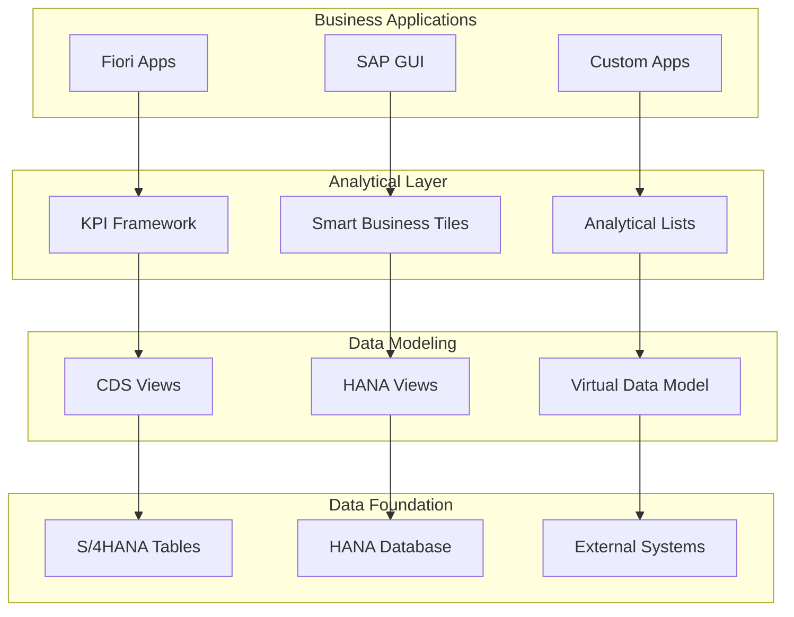

## Introduction

SAP S/4HANA Embedded Analytics represents a paradigm shift from traditional bolt-on analytics to real-time, context-aware insights built directly into business processes. This comprehensive guide explores how to leverage CDS views, KPI frameworks, and analytical applications to deliver actionable insights at the point of business decision-making.

## Architecture Overview

### Embedded Analytics Stack



### Core Components

#### 1. CDS Views (Core Data Services)
```sql
@AbapCatalog.viewEnhancementCategory: [#NONE]
@AccessControl.authorizationCheck: #CHECK
@Analytics.dataCategory: #CUBE
@Analytics.dataExtraction.enabled: true
@VDM.viewType: #COMPOSITE

define view C_SalesPerformance
  as select from I_SalesDocument as Sales
    inner join I_SalesDocumentItem as Items
      on Sales.SalesDocument = Items.SalesDocument
    inner join I_Customer as Customer
      on Sales.SoldToParty = Customer.Customer
    inner join I_Product as Product
      on Items.Material = Product.Product
{
  @Analytics.dimension: true
  Sales.SalesOrganization,
  
  @Analytics.dimension: true  
  Sales.SoldToParty,
  
  @Analytics.dimension: true
  Customer.CustomerName,
  
  @Analytics.dimension: true
  Items.Material,
  
  @Analytics.dimension: true
  Product.ProductDescription,
  
  @Analytics.dimension: true
  Sales.SalesDocumentDate,
  
  @Analytics.measure: true
  @Aggregation.default: #SUM
  Items.NetAmount,
  
  @Analytics.measure: true
  @Aggregation.default: #SUM  
  Items.OrderQuantity,
  
  @Analytics.measure: true
  @Aggregation.default: #SUM
  Items.ConfdDelivQtyInOrderQtyUnit as ConfirmedQuantity
}
```

#### 2. KPI Framework Implementation
```abap
CLASS zcl_kpi_sales_performance DEFINITION
  PUBLIC
  INHERITING FROM cl_apa_kpi_runtime
  FINAL
  CREATE PUBLIC.

  PUBLIC SECTION.
    METHODS: calculate_kpi REDEFINITION.
    
  PRIVATE SECTION.
    METHODS:
      get_sales_data
        IMPORTING
          iv_period TYPE dats
        RETURNING
          VALUE(rt_data) TYPE ztt_sales_data,
          
      calculate_growth_rate
        IMPORTING
          iv_current TYPE p DECIMALS 2
          iv_previous TYPE p DECIMALS 2
        RETURNING
          VALUE(rv_growth) TYPE p DECIMALS 2.

ENDCLASS.

CLASS zcl_kpi_sales_performance IMPLEMENTATION.

  METHOD calculate_kpi.
    DATA: lv_current_period TYPE dats,
          lv_previous_period TYPE dats,
          lv_current_sales TYPE p DECIMALS 2,
          lv_previous_sales TYPE p DECIMALS 2,
          lv_growth_rate TYPE p DECIMALS 2.

    " Get current period
    lv_current_period = sy-datum.
    lv_previous_period = lv_current_period - 365.

    " Get sales data
    SELECT SUM( netamount ) FROM c_salesperformance
      WHERE salesdocumentdate >= @lv_current_period
        AND salesdocumentdate < @sy-datum
      INTO @lv_current_sales.

    SELECT SUM( netamount ) FROM c_salesperformance  
      WHERE salesdocumentdate >= @lv_previous_period
        AND salesdocumentdate < @lv_current_period
      INTO @lv_previous_sales.

    " Calculate growth rate
    lv_growth_rate = calculate_growth_rate(
      iv_current = lv_current_sales
      iv_previous = lv_previous_sales
    ).

    " Set KPI values
    set_kpi_value(
      iv_kpi_id = 'SALES_REVENUE'
      iv_value = lv_current_sales
    ).

    set_kpi_value(
      iv_kpi_id = 'SALES_GROWTH'  
      iv_value = lv_growth_rate
    ).

  ENDMETHOD.

  METHOD calculate_growth_rate.
    IF iv_previous > 0.
      rv_growth = ( ( iv_current - iv_previous ) / iv_previous ) * 100.
    ELSE.
      rv_growth = 0.
    ENDIF.
  ENDMETHOD.

ENDCLASS.
```

## CDS View Development Patterns

### Dimensional Modeling with CDS

#### Basic CDS View Structure
```sql
@AccessControl.authorizationCheck: #CHECK
@Analytics.dataCategory: #DIMENSION
@Analytics.dataExtraction.enabled: true
@ObjectModel.representativeKey: 'Customer'

define view I_CustomerDimension
  as select from kna1 as Customer
  left outer join knb1 as CustomerCompany
    on Customer.kunnr = CustomerCompany.kunnr
  left outer join t005t as CountryText
    on Customer.land1 = CountryText.land1
    and CountryText.spras = $session.system_language
{
  @ObjectModel.text.element: ['CustomerName']
  @Analytics.dimension: true
  key Customer.kunnr as Customer,
  
  @Analytics.dimension: true
  Customer.name1 as CustomerName,
  
  @Analytics.dimension: true
  Customer.ktokd as CustomerAccountGroup,
  
  @Analytics.dimension: true  
  Customer.land1 as Country,
  
  @Analytics.dimension: true
  CountryText.landx as CountryName,
  
  @Analytics.dimension: true
  CustomerCompany.bukrs as CompanyCode,
  
  @Analytics.dimension: true
  CustomerCompany.zterm as PaymentTerms
}
```

#### Fact CDS View with Calculations
```sql
@AccessControl.authorizationCheck: #CHECK
@Analytics.dataCategory: #CUBE
@Analytics.dataExtraction.enabled: true

define view C_SalesOrderFact
  as select from I_SalesDocument as Header
    inner join I_SalesDocumentItem as Item
      on Header.SalesDocument = Item.SalesDocument
    left outer join I_CustomerDimension as Customer
      on Header.SoldToParty = Customer.Customer
{
  @Analytics.dimension: true
  Header.SalesDocument,
  
  @Analytics.dimension: true
  Header.SoldToParty as Customer,
  
  @Analytics.dimension: true
  Customer.CustomerName,
  
  @Analytics.dimension: true
  Header.SalesDocumentDate,
  
  @Analytics.dimension: true
  Header.SalesOrganization,
  
  @Analytics.measure: true
  @Aggregation.default: #SUM
  Item.NetAmount,
  
  @Analytics.measure: true
  @Aggregation.default: #SUM
  Item.OrderQuantity,
  
  // Calculated measures
  @Analytics.measure: true
  @Aggregation.default: #FORMULA
  case 
    when Item.OrderQuantity > 0 
    then Item.NetAmount / Item.OrderQuantity
    else 0
  end as AverageUnitPrice,
  
  @Analytics.measure: true
  @Aggregation.default: #SUM
  case
    when Header.SalesDocumentDate >= tstmp_to_dats(tstmp_current_utctimestamp()) - 30
    then Item.NetAmount
    else 0
  end as Last30DaysSales
}
```

### Advanced CDS Patterns

#### Time Intelligence Functions
```sql
@Analytics.dataCategory: #CUBE
define view C_SalesWithTimeIntelligence
  as select from C_SalesOrderFact as Sales
{
  Sales.Customer,
  Sales.SalesDocumentDate,
  Sales.NetAmount,
  
  // Year-to-date calculation
  @Analytics.measure: true
  @Aggregation.default: #SUM
  case 
    when extract_month(Sales.SalesDocumentDate) <= extract_month(dats_to_tstmp(tstmp_current_utctimestamp()))
      and extract_year(Sales.SalesDocumentDate) = extract_year(dats_to_tstmp(tstmp_current_utctimestamp()))
    then Sales.NetAmount
    else 0
  end as YTDSales,
  
  // Quarter-over-quarter comparison
  @Analytics.measure: true
  @Aggregation.default: #SUM
  case
    when extract_month(Sales.SalesDocumentDate) between 
      ((extract_month(dats_to_tstmp(tstmp_current_utctimestamp())) - 1) / 3) * 3 + 1
      and ((extract_month(dats_to_tstmp(tstmp_current_utctimestamp())) - 1) / 3 + 1) * 3
    then Sales.NetAmount
    else 0
  end as CurrentQuarterSales,
  
  // Moving average (simplified)
  @Analytics.measure: true
  avg(Sales.NetAmount) over (
    partition by Sales.Customer 
    order by Sales.SalesDocumentDate 
    rows between 2 preceding and current row
  ) as MovingAverage3Month
}
```

#### Hierarchical Dimensions
```sql
@Analytics.dataCategory: #DIMENSION
@Analytics.dimension.hierarchy: true
@ObjectModel.hierarchy.parentChild: [{ 
  source: 'ParentNode',
  child: 'HierarchyNode',
  directory: 'HierarchyDirectory'
}]

define view I_OrganizationHierarchy
  as select from zcustomer_hierarchy as Hierarchy
{
  @ObjectModel.hierarchy.node: true
  key Hierarchy.node_id as HierarchyNode,
  
  @ObjectModel.hierarchy.parentNode: true  
  Hierarchy.parent_node as ParentNode,
  
  @ObjectModel.hierarchy.directory: true
  'CUSTOMER_HIER' as HierarchyDirectory,
  
  @ObjectModel.text.element: ['NodeText']
  Hierarchy.node_text as NodeText,
  
  @ObjectModel.hierarchy.level: true
  Hierarchy.level_number as HierarchyLevel
}
```

## KPI Framework Implementation

### KPI Configuration

#### KPI Tile Configuration
```xml
<!-- KPI Tile Manifest -->
<sap.app>
  <id>com.company.kpi.sales</id>
  <type>application</type>
  <title>Sales KPI Tile</title>
</sap.app>

<sap.ui5>
  <dependencies>
    <libs>
      <sap.suite.ui.commons/>
      <sap.ushell/>
    </libs>
  </dependencies>
</sap.ui5>

<sap.app.kpi>
  <entitySet>C_SalesKPI</entitySet>
  <measure>
    <name>TotalSales</name>
    <unit>Currency</unit>
  </measure>
  <evaluation>
    <goalType>maximize</goalType>
    <criticality>
      <improve>
        <operator>GE</operator>
        <threshold>1000000</threshold>
      </improve>
      <deviating>
        <operator>BT</operator>
        <threshold1>500000</threshold1>
        <threshold2>999999</threshold2>
      </deviating>
    </criticality>
  </evaluation>
</sap.app.kpi>
```

#### Smart Business Service Implementation
```javascript
// Smart Business Service Configuration
sap.ui.define([
    "sap/ushell/components/tiles/sbtilematrix/SBTileMatrix"
], function(SBTileMatrix) {
    "use strict";
    
    return SBTileMatrix.extend("com.company.tiles.SalesKPITile", {
        
        init: function() {
            this.TILE_PROPERTIES = {
                "entitySet": "C_SalesKPI",
                "measure": "TotalSales", 
                "unit": "Currency",
                "target": "1000000",
                "trend": "Up",
                "thresholds": {
                    "good": 1000000,
                    "critical": 500000
                }
            };
        },
        
        calculateKPIValue: function() {
            const oModel = this.getModel();
            const sPath = "/" + this.TILE_PROPERTIES.entitySet;
            
            oModel.read(sPath, {
                filters: this.buildFilters(),
                success: function(data) {
                    this.updateTileDisplay(data);
                }.bind(this),
                error: function(error) {
                    this.showError(error);
                }.bind(this)
            });
        },
        
        buildFilters: function() {
            return [
                new sap.ui.model.Filter("FiscalPeriod", "EQ", this.getCurrentPeriod()),
                new sap.ui.model.Filter("CompanyCode", "EQ", this.getCompanyCode())
            ];
        },
        
        updateTileDisplay: function(data) {
            const value = data.results[0].TotalSales;
            const target = this.TILE_PROPERTIES.target;
            const percentage = (value / target) * 100;
            
            this.setTileValue(value);
            this.setTilePercentage(percentage);
            this.updateCriticality(percentage);
        }
    });
});
```

### Advanced KPI Patterns

#### Multi-Dimensional KPI Analysis
```abap
CLASS zcl_kpi_multidimensional DEFINITION.
  
  PUBLIC SECTION.
    TYPES: BEGIN OF ty_kpi_dimension,
             dimension_type TYPE string,
             dimension_value TYPE string,
             measure_value TYPE p DECIMALS 2,
           END OF ty_kpi_dimension.
    
    TYPES: tt_kpi_dimensions TYPE TABLE OF ty_kpi_dimension.
    
    METHODS: 
      calculate_dimensional_kpi
        IMPORTING
          iv_kpi_id TYPE string
          it_filters TYPE ztt_filter_criteria
        RETURNING
          VALUE(rt_dimensions) TYPE tt_kpi_dimensions.

ENDCLASS.

CLASS zcl_kpi_multidimensional IMPLEMENTATION.
  
  METHOD calculate_dimensional_kpi.
    DATA: lo_sql TYPE REF TO cl_sql_statement,
          lr_result TYPE REF TO data.
    
    FIELD-SYMBOLS: <lt_result> TYPE STANDARD TABLE.
    
    " Build dynamic SQL based on KPI configuration
    DATA(lv_sql) = |SELECT | &
                   |  dimension_type, | &
                   |  dimension_value, | &
                   |  SUM(measure_value) as measure_value | &
                   |FROM { get_kpi_view_name( iv_kpi_id ) } | &
                   |WHERE { build_where_clause( it_filters ) } | &
                   |GROUP BY dimension_type, dimension_value | &
                   |ORDER BY measure_value DESC|.
    
    " Execute query
    CREATE OBJECT lo_sql TYPE cl_sql_statement.
    lo_sql->execute_query( 
      EXPORTING query = lv_sql
      IMPORTING result = lr_result
    ).
    
    " Process results
    ASSIGN lr_result->* TO <lt_result>.
    LOOP AT <lt_result> INTO DATA(ls_row).
      APPEND VALUE #(
        dimension_type = ls_row-dimension_type
        dimension_value = ls_row-dimension_value  
        measure_value = ls_row-measure_value
      ) TO rt_dimensions.
    ENDLOOP.
    
  ENDMETHOD.
  
ENDCLASS.
```

## Real-Time Analytics Implementation

### Live Data Connection Patterns

#### OData Service for Analytics
```javascript
// OData V4 Service Implementation
sap.ui.define([
    "sap/ui/core/mvc/Controller",
    "sap/ui/model/odata/v4/ODataModel"
], function(Controller, ODataModel) {
    "use strict";
    
    return Controller.extend("com.company.analytics.RealTimeController", {
        
        onInit: function() {
            this.setupRealTimeModel();
            this.startAutoRefresh();
        },
        
        setupRealTimeModel: function() {
            const oModel = new ODataModel({
                serviceUrl: "/sap/opu/odata4/sap/api_sales_analytics/",
                synchronizationMode: "None",
                autoExpandSelect: true,
                operationMode: "Server"
            });
            
            this.getView().setModel(oModel, "analytics");
        },
        
        startAutoRefresh: function() {
            this.refreshTimer = setInterval(() => {
                this.refreshAnalyticsData();
            }, 30000); // Refresh every 30 seconds
        },
        
        refreshAnalyticsData: function() {
            const oBinding = this.byId("salesChart").getBinding("data");
            
            if (oBinding) {
                oBinding.refresh();
                this.updateTimestamp();
            }
        },
        
        buildRealTimeFilters: function() {
            return [
                new sap.ui.model.Filter({
                    path: "SalesDocumentDate",
                    operator: "GE",
                    value1: new Date(Date.now() - 24*60*60*1000) // Last 24 hours
                }),
                new sap.ui.model.Filter({
                    path: "SalesStatus",
                    operator: "NE", 
                    value1: "Cancelled"
                })
            ];
        }
    });
});
```

#### WebSocket Integration for Real-Time Updates
```javascript
class RealTimeAnalyticsService {
    constructor() {
        this.websocket = null;
        this.subscribers = new Map();
        this.reconnectAttempts = 0;
        this.maxReconnectAttempts = 5;
    }
    
    connect(analyticsEndpoint) {
        try {
            this.websocket = new WebSocket(analyticsEndpoint);
            
            this.websocket.onopen = () => {
                console.log('Real-time analytics connection established');
                this.reconnectAttempts = 0;
                this.subscribeToKPIs();
            };
            
            this.websocket.onmessage = (event) => {
                this.handleRealTimeUpdate(JSON.parse(event.data));
            };
            
            this.websocket.onclose = () => {
                this.handleConnectionClose();
            };
            
            this.websocket.onerror = (error) => {
                console.error('WebSocket error:', error);
            };
            
        } catch (error) {
            console.error('Failed to establish WebSocket connection:', error);
        }
    }
    
    subscribeToKPI(kpiId, callback) {
        if (!this.subscribers.has(kpiId)) {
            this.subscribers.set(kpiId, []);
        }
        this.subscribers.get(kpiId).push(callback);
        
        // Send subscription message
        if (this.websocket && this.websocket.readyState === WebSocket.OPEN) {
            this.websocket.send(JSON.stringify({
                type: 'subscribe',
                kpiId: kpiId,
                filters: this.getKPIFilters(kpiId)
            }));
        }
    }
    
    handleRealTimeUpdate(data) {
        const { kpiId, value, timestamp, trend } = data;
        
        if (this.subscribers.has(kpiId)) {
            this.subscribers.get(kpiId).forEach(callback => {
                callback({
                    kpiId,
                    value,
                    timestamp: new Date(timestamp),
                    trend,
                    change: data.change || 0
                });
            });
        }
    }
    
    handleConnectionClose() {
        if (this.reconnectAttempts < this.maxReconnectAttempts) {
            setTimeout(() => {
                this.reconnectAttempts++;
                this.connect(this.lastEndpoint);
            }, Math.pow(2, this.reconnectAttempts) * 1000);
        }
    }
}
```

## Dashboard and Visualization Patterns

### Analytical List Pages

#### Configuration
```xml
<!-- Analytical List Page Manifest -->
<sap.app>
  <id>com.company.analytics.salesperformance</id>
  <type>application</type>
</sap.app>

<sap.ui.generic.app>
  <pages>
    <page>
      <entitySet>C_SalesPerformance</entitySet>
      <component>
        <name>sap.suite.ui.generic.template.AnalyticalListPage</name>
        <settings>
          <tableSettings>
            <type>AnalyticalTable</type>
            <multiSelect>true</multiSelect>
            <selectAll>true</selectAll>
          </tableSettings>
          <chartSettings>
            <chartType>Column</chartType>
            <measureAxis>vertical</measureAxis>
            <categoryAxis>horizontal</categoryAxis>
          </chartSettings>
          <filterSettings>
            <filterBarExpanded>true</filterBarExpanded>
          </filterSettings>
        </settings>
      </component>
    </page>
  </pages>
</sap.ui.generic.app>
```

#### Custom Chart Implementation
```javascript
sap.ui.define([
    "sap/suite/ui/commons/ChartContainer",
    "sap/viz/ui5/controls/VizFrame"
], function(ChartContainer, VizFrame) {
    "use strict";
    
    return {
        createSalesPerformanceChart: function(oContainer, oModel) {
            
            // Create VizFrame
            const oVizFrame = new VizFrame({
                vizType: "combination",
                legendVisible: true,
                width: "100%",
                height: "400px"
            });
            
            // Configure dimensions and measures
            const oDataset = {
                dimensions: [{
                    name: "Month",
                    value: "{SalesDocumentDate}"
                }],
                measures: [{
                    name: "Revenue", 
                    value: "{NetAmount}"
                }, {
                    name: "Quantity",
                    value: "{OrderQuantity}"
                }]
            };
            
            // Configure feeds
            const aFeeds = [{
                uid: "categoryAxis",
                type: "Dimension", 
                values: ["Month"]
            }, {
                uid: "valueAxis",
                type: "Measure",
                values: ["Revenue"]
            }, {
                uid: "valueAxis2", 
                type: "Measure",
                values: ["Quantity"]
            }];
            
            // Set model and bindings
            oVizFrame.setModel(oModel);
            oVizFrame.bindData({
                path: "/C_SalesPerformance",
                parameters: {
                    $select: "SalesDocumentDate,NetAmount,OrderQuantity",
                    $filter: this.buildChartFilters()
                }
            });
            
            oVizFrame.getDataset().setDimensions(oDataset.dimensions);
            oVizFrame.getDataset().setMeasures(oDataset.measures);
            oVizFrame.setFeeds(aFeeds);
            
            // Add to container
            oContainer.addContent(oVizFrame);
            
            return oVizFrame;
        },
        
        buildChartFilters: function() {
            const lastYear = new Date();
            lastYear.setFullYear(lastYear.getFullYear() - 1);
            
            return `SalesDocumentDate ge ${lastYear.toISOString().split('T')[0]}`;
        }
    };
});
```

### Interactive Dashboard Components

#### KPI Tile with Drill-Down
```javascript
sap.ui.define([
    "sap/suite/ui/commons/NumericTile",
    "sap/m/ActionSheet"
], function(NumericTile, ActionSheet) {
    "use strict";
    
    return NumericTile.extend("com.company.tiles.InteractiveKPITile", {
        
        metadata: {
            properties: {
                kpiId: { type: "string" },
                drillDownEnabled: { type: "boolean", defaultValue: true }
            }
        },
        
        init: function() {
            NumericTile.prototype.init.apply(this, arguments);
            this.attachPress(this.onTilePress, this);
        },
        
        onTilePress: function() {
            if (this.getDrillDownEnabled()) {
                this.showDrillDownOptions();
            } else {
                this.navigateToDetailPage();
            }
        },
        
        showDrillDownOptions: function() {
            const oActionSheet = new ActionSheet({
                title: "Drill Down Options",
                buttons: [
                    new sap.m.Button({
                        text: "By Region",
                        press: () => this.drillDownBy("Region")
                    }),
                    new sap.m.Button({
                        text: "By Product",
                        press: () => this.drillDownBy("Product") 
                    }),
                    new sap.m.Button({
                        text: "By Time",
                        press: () => this.drillDownBy("Time")
                    })
                ]
            });
            
            oActionSheet.openBy(this);
        },
        
        drillDownBy: function(dimension) {
            const oRouter = this.getRouter();
            oRouter.navTo("analyticalDetail", {
                kpiId: this.getKpiId(),
                dimension: dimension,
                value: this.getHeaderAltText()
            });
        },
        
        updateKPIValue: function(value, trend, target) {
            this.setHeaderAltText(value);
            this.setSubHeaderAltText(this.calculateVariance(value, target));
            this.setTileIcon(this.getTrendIcon(trend));
            this.setValueColor(this.getStatusColor(value, target));
        },
        
        calculateVariance: function(actual, target) {
            if (target && target > 0) {
                const variance = ((actual - target) / target) * 100;
                return `${variance > 0 ? '+' : ''}${variance.toFixed(1)}%`;
            }
            return "N/A";
        }
    });
});
```

## Integration Patterns

### SAP Analytics Cloud Integration

#### Live Connection Setup
```javascript
class SACIntegrationService {
    constructor() {
        this.connectionConfig = {
            protocol: 'HTTPS',
            host: 's4hana.company.com',
            port: '44300',
            client: '100',
            authentication: 'SAML'
        };
    }
    
    setupLiveConnection() {
        return {
            connectionType: 'LiveDataConnection',
            systemType: 'SAP_S4HANA',
            connectionProperties: {
                ...this.connectionConfig,
                allowedServices: [
                    'C_SalesPerformance',
                    'C_ProfitabilityAnalysis', 
                    'C_CashFlowAnalysis'
                ]
            },
            securitySettings: {
                singleSignOn: true,
                certificateValidation: true,
                dataPrivacy: 'EU_GDPR_COMPLIANT'
            }
        };
    }
    
    createSACModel(connectionId, cdsViews) {
        return {
            modelType: 'ANALYTICAL',
            dataSource: {
                connectionId: connectionId,
                queries: cdsViews.map(view => ({
                    viewName: view.name,
                    dimensions: view.dimensions,
                    measures: view.measures,
                    hierarchies: view.hierarchies
                }))
            },
            calculations: this.generateCalculatedMembers(),
            restrictions: this.generateDataRestrictions()
        };
    }
    
    generateCalculatedMembers() {
        return [
            {
                name: 'Revenue_Growth',
                formula: '([Revenue] - [Revenue].PreviousPeriod) / [Revenue].PreviousPeriod',
                dataType: 'Percentage'
            },
            {
                name: 'Profitability_Ratio',
                formula: '[Profit] / [Revenue]',
                dataType: 'Percentage'
            }
        ];
    }
}
```

### External System Integration

#### REST API for External Analytics Tools
```abap
CLASS zcl_analytics_api DEFINITION
  PUBLIC
  INHERITING FROM cl_rest_resource
  FINAL
  CREATE PUBLIC.

  PUBLIC SECTION.
    METHODS: post REDEFINITION.

ENDCLASS.

CLASS zcl_analytics_api IMPLEMENTATION.

  METHOD post.
    DATA: lo_entity TYPE REF TO zcl_analytics_entity,
          lv_json TYPE string,
          lr_reader TYPE REF TO zif_json_reader.

    " Parse request
    lv_json = mo_entity->get_string_data( ).
    lr_reader = zcl_json_reader=>create_reader( lv_json ).

    " Extract parameters
    DATA(ls_params) = VALUE zs_analytics_params(
      entity_set = lr_reader->get_string( 'entitySet' )
      measures = lr_reader->get_string_array( 'measures' )
      dimensions = lr_reader->get_string_array( 'dimensions' )
      filters = lr_reader->get_object( 'filters' )
      time_range = lr_reader->get_object( 'timeRange' )
    ).

    " Execute analytics query
    DATA(lr_analytics) = NEW zcl_embedded_analytics( ).
    DATA(lt_results) = lr_analytics->execute_query( ls_params ).

    " Format response
    DATA(lv_response) = zcl_json_writer=>create_writer( )->write_array(
      iv_array_name = 'results'
      it_array = lt_results
    )->get_json( ).

    " Set response
    mo_entity->set_string_data( lv_response ).
    mo_entity->set_content_type( 'application/json' ).
    
  ENDMETHOD.

ENDCLASS.
```

## Performance Optimization

### CDS View Optimization

#### Performance Analysis and Tuning
```sql
-- Optimized CDS View with proper indexing hints
@AccessControl.authorizationCheck: #CHECK
@Analytics.dataCategory: #CUBE

define view C_OptimizedSalesAnalysis
  as select from vbak as SalesHeader
    inner join vbap as SalesItem
      on SalesHeader.vbeln = SalesItem.vbeln
    inner join mara as Material  
      on SalesItem.matnr = Material.matnr
{
  @Analytics.dimension: true
  SalesHeader.vbeln as SalesDocument,
  
  @Analytics.dimension: true
  SalesHeader.vkorg as SalesOrganization,
  
  @Analytics.dimension: true  
  @ObjectModel.foreignKey.association: '_Customer'
  SalesHeader.kunnr as Customer,
  
  @Analytics.dimension: true
  SalesItem.matnr as Material,
  
  @Analytics.dimension: true
  SalesHeader.erdat as CreationDate,
  
  // Optimized measures with proper aggregation
  @Analytics.measure: true
  @Aggregation.default: #SUM
  @Semantics.amount.currencyCode: 'DocumentCurrency'
  SalesItem.netwr as NetAmount,
  
  @Analytics.measure: true
  @Aggregation.default: #SUM
  SalesItem.kwmeng as OrderQuantity,
  
  // Pre-calculated ratios for better performance
  @Analytics.measure: true
  @Aggregation.default: #FORMULA
  division(SalesItem.netwr, SalesItem.kwmeng, 3) as UnitPrice,
  
  SalesHeader.waerk as DocumentCurrency,
  
  // Associations for drill-down
  _Customer,
  _Material,
  _SalesOrganization
}
where SalesHeader.vbtyp = 'C'  -- Sales orders only
  and SalesItem.abgru = ''     -- Not rejected
```

#### Query Performance Monitoring
```abap
CLASS zcl_analytics_performance DEFINITION.
  
  PUBLIC SECTION.
    TYPES: BEGIN OF ty_performance_metric,
             view_name TYPE string,
             execution_time TYPE i,
             records_processed TYPE i,
             memory_consumption TYPE i,
             timestamp TYPE timestampl,
           END OF ty_performance_metric.
    
    METHODS: monitor_query_performance
               IMPORTING iv_view_name TYPE string
               RETURNING VALUE(rs_metrics) TYPE ty_performance_metric.

ENDCLASS.

CLASS zcl_analytics_performance IMPLEMENTATION.
  
  METHOD monitor_query_performance.
    DATA: lv_start_time TYPE timestampl,
          lv_end_time TYPE timestampl,
          lv_memory_before TYPE i,
          lv_memory_after TYPE i.
    
    " Capture start metrics
    GET TIME STAMP FIELD lv_start_time.
    CALL FUNCTION 'SYSTEM_GET_MEMORY_SIZE'
      IMPORTING
        memory_size = lv_memory_before.
    
    " Execute sample query to measure performance
    SELECT COUNT(*) FROM (iv_view_name)
      INTO @DATA(lv_record_count).
    
    " Capture end metrics  
    GET TIME STAMP FIELD lv_end_time.
    CALL FUNCTION 'SYSTEM_GET_MEMORY_SIZE'
      IMPORTING
        memory_size = lv_memory_after.
    
    " Calculate performance metrics
    rs_metrics = VALUE #(
      view_name = iv_view_name
      execution_time = lv_end_time - lv_start_time
      records_processed = lv_record_count
      memory_consumption = lv_memory_after - lv_memory_before
      timestamp = lv_end_time
    ).
    
  ENDMETHOD.
  
ENDCLASS.
```

## Security and Authorization

### Authorization Concept

#### CDS Access Control
```sql
@MappingRole: true
define role Z_SALES_ANALYTICS {
  
  grant select on C_SalesPerformance
    where (SalesOrganization) = 
      aspect pfcg_auth (
        V_VBAK_VKO,
        VKORG,
        ACTVT = '03'
      );
  
  grant select on C_CustomerAnalysis  
    where (Customer) in (
      select Customer from I_CustomerAuth
        where AuthorizedUser = $session.user
    );
}
```

#### Dynamic Authorization Implementation
```abap
CLASS zcl_analytics_authorization DEFINITION.
  
  PUBLIC SECTION.
    METHODS: check_analytics_access
               IMPORTING iv_view_name TYPE string
                        iv_user TYPE sy-uname OPTIONAL
               RETURNING VALUE(rv_authorized) TYPE abap_bool,
                        
             get_authorized_entities
               IMPORTING iv_user TYPE sy-uname OPTIONAL
               RETURNING VALUE(rt_entities) TYPE ztt_authorized_entities.

ENDCLASS.

CLASS zcl_analytics_authorization IMPLEMENTATION.

  METHOD check_analytics_access.
    DATA: lv_user TYPE sy-uname.
    
    lv_user = COND #( WHEN iv_user IS NOT INITIAL THEN iv_user ELSE sy-uname ).
    
    " Check view-specific authorization
    CASE iv_view_name.
      WHEN 'C_SalesPerformance'.
        CALL FUNCTION 'AUTHORITY_CHECK_TCODE'
          EXPORTING
            tcode = 'VA03'
          EXCEPTIONS
            ok = 0
            not_ok = 1.
        rv_authorized = COND #( WHEN sy-subrc = 0 THEN abap_true ELSE abap_false ).
        
      WHEN 'C_FinancialAnalysis'.
        AUTHORITY-CHECK OBJECT 'F_BKPF_BUK'
          ID 'BUKRS' DUMMY
          ID 'ACTVT' FIELD '03'.
        rv_authorized = COND #( WHEN sy-subrc = 0 THEN abap_true ELSE abap_false ).
        
      WHEN OTHERS.
        rv_authorized = abap_false.
    ENDCASE.
    
  ENDMETHOD.

  METHOD get_authorized_entities.
    " Implementation to get user's authorized organizational entities
    " This would integrate with existing authorization framework
  ENDMETHOD.
  
ENDCLASS.
```

## Troubleshooting and Best Practices

### Common Issues and Solutions

#### Performance Issues
```javascript
class AnalyticsPerformanceDiagnostics {
    constructor() {
        this.performanceThresholds = {
            queryTime: 5000,     // 5 seconds
            dataVolume: 100000,  // 100k records
            memoryUsage: 512     // 512 MB
        };
    }
    
    diagnosePerformance(analyticsComponent) {
        const diagnostics = {
            issues: [],
            recommendations: [],
            optimizations: []
        };
        
        // Check query performance
        if (analyticsComponent.lastQueryTime > this.performanceThresholds.queryTime) {
            diagnostics.issues.push({
                type: 'slow_query',
                impact: 'high',
                description: `Query execution time: ${analyticsComponent.lastQueryTime}ms`
            });
            
            diagnostics.recommendations.push({
                priority: 'high',
                action: 'optimize_cds_view',
                details: 'Add proper filters and indexes to CDS view'
            });
        }
        
        // Check data volume
        if (analyticsComponent.recordCount > this.performanceThresholds.dataVolume) {
            diagnostics.issues.push({
                type: 'large_dataset',
                impact: 'medium',
                description: `Processing ${analyticsComponent.recordCount} records`
            });
            
            diagnostics.recommendations.push({
                priority: 'medium',
                action: 'implement_pagination',
                details: 'Add server-side pagination and filtering'
            });
        }
        
        return diagnostics;
    }
    
    generateOptimizationPlan(diagnostics) {
        const plan = {
            immediate_actions: [],
            short_term_improvements: [],
            long_term_strategy: []
        };
        
        diagnostics.issues.forEach(issue => {
            switch (issue.type) {
                case 'slow_query':
                    plan.immediate_actions.push('Add CDS view indexes');
                    plan.short_term_improvements.push('Implement result caching');
                    break;
                    
                case 'large_dataset':
                    plan.immediate_actions.push('Add default filters');
                    plan.short_term_improvements.push('Implement data archiving');
                    break;
            }
        });
        
        return plan;
    }
}
```

### Best Practices Checklist

#### Development Guidelines
```yaml
cds_view_best_practices:
  naming_conventions:
    - Use consistent prefixes (I_ for basic, C_ for consumption)
    - Include business context in names
    - Avoid technical abbreviations
  
  performance:
    - Always include proper WHERE clauses
    - Use appropriate aggregation functions
    - Implement proper associations
    - Consider data volume impact
  
  security:
    - Always include @AccessControl.authorizationCheck
    - Implement proper CDS access control
    - Use dynamic authorization where needed
  
  maintainability:
    - Document complex calculations
    - Use meaningful field aliases
    - Implement proper error handling
    - Follow layered architecture principles

kpi_framework_guidelines:
  design:
    - Define clear business meaning for each KPI
    - Implement proper thresholds and targets
    - Use consistent calculation logic
    - Enable drill-down capabilities
  
  implementation:
    - Optimize calculation performance
    - Implement proper caching
    - Handle edge cases gracefully
    - Provide meaningful error messages
  
  user_experience:
    - Design intuitive visualizations
    - Implement responsive layouts
    - Provide contextual help
    - Enable personalization options
```

## Future Roadmap

### Emerging Capabilities

#### AI-Enhanced Analytics
```python
class AIEnhancedEmbeddedAnalytics:
    def __init__(self):
        self.ai_services = {
            'anomaly_detection': 'SAP_AI_CORE',
            'predictive_analytics': 'SAP_HANA_ML',
            'natural_language': 'SAP_CONVERSATIONAL_AI'
        }
    
    def implement_intelligent_insights(self):
        return {
            'automated_anomaly_detection': {
                'description': 'AI automatically detects unusual patterns in KPIs',
                'implementation': 'Machine learning models trained on historical data',
                'business_value': 'Early warning system for business issues'
            },
            'predictive_kpis': {
                'description': 'Forward-looking KPIs based on predictive models',
                'implementation': 'Integration with SAP Analytics Cloud predictive algorithms',
                'business_value': 'Proactive decision making capabilities'
            },
            'natural_language_queries': {
                'description': 'Ask questions about data in natural language',
                'implementation': 'NLP processing of user queries to generate CDS view queries',
                'business_value': 'Democratized access to analytics for all users'
            }
        }
    
    def enable_contextual_recommendations(self):
        return {
            'smart_drill_downs': 'AI suggests most relevant drill-down paths',
            'comparative_analysis': 'Automatically identify relevant comparisons',
            'action_recommendations': 'Suggest specific business actions based on insights'
        }
```

## Conclusion

SAP S/4HANA Embedded Analytics transforms traditional reporting by bringing real-time insights directly into business processes. Success with embedded analytics requires:

1. **Strategic CDS View Design**: Build reusable, performant analytical views
2. **Effective KPI Framework**: Implement meaningful business metrics with proper thresholds
3. **User-Centric Design**: Create intuitive dashboards and visualizations
4. **Performance Optimization**: Ensure fast response times for real-time insights
5. **Proper Security**: Implement comprehensive authorization concepts
6. **Integration Strategy**: Seamlessly connect with external analytics platforms

The future of embedded analytics lies in AI-enhanced capabilities, natural language interfaces, and predictive insights that enable proactive decision-making at the point of business execution.

Start your embedded analytics journey by identifying key business processes that would benefit from real-time insights, then build incrementally from basic KPIs to sophisticated analytical applications.

---

*Ready to implement real-time embedded analytics in your SAP S/4HANA environment? Contact Varnika IT Consulting for expert guidance on CDS view development, KPI framework implementation, and analytical application design tailored to your business requirements.*