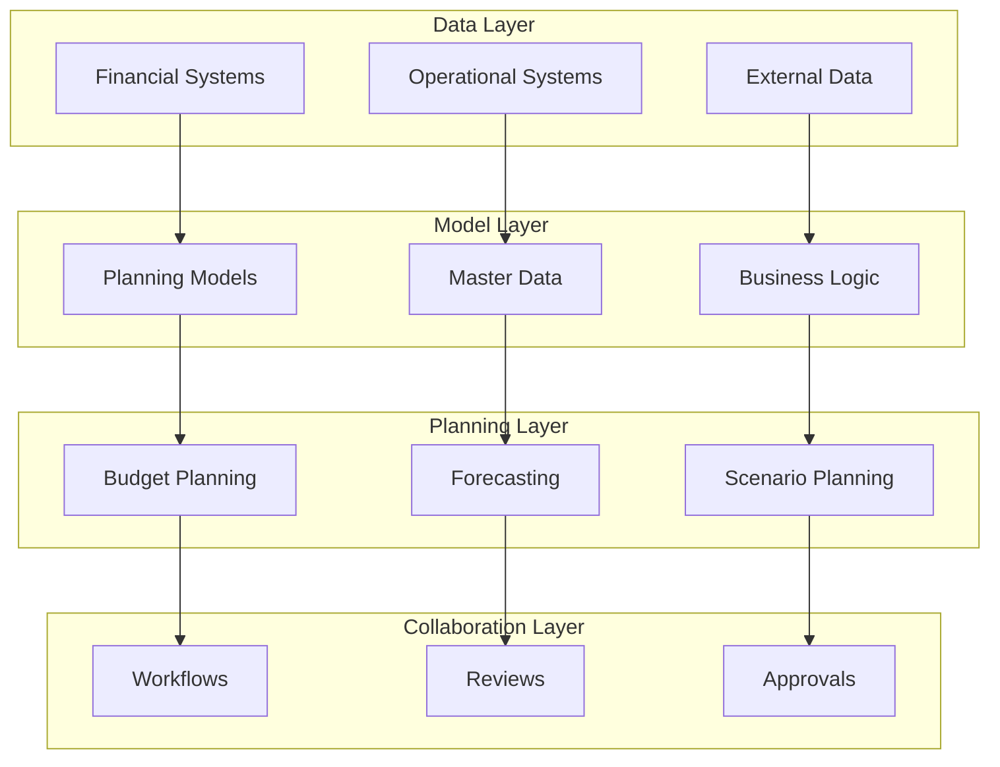

## Introduction

SAP Analytics Cloud (SAC) Planning represents one of the most powerful integrated planning platforms available today, combining financial planning, operational planning, and predictive analytics in a single cloud-native solution. This comprehensive tutorial will guide you through advanced planning scenarios, from basic budgeting to sophisticated financial consolidation and predictive planning.

## SAC Planning Fundamentals

### Planning Architecture Overview



### Core Components

#### 1. Planning Models
```javascript
class PlanningModel {
    constructor(modelConfig) {
        this.dimensions = modelConfig.dimensions;
        this.measures = modelConfig.measures;
        this.businessLogic = modelConfig.businessLogic;
        this.dataActions = [];
    }
    
    // Example financial planning model structure
    createFinancialModel() {
        return {
            dimensions: {
                account: {
                    type: 'Account',
                    hierarchy: true,
                    members: ['Revenue', 'COGS', 'OpEx', 'EBITDA']
                },
                entity: {
                    type: 'Entity',
                    hierarchy: true,
                    members: this.getEntityHierarchy()
                },
                time: {
                    type: 'Date',
                    granularity: 'Month',
                    range: '2025-2027'
                },
                version: {
                    type: 'Version',
                    members: ['Actual', 'Budget', 'Forecast', 'Scenario']
                }
            },
            measures: {
                amount: { type: 'Numeric', aggregation: 'SUM' },
                units: { type: 'Numeric', aggregation: 'SUM' },
                rate: { type: 'Numeric', aggregation: 'AVG' }
            }
        };
    }
}
```

## Advanced Financial Planning Scenarios

### Scenario 1: Multi-Year Budget Planning

#### Model Design
```yaml
budget_model:
  name: "Corporate_Budget_2025-2027"
  type: "Financial Planning"
  
  dimensions:
    entity:
      - North_America
      - Europe
      - Asia_Pacific
      - Corporate
    
    account:
      - P&L_Accounts
      - Balance_Sheet
      - Cash_Flow
    
    time:
      granularity: "Month"
      range: "2025-01 to 2027-12"
    
    version:
      - Budget_2025
      - Budget_2026
      - Budget_2027
      - Rolling_Forecast
    
    category:
      - Personnel
      - Non_Personnel
      - Capital_Expenditure
```

#### Implementation Steps

##### Step 1: Model Creation and Configuration
```javascript
// SAC Planning API example
async function createBudgetModel() {
    const modelConfig = {
        name: "Corporate_Budget_2025-2027",
        type: "PLANNING",
        dimensions: [
            {
                id: "Entity",
                type: "GENERIC",
                hierarchyActive: true
            },
            {
                id: "Account", 
                type: "ACCOUNT",
                hierarchyActive: true
            },
            {
                id: "Time",
                type: "TIME", 
                granularity: "MONTH"
            },
            {
                id: "Version",
                type: "VERSION"
            }
        ],
        measures: [
            {
                id: "Amount",
                dataType: "NUMBER",
                aggregation: "SUM"
            }
        ]
    };
    
    const model = await SACPlanning.createModel(modelConfig);
    await this.setupMasterData(model);
    await this.implementBusinessLogic(model);
    
    return model;
}
```

##### Step 2: Business Logic Implementation
```javascript
class BudgetBusinessLogic {
    constructor(model) {
        this.model = model;
        this.dataActions = new DataActionManager();
    }
    
    // Revenue calculation based on drivers
    calculateRevenue() {
        return {
            formula: `
                [d/Account].[Revenue] = 
                [d/Account].[Units_Sold] * 
                [d/Account].[Price_Per_Unit] * 
                (1 + [d/Account].[Price_Increase_Rate])
            `,
            scope: {
                version: ['Budget_2025', 'Budget_2026', 'Budget_2027'],
                entity: ['ALL'],
                time: ['ALL']
            }
        };
    }
    
    // Personnel cost calculation
    calculatePersonnelCosts() {
        return {
            formula: `
                [d/Account].[Personnel_Costs] = 
                [d/Account].[Headcount] * 
                [d/Account].[Average_Salary] * 
                (1 + [d/Account].[Salary_Increase_Rate]) *
                [d/Account].[Burden_Factor]
            `,
            scope: {
                version: ['Budget_2025', 'Budget_2026', 'Budget_2027'],
                entity: ['ALL'],
                time: ['ALL']
            }
        };
    }
    
    // Depreciation calculation
    calculateDepreciation() {
        return {
            formula: `
                [d/Account].[Depreciation] = 
                RESULTLOOKUP(
                    [d/Account].[Fixed_Assets],
                    [d/Time].[PREVIOUS],
                    [d/Version].[CURRENTMEMBER],
                    [d/Entity].[CURRENTMEMBER]
                ) / [d/Account].[Useful_Life]
            `,
            scope: {
                account: ['Depreciation'],
                version: ['Budget_2025', 'Budget_2026', 'Budget_2027']
            }
        };
    }
}
```

### Scenario 2: Rolling Forecast Implementation

#### Configuration
```yaml
rolling_forecast:
  model: "Corporate_Budget_2025-2027"
  frequency: "Monthly"
  horizon: "18_months"
  
  data_sources:
    actuals:
      - SAP_S4HANA
      - Salesforce
      - Workday
    
    driver_based:
      - Market_Research
      - Sales_Pipeline
      - HR_Planning
  
  automation:
    data_refresh: "Daily"
    calculation_refresh: "Weekly"
    report_generation: "Monthly"
```

#### Automated Data Integration
```python
class RollingForecastEngine:
    def __init__(self, model_id):
        self.model_id = model_id
        self.data_sources = DataSourceManager()
        self.calculation_engine = CalculationEngine()
    
    async def execute_rolling_forecast(self, forecast_date):
        """Execute monthly rolling forecast process"""
        
        # Step 1: Load actual data
        actuals = await self.load_actual_data(forecast_date)
        
        # Step 2: Update forecast assumptions
        assumptions = await self.update_forecast_assumptions()
        
        # Step 3: Run forecast calculations
        forecast_results = await self.calculate_forecast(actuals, assumptions)
        
        # Step 4: Validate results
        validation_results = await self.validate_forecast(forecast_results)
        
        # Step 5: Generate variance analysis
        variance_analysis = await self.generate_variance_analysis(forecast_results)
        
        return {
            'forecast_results': forecast_results,
            'validation': validation_results,
            'variance_analysis': variance_analysis,
            'execution_summary': self.generate_summary()
        }
    
    async def load_actual_data(self, cutoff_date):
        """Load actual data from source systems"""
        data_sources = {
            'financials': self.data_sources.get_s4hana_actuals(cutoff_date),
            'sales': self.data_sources.get_salesforce_actuals(cutoff_date),
            'hr': self.data_sources.get_workday_actuals(cutoff_date)
        }
        
        return await self.harmonize_actual_data(data_sources)
    
    async def update_forecast_assumptions(self):
        """Update key forecast drivers and assumptions"""
        return {
            'market_growth': await self.get_market_assumptions(),
            'fx_rates': await self.get_fx_rates(),
            'inflation_rates': await self.get_inflation_assumptions(),
            'business_drivers': await self.get_business_drivers()
        }
```

### Scenario 3: Scenario Planning and Sensitivity Analysis

#### Scenario Configuration
```javascript
class ScenarioPlanner {
    constructor(baseModel) {
        this.baseModel = baseModel;
        this.scenarios = new Map();
    }
    
    createScenario(scenarioName, assumptions) {
        const scenario = {
            name: scenarioName,
            baseVersion: 'Budget_2025',
            assumptions: assumptions,
            calculations: this.buildScenarioCalculations(assumptions)
        };
        
        this.scenarios.set(scenarioName, scenario);
        return scenario;
    }
    
    // Economic downturn scenario
    createDownturnScenario() {
        return this.createScenario('Economic_Downturn', {
            revenue_decline: -0.15,
            cost_reduction: 0.08,
            capex_reduction: 0.25,
            working_capital_impact: 0.05,
            fx_impact: -0.03
        });
    }
    
    // Growth acceleration scenario
    createGrowthScenario() {
        return this.createScenario('Growth_Acceleration', {
            revenue_growth: 0.25,
            investment_increase: 0.30,
            headcount_increase: 0.15,
            market_expansion: 0.20
        });
    }
    
    // Monte Carlo simulation
    runMonteCarloAnalysis(iterations = 1000) {
        const results = [];
        
        for (let i = 0; i < iterations; i++) {
            const randomAssumptions = this.generateRandomAssumptions();
            const scenarioResult = this.calculateScenario(randomAssumptions);
            results.push(scenarioResult);
        }
        
        return this.analyzeMonteCarloResults(results);
    }
    
    generateRandomAssumptions() {
        return {
            revenue_growth: this.normalDistribution(0.05, 0.15),
            cost_inflation: this.normalDistribution(0.03, 0.08),
            fx_volatility: this.normalDistribution(0, 0.10),
            market_share_change: this.triangularDistribution(-0.05, 0.15, 0.05)
        };
    }
}
```

## Advanced Planning Features

### Predictive Planning with Machine Learning

#### Implementation
```python
class PredictivePlanning:
    def __init__(self, model_id):
        self.model_id = model_id
        self.ml_service = SACSmartInsights()
        self.time_series_engine = TimeSeriesEngine()
    
    async def create_predictive_forecast(self, target_measure, drivers):
        """Create ML-based predictive forecast"""
        
        # Prepare training data
        training_data = await self.prepare_training_data(target_measure, drivers)
        
        # Train predictive model
        ml_model = await self.ml_service.train_model({
            'algorithm': 'PROPHET',
            'target': target_measure,
            'features': drivers,
            'data': training_data
        })
        
        # Generate predictions
        predictions = await ml_model.predict({
            'horizon': 18,  # 18 months
            'confidence_interval': 0.95
        })
        
        # Integrate predictions into planning model
        await self.integrate_predictions(predictions)
        
        return {
            'model_accuracy': ml_model.get_accuracy(),
            'predictions': predictions,
            'feature_importance': ml_model.get_feature_importance()
        }
    
    async def implement_smart_insights(self):
        """Implement automated insights and recommendations"""
        
        insights = await self.ml_service.generate_insights({
            'model': self.model_id,
            'analysis_types': [
                'anomaly_detection',
                'trend_analysis', 
                'variance_explanation',
                'driver_impact_analysis'
            ]
        })
        
        recommendations = await self.generate_recommendations(insights)
        
        return {
            'insights': insights,
            'recommendations': recommendations,
            'actions': await self.create_automated_actions(recommendations)
        }
```

### Collaborative Planning Workflows

#### Workflow Design
```yaml
planning_workflow:
  name: "Annual_Budget_Process"
  participants:
    - Finance_Team
    - Business_Unit_Managers
    - Department_Heads
    - Executive_Committee
  
  phases:
    phase_1:
      name: "Guidelines_and_Assumptions"
      owner: "Finance_Team"
      duration: "2_weeks"
      deliverables:
        - Economic_assumptions
        - Budget_guidelines
        - Planning_templates
    
    phase_2:
      name: "Initial_Budget_Submission"
      owner: "Business_Units"
      duration: "4_weeks" 
      activities:
        - Revenue_planning
        - Expense_budgeting
        - Capital_planning
        - Headcount_planning
    
    phase_3:
      name: "Review_and_Consolidation"
      owner: "Finance_Team"
      duration: "3_weeks"
      activities:
        - Variance_analysis
        - Challenge_sessions
        - Consolidation
        - Adjustments
    
    phase_4:
      name: "Executive_Review"
      owner: "Executive_Committee"
      duration: "2_weeks"
      activities:
        - Presentation
        - Strategic_review
        - Final_approval
```

#### Implementation
```javascript
class PlanningWorkflow {
    constructor(workflowConfig) {
        this.config = workflowConfig;
        this.taskManager = new TaskManager();
        this.notificationService = new NotificationService();
    }
    
    async initiateBudgetCycle() {
        const cycle = await this.createBudgetCycle();
        
        // Phase 1: Guidelines
        await this.executePhase('guidelines', {
            tasks: [
                'create_economic_assumptions',
                'define_budget_guidelines', 
                'prepare_templates',
                'communicate_kickoff'
            ],
            deadline: this.calculateDeadline(2, 'weeks'),
            participants: ['finance_team']
        });
        
        // Phase 2: Budget Submission
        await this.executePhase('submission', {
            tasks: [
                'revenue_planning',
                'expense_budgeting',
                'capital_planning',
                'headcount_planning'
            ],
            deadline: this.calculateDeadline(4, 'weeks'),
            participants: ['business_units'],
            parallel_execution: true
        });
        
        return cycle;
    }
    
    async executePhase(phaseName, phaseConfig) {
        const phase = new PlanningPhase(phaseName, phaseConfig);
        
        // Create tasks for participants
        const tasks = await this.createPhaseTasks(phase);
        
        // Monitor progress
        const monitor = new ProgressMonitor(tasks);
        
        // Send notifications
        await this.notificationService.notifyParticipants(
            phase.participants,
            `Planning phase ${phaseName} has started`
        );
        
        // Execute and monitor
        return await phase.execute();
    }
}
```

## Advanced Modeling Techniques

### Driver-Based Planning

#### Revenue Model Implementation
```javascript
class DriverBasedRevenueModel {
    constructor(model) {
        this.model = model;
        this.drivers = {
            customer_acquisition: 'New_Customers',
            customer_retention: 'Retention_Rate',
            pricing: 'Average_Price',
            usage: 'Usage_Per_Customer'
        };
    }
    
    implementRevenueLogic() {
        return {
            // Customer acquisition forecast
            new_customers: `
                [d/Account].[New_Customers] = 
                [d/Account].[Marketing_Spend] * 
                [d/Account].[Customer_Acquisition_Cost_Ratio] *
                GROWTH([d/Account].[Market_Growth_Rate], [d/Time])
            `,
            
            // Total customers calculation
            total_customers: `
                [d/Account].[Total_Customers] = 
                RESULTLOOKUP([d/Account].[Total_Customers], [d/Time].[PREVIOUS]) * 
                [d/Account].[Retention_Rate] + 
                [d/Account].[New_Customers]
            `,
            
            // Revenue calculation
            total_revenue: `
                [d/Account].[Revenue] = 
                [d/Account].[Total_Customers] * 
                [d/Account].[Average_Price] * 
                [d/Account].[Usage_Per_Customer] *
                (1 + [d/Account].[Price_Increase_Rate])
            `
        };
    }
    
    implementSensitivityAnalysis() {
        return {
            customer_acquisition_sensitivity: {
                low: -0.20,
                base: 0.00,
                high: 0.20
            },
            pricing_sensitivity: {
                low: -0.10,
                base: 0.00, 
                high: 0.15
            },
            retention_sensitivity: {
                low: -0.05,
                base: 0.00,
                high: 0.03
            }
        };
    }
}
```

### Cost Planning Models

#### Activity-Based Costing Integration
```python
class ActivityBasedCostModel:
    def __init__(self, planning_model):
        self.planning_model = planning_model
        self.activity_drivers = {}
        self.cost_pools = {}
    
    def design_abc_model(self):
        return {
            'cost_pools': {
                'procurement': {
                    'driver': 'purchase_orders',
                    'driver_rate': 150,  # $ per PO
                    'capacity': 10000    # Max POs per period
                },
                'quality_control': {
                    'driver': 'inspection_hours',
                    'driver_rate': 75,   # $ per hour
                    'capacity': 2000     # Max hours per period
                },
                'customer_service': {
                    'driver': 'service_calls',
                    'driver_rate': 25,   # $ per call
                    'capacity': 50000    # Max calls per period
                }
            },
            'activity_assignments': {
                'product_line_a': {
                    'procurement': 0.40,
                    'quality_control': 0.60,
                    'customer_service': 0.30
                },
                'product_line_b': {
                    'procurement': 0.35,
                    'quality_control': 0.25,
                    'customer_service': 0.45
                }
            }
        }
    
    def calculate_activity_costs(self, volume_drivers):
        """Calculate costs based on activity consumption"""
        activity_costs = {}
        
        for product, activities in self.activity_assignments.items():
            product_cost = 0
            
            for activity, allocation_rate in activities.items():
                driver_volume = volume_drivers[product][activity]
                driver_rate = self.cost_pools[activity]['driver_rate']
                capacity = self.cost_pools[activity]['capacity']
                
                # Calculate utilization-based cost
                utilization = min(driver_volume / capacity, 1.0)
                activity_cost = driver_volume * driver_rate
                
                # Apply capacity constraints
                if utilization > 0.8:
                    activity_cost *= (1 + (utilization - 0.8) * 2)  # Overtime premium
                
                product_cost += activity_cost * allocation_rate
            
            activity_costs[product] = product_cost
        
        return activity_costs
```

## Integration Patterns

### ERP Integration

#### SAP S/4HANA Integration
```yaml
s4hana_integration:
  connection_type: "Live"
  protocol: "OData"
  authentication: "OAuth2"
  
  data_flows:
    actuals_import:
      frequency: "Daily"
      objects:
        - GL_Account_Balances
        - Cost_Center_Actuals
        - Profit_Center_Results
        - Statistical_Key_Figures
    
    plan_data_export:
      frequency: "Monthly"
      objects:
        - Budget_Allocations
        - Forecast_Updates
        - Planning_Versions
    
    master_data_sync:
      frequency: "Weekly"
      objects:
        - Chart_of_Accounts
        - Cost_Centers
        - Profit_Centers
        - Company_Codes
```

#### Implementation
```javascript
class ERPIntegrationService {
    constructor() {
        this.s4hanaConnector = new S4HANAConnector();
        self.dataTransformation = new DataTransformationEngine();
    }
    
    async importActuals() {
        try {
            // Extract actual data from S/4HANA
            const actualData = await this.s4hanaConnector.extractActuals({
                dateRange: this.getCurrentPeriod(),
                entities: ['1000', '2000', '3000'],  // Company codes
                accounts: this.getPlanningAccounts()
            });
            
            // Transform data for SAC model structure
            const transformedData = await this.dataTransformation.transform(
                actualData,
                this.getMappingRules()
            );
            
            // Import into planning model
            const importResult = await this.importToPlanningModel(transformedData);
            
            return {
                status: 'success',
                records_imported: importResult.recordCount,
                execution_time: importResult.duration,
                data_quality_score: this.calculateDataQuality(transformedData)
            };
            
        } catch (error) {
            return {
                status: 'error',
                error_message: error.message,
                recommendations: this.generateErrorRecommendations(error)
            };
        }
    }
    
    getMappingRules() {
        return {
            account_mapping: {
                'source_field': 'GL_ACCOUNT',
                'target_field': 'Account',
                'transformation': 'direct_mapping',
                'default_value': 'UNMAPPED'
            },
            entity_mapping: {
                'source_field': 'COMPANY_CODE',
                'target_field': 'Entity',
                'transformation': 'lookup_table',
                'lookup_table': 'company_code_mapping'
            },
            amount_mapping: {
                'source_field': 'AMOUNT_LOCAL',
                'target_field': 'Amount',
                'transformation': 'currency_conversion',
                'target_currency': 'USD'
            }
        };
    }
}
```

### Analytics Integration

#### Dashboard and Reporting Integration
```python
class PlanningAnalytics:
    def __init__(self, planning_model_id):
        self.model_id = planning_model_id
        self.story_builder = StoryBuilder()
        self.dashboard_service = DashboardService()
    
    def create_executive_dashboard(self):
        """Create executive-level planning dashboard"""
        dashboard = self.dashboard_service.create_dashboard({
            'title': 'Executive Planning Dashboard',
            'layout': 'executive_layout',
            'refresh_frequency': 'real_time'
        })
        
        # Key metrics
        dashboard.add_widget('kpi_panel', {
            'metrics': [
                'revenue_vs_budget',
                'ebitda_margin', 
                'cash_flow_forecast',
                'budget_accuracy'
            ],
            'layout': 'grid_2x2'
        })
        
        # Trend analysis
        dashboard.add_widget('trend_chart', {
            'type': 'line_chart',
            'measures': ['Revenue', 'EBITDA', 'Cash_Flow'],
            'time_axis': 'rolling_12_months',
            'scenarios': ['Actual', 'Budget', 'Forecast']
        })
        
        # Variance analysis
        dashboard.add_widget('variance_table', {
            'type': 'data_table',
            'dimensions': ['Entity', 'Account'],
            'variance_types': ['absolute', 'percentage'],
            'exception_highlighting': True
        })
        
        return dashboard
    
    def create_planning_story(self, story_config):
        """Create interactive planning story"""
        story = self.story_builder.create_story(story_config)
        
        # Planning input page
        story.add_page('planning_inputs', {
            'widgets': [
                self.create_planning_table(),
                self.create_driver_inputs(),
                self.create_scenario_controls()
            ]
        })
        
        # Analysis page
        story.add_page('analysis', {
            'widgets': [
                self.create_waterfall_chart(),
                self.create_sensitivity_analysis(),
                self.create_variance_breakdown()
            ]
        })
        
        # Approval page
        story.add_page('approval', {
            'widgets': [
                self.create_approval_summary(),
                self.create_comments_panel(),
                self.create_workflow_status()
            ]
        })
        
        return story
```

## Performance Optimization

### Model Optimization Techniques

#### Data Volume Management
```javascript
class ModelOptimizer {
    constructor(model) {
        this.model = model;
        this.analyzer = new PerformanceAnalyzer();
    }
    
    async optimizeModel() {
        const analysis = await this.analyzer.analyzeModel(this.model);
        const optimizations = [];
        
        // Optimize data volume
        if (analysis.dataVolume > this.getVolumeThreshold()) {
            optimizations.push(await this.implementArchiving());
            optimizations.push(await this.optimizeGranularity());
        }
        
        // Optimize calculations
        if (analysis.calculationComplexity === 'HIGH') {
            optimizations.push(await this.optimizeFormulas());
            optimizations.push(await this.implementCaching());
        }
        
        // Optimize memory usage
        if (analysis.memoryUsage > this.getMemoryThreshold()) {
            optimizations.push(await this.optimizeDataLoad());
        }
        
        return optimizations;
    }
    
    async implementArchiving() {
        return {
            strategy: 'time_based_archiving',
            archive_cutoff: '24_months',
            expected_reduction: '60%',
            implementation: async () => {
                // Move historical data to archive model
                await this.createArchiveModel();
                await this.moveHistoricalData();
                await this.setupArchiveAccess();
            }
        };
    }
    
    async optimizeFormulas() {
        const formulas = await this.model.getFormulas();
        const optimizedFormulas = [];
        
        for (const formula of formulas) {
            const optimization = await this.analyzeFormula(formula);
            
            if (optimization.canOptimize) {
                optimizedFormulas.push({
                    original: formula.expression,
                    optimized: optimization.optimizedExpression,
                    performance_gain: optimization.expectedGain
                });
            }
        }
        
        return optimizedFormulas;
    }
}
```

### Query Optimization

```sql
-- Optimized planning query examples
-- Use appropriate filters to reduce data volume
SELECT 
    Entity,
    Account,
    Time,
    SUM(Amount) as Total_Amount
FROM PlanningModel
WHERE Time >= CURRENT_PERIOD
  AND Version = 'Budget'
  AND Entity IN ('1000', '2000', '3000')
GROUP BY Entity, Account, Time;

-- Use calculated columns for complex logic
CREATE CALCULATED_COLUMN Revenue_Growth AS
    (Amount - LAG(Amount, 12) OVER (PARTITION BY Entity, Account ORDER BY Time)) 
    / LAG(Amount, 12) OVER (PARTITION BY Entity, Account ORDER BY Time);

-- Implement hierarchical aggregation
SELECT 
    Entity_Level_2,
    Account_Level_1,
    Time,
    SUM(Amount) as Aggregated_Amount
FROM PlanningModel
WHERE Level(Entity) <= 2
  AND Level(Account) <= 1
GROUP BY Entity_Level_2, Account_Level_1, Time;
```

## Best Practices and Common Patterns

### Model Design Patterns

#### 1. Layered Planning Architecture
```yaml
layered_architecture:
  operational_layer:
    granularity: "Daily/Weekly"
    purpose: "Detailed operational planning"
    models:
      - Sales_Planning_Detail
      - Workforce_Planning_Detail
      - Supply_Chain_Planning
  
  tactical_layer:
    granularity: "Monthly"
    purpose: "Mid-term planning and budgeting"
    models:
      - Financial_Planning_Monthly
      - Business_Unit_Budgets
      - Capital_Planning
  
  strategic_layer:
    granularity: "Quarterly/Annually"
    purpose: "Strategic planning and scenarios"
    models:
      - Corporate_Strategic_Plan
      - Long_Range_Plan
      - Scenario_Models
```

#### 2. Driver-Based Planning Framework
```javascript
class DriverBasedFramework {
    constructor() {
        this.driverHierarchy = {
            'Level 1': 'Business Drivers',
            'Level 2': 'Operational Drivers', 
            'Level 3': 'Financial Drivers'
        };
    }
    
    designDriverModel(businessArea) {
        const frameworks = {
            'sales': {
                'business_drivers': ['market_size', 'market_share', 'customer_segments'],
                'operational_drivers': ['sales_force_size', 'conversion_rates', 'pricing'],
                'financial_drivers': ['revenue', 'commissions', 'sales_expenses']
            },
            'manufacturing': {
                'business_drivers': ['demand_forecast', 'capacity_utilization', 'quality_targets'],
                'operational_drivers': ['production_volume', 'labor_hours', 'material_usage'],
                'financial_drivers': ['cogs', 'manufacturing_overhead', 'inventory']
            },
            'hr': {
                'business_drivers': ['strategic_initiatives', 'growth_targets', 'capability_gaps'],
                'operational_drivers': ['headcount', 'productivity', 'retention_rates'],
                'financial_drivers': ['personnel_costs', 'training_costs', 'benefits']
            }
        };
        
        return frameworks[businessArea];
    }
}
```

### Data Quality and Governance

#### Implementation
```python
class PlanningDataGovernance:
    def __init__(self):
        self.quality_rules = QualityRuleEngine()
        self.audit_logger = AuditLogger()
        self.approval_engine = ApprovalEngine()
    
    def implement_data_quality_checks(self):
        return {
            'completeness_checks': {
                'mandatory_fields': ['Entity', 'Account', 'Time', 'Amount'],
                'tolerance': 0,
                'action': 'reject_submission'
            },
            'consistency_checks': {
                'balance_sheet_balancing': {
                    'rule': 'Assets = Liabilities + Equity',
                    'tolerance': 0.01,
                    'action': 'flag_for_review'
                },
                'profit_loss_consistency': {
                    'rule': 'Revenue - Expenses = Net_Income',
                    'tolerance': 0.01,
                    'action': 'flag_for_review'
                }
            },
            'reasonableness_checks': {
                'variance_limits': {
                    'revenue_variance': {'min': -50, 'max': 100},  # % variance
                    'expense_variance': {'min': -30, 'max': 50},
                    'action': 'require_explanation'
                }
            }
        }
    
    async def execute_approval_workflow(self, submission):
        workflow = self.approval_engine.create_workflow({
            'entity': submission.entity,
            'amount_threshold': self.get_approval_threshold(submission),
            'approvers': await self.get_approvers(submission)
        })
        
        # Log submission
        await self.audit_logger.log_submission(submission, workflow.id)
        
        # Execute approval steps
        for step in workflow.steps:
            approval_result = await step.execute()
            await self.audit_logger.log_approval_step(approval_result)
            
            if approval_result.status == 'rejected':
                return await self.handle_rejection(submission, approval_result)
        
        return await self.finalize_approval(submission)
```

## Troubleshooting and Common Issues

### Performance Issues

#### Diagnostic Framework
```python
class PlanningPerformanceDiagnostics:
    def __init__(self, model_id):
        self.model_id = model_id
        self.profiler = PerformanceProfiler()
    
    async def diagnose_performance_issues(self):
        diagnostics = {}
        
        # Model size analysis
        diagnostics['model_size'] = await self.analyze_model_size()
        
        # Query performance analysis
        diagnostics['query_performance'] = await self.analyze_query_performance()
        
        # Memory usage analysis
        diagnostics['memory_usage'] = await self.analyze_memory_usage()
        
        # Formula complexity analysis
        diagnostics['formula_complexity'] = await self.analyze_formulas()
        
        return {
            'diagnostics': diagnostics,
            'recommendations': await self.generate_recommendations(diagnostics),
            'optimization_plan': await self.create_optimization_plan(diagnostics)
        }
    
    async def analyze_model_size(self):
        model_stats = await self.profiler.get_model_statistics(self.model_id)
        
        return {
            'total_cells': model_stats.total_cells,
            'non_empty_cells': model_stats.non_empty_cells,
            'sparsity': (model_stats.total_cells - model_stats.non_empty_cells) / model_stats.total_cells,
            'size_mb': model_stats.size_mb,
            'dimensions': model_stats.dimensions,
            'recommendations': self.get_size_recommendations(model_stats)
        }
```

### Integration Issues

#### Common Problems and Solutions
```javascript
class IntegrationTroubleshooting {
    constructor() {
        this.commonIssues = new Map();
        this.setupCommonIssues();
    }
    
    setupCommonIssues() {
        this.commonIssues.set('data_mapping_error', {
            symptoms: ['Missing data', 'Incorrect values', 'Mapping failures'],
            causes: ['Incorrect mapping configuration', 'Source system changes', 'Data type mismatches'],
            solutions: [
                'Review mapping configuration',
                'Validate source system structure',
                'Update data transformation rules',
                'Implement data validation checks'
            ]
        });
        
        this.commonIssues.set('performance_degradation', {
            symptoms: ['Slow data imports', 'Timeout errors', 'High memory usage'],
            causes: ['Large data volumes', 'Complex transformations', 'Network latency'],
            solutions: [
                'Implement incremental loading',
                'Optimize transformation logic',
                'Add data archiving',
                'Use compression techniques'
            ]
        });
        
        this.commonIssues.set('calculation_errors', {
            symptoms: ['Incorrect calculations', 'Formula errors', 'Missing results'],
            causes: ['Formula syntax errors', 'Data dependency issues', 'Timing problems'],
            solutions: [
                'Validate formula syntax',
                'Check data dependencies',
                'Implement proper sequencing',
                'Add error handling'
            ]
        });
    }
    
    diagnose(symptoms) {
        const possibleIssues = [];
        
        for (const [issue, details] of this.commonIssues) {
            const matchScore = this.calculateSymptomMatch(symptoms, details.symptoms);
            if (matchScore > 0.5) {
                possibleIssues.push({
                    issue: issue,
                    confidence: matchScore,
                    solutions: details.solutions
                });
            }
        }
        
        return possibleIssues.sort((a, b) => b.confidence - a.confidence);
    }
}
```

## Future Roadmap and Emerging Features

### AI-Enhanced Planning

```python
class AIEnhancedPlanning:
    def __init__(self):
        self.ai_service = SAPAnalyticsCloudAI()
        self.prediction_engine = PredictionEngine()
    
    async def implement_intelligent_forecasting(self):
        return {
            'automatic_model_selection': {
                'description': 'AI automatically selects best forecasting model',
                'algorithms': ['ARIMA', 'Prophet', 'Neural Networks', 'Ensemble'],
                'accuracy_improvement': '15-25%'
            },
            'anomaly_detection': {
                'description': 'Real-time detection of planning anomalies',
                'capabilities': ['Data quality issues', 'Unusual patterns', 'Outlier identification'],
                'false_positive_rate': '<5%'
            },
            'intelligent_variance_analysis': {
                'description': 'AI-powered root cause analysis',
                'features': ['Automated drill-down', 'Contributing factor analysis', 'Predictive insights'],
                'time_savings': '60-80%'
            }
        }
    
    async def enable_natural_language_planning(self):
        return {
            'conversational_interface': 'Natural language planning interactions',
            'automated_insights': 'Plain English explanation of variances',
            'voice_commands': 'Voice-enabled planning updates',
            'smart_suggestions': 'AI-generated planning recommendations'
        }
```

## Conclusion

SAP Analytics Cloud Planning provides a comprehensive platform for modern financial planning and analysis. Success with SAC Planning depends on:

1. **Proper Model Design**: Start with clear requirements and design scalable models
2. **Effective Integration**: Seamless connection with source systems and analytics tools
3. **User Adoption**: Intuitive interfaces and collaborative workflows
4. **Performance Optimization**: Efficient models and optimized calculations
5. **Governance Framework**: Data quality, security, and approval processes
6. **Continuous Improvement**: Regular optimization and feature adoption

As planning requirements evolve and AI capabilities advance, SAC Planning continues to provide the flexibility and power needed for sophisticated financial planning scenarios.

The key to success is starting with core use cases, proving value quickly, and gradually expanding to more advanced scenarios as user proficiency and confidence grow.

---

*Ready to transform your financial planning process with SAP Analytics Cloud? Contact Varnika IT Consulting for expert guidance on implementation strategy, model design, and user adoption planning tailored to your organization's specific requirements.*