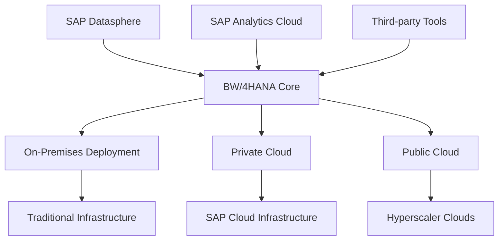
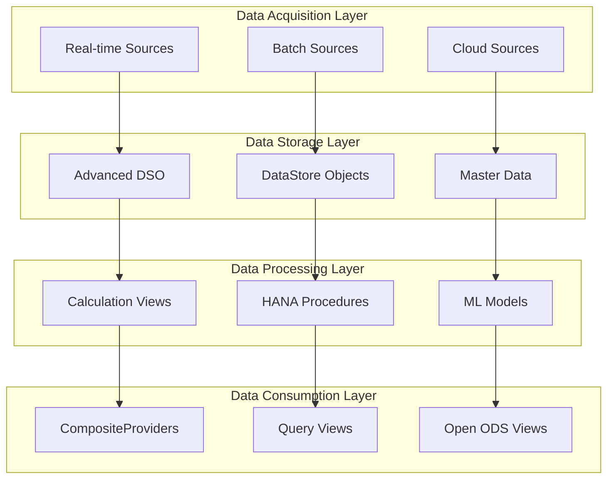

## Introduction

SAP BW/4HANA 2025 represents the latest evolution in SAP's data warehousing platform, bringing significant enhancements in performance, cloud integration, and modern analytics capabilities. As organizations plan their data modernization strategies, understanding the migration path and new features becomes critical for success.

This comprehensive guide covers everything you need to know about migrating to and maximizing SAP BW/4HANA 2025.

## What's New in SAP BW/4HANA 2025

### Enhanced Cloud Integration

#### Native Cloud Services Integration
```yaml
cloud_integrations:
  sap_datasphere:
    - Direct data sharing
    - Federated queries
    - Unified security model
    - Seamless metadata sync
  
  analytics_cloud:
    - Live connections
    - Model sharing
    - Planning integration
    - Story embedding
  
  data_intelligence:
    - Pipeline orchestration
    - ML model deployment
    - Data quality monitoring
    - Metadata management
```

#### Hybrid Deployment Options


### Advanced Analytics Capabilities

#### Native Machine Learning
```sql
-- Example: Predictive Analytics in BW/4HANA
CREATE CALCULATION VIEW "CV_SALES_FORECAST" AS 
SELECT 
    SALES_ORG,
    MATERIAL,
    FORECAST_DATE,
    PREDICTED_SALES,
    CONFIDENCE_INTERVAL
FROM 
    "_SYS_AFL"."PAL_LINEAR_REGRESSION"(
        "T_SALES_HISTORY",
        "T_FORECAST_PARAMS"
    )
WITH HINT(WORKLOAD_CLASS('PREDICTIVE'));
```

#### Enhanced Data Modeling
```yaml
new_modeling_features:
  composite_providers:
    - Multi-source federation
    - Real-time and batch data
    - Simplified architecture
    - Performance optimization
  
  advanced_dso:
    - Change data capture
    - Delta handling
    - Partitioning support
    - Compression algorithms
  
  calculation_views:
    - Enhanced performance
    - Better debugging
    - Parameterization
    - Union improvements
```

### Performance Enhancements

#### Intelligent Data Placement
```javascript
class IntelligentDataPlacement {
  constructor() {
    this.memoryTiers = ['L1_Cache', 'L2_Cache', 'Memory', 'Storage'];
    this.accessPatterns = new AccessPatternAnalyzer();
  }
  
  optimizeDataPlacement(dataObject) {
    const usage = this.accessPatterns.analyze(dataObject);
    const tier = this.determineTier(usage);
    
    return {
      dataObject: dataObject.name,
      recommendedTier: tier,
      expectedPerformance: this.calculatePerformance(tier),
      costImpact: this.calculateCost(tier)
    };
  }
  
  determineTier(usage) {
    if (usage.frequency === 'high' && usage.latency === 'critical') {
      return 'L1_Cache';
    } else if (usage.frequency === 'medium') {
      return 'Memory';
    } else {
      return 'Storage';
    }
  }
}
```

## Migration Strategies

### Strategy 1: Shell Conversion (In-Place Migration)

#### Overview
Convert existing BW system to BW/4HANA with minimal changes.

```yaml
shell_conversion:
  approach: "Convert existing system in place"
  timeline: "6-12 months"
  complexity: "Medium"
  risk: "Low to Medium"
  
  prerequisites:
    - SAP BW 7.5 SP08 or higher
    - Compatible HANA version
    - System health check
    - Technical preparation
  
  steps:
    1. "System preparation"
    2. "Software update manager execution"
    3. "Conversion verification"
    4. "Post-conversion optimization"
    5. "Testing and validation"
```

#### Technical Implementation
```bash
# Pre-conversion checklist script
#!/bin/bash

echo "SAP BW/4HANA Conversion Readiness Check"
echo "======================================"

# Check BW release
BW_RELEASE=$(cat /usr/sap/BW1/SYS/exe/uc/linuxx86_64/DBGSHELP.HLP | grep "Release")
echo "Current BW Release: $BW_RELEASE"

# Check HANA version
HANA_VERSION=$(hdbsql -U SYSTEM "SELECT VERSION FROM M_DATABASE")
echo "HANA Version: $HANA_VERSION"

# Check disk space
DISK_SPACE=$(df -h | grep -E "/(usr/sap|hana)" | awk '{print $1 ": " $4}')
echo "Available Disk Space:"
echo "$DISK_SPACE"

# Check system health
echo "Running system health checks..."
# Add system-specific health checks here
```

### Strategy 2: Data Migration (Greenfield Approach)

#### Planning and Design
```yaml
greenfield_migration:
  approach: "Build new BW/4HANA system"
  timeline: "12-24 months"
  complexity: "High"
  risk: "Medium to High"
  
  advantages:
    - Clean architecture
    - Modern design patterns
    - Performance optimization
    - Simplified data flow
  
  phases:
    1. "Requirements analysis"
    2. "Architecture design"
    3. "Development and testing"
    4. "Data migration"
    5. "Go-live and support"
```

#### Migration Framework
```python
class BW4HANAMigrationFramework:
    def __init__(self):
        self.source_system = None
        self.target_system = None
        self.migration_config = {}
    
    def analyze_source_system(self, bw_system):
        """Analyze source BW system for migration planning"""
        analysis = {
            'data_objects': self.catalog_data_objects(bw_system),
            'dependencies': self.map_dependencies(bw_system),
            'customizations': self.identify_customizations(bw_system),
            'performance_issues': self.identify_performance_issues(bw_system)
        }
        return analysis
    
    def design_target_architecture(self, requirements):
        """Design target BW/4HANA architecture"""
        architecture = {
            'layered_scalable_architecture': self.design_lsa(requirements),
            'data_models': self.design_data_models(requirements),
            'integration_patterns': self.design_integrations(requirements),
            'security_concept': self.design_security(requirements)
        }
        return architecture
    
    def generate_migration_plan(self, source_analysis, target_architecture):
        """Generate detailed migration plan"""
        plan = {
            'waves': self.plan_migration_waves(source_analysis),
            'timeline': self.create_timeline(),
            'resources': self.estimate_resources(),
            'risks': self.assess_risks()
        }
        return plan
```

### Strategy 3: Hybrid Migration

#### Phased Approach
```yaml
hybrid_migration:
  approach: "Gradual migration with coexistence"
  timeline: "18-36 months"
  complexity: "Very High"
  risk: "Low"
  
  benefits:
    - Reduced business disruption
    - Gradual learning curve
    - Risk mitigation
    - Continuous operation
  
  architecture:
    - Source BW system continues
    - New BW/4HANA for selected areas
    - Data synchronization layer
    - Unified reporting interface
```

## Technical Migration Process

### Pre-Migration Assessment

#### System Analysis Script
```sql
-- BW System Analysis Queries
-- Data volume assessment
SELECT 
    TABNAME,
    TABCLASS,
    AS4LOCAL,
    TABKAT,
    COUNT(*) as RECORD_COUNT
FROM DD02L 
WHERE TABNAME LIKE '/BIC/%' 
   OR TABNAME LIKE '0%'
GROUP BY TABNAME, TABCLASS, AS4LOCAL, TABKAT
ORDER BY RECORD_COUNT DESC;

-- Process chain analysis
SELECT 
    CHAIN_ID,
    CHAIN_TEXT,
    TYPE,
    START_TIME,
    MAX_RUNTIME,
    AVERAGE_RUNTIME
FROM RSPC_CHAIN
WHERE OBJVERS = 'A'
  AND TYPE IN ('CHAIN', 'PROCESS_CHAIN')
ORDER BY AVERAGE_RUNTIME DESC;

-- InfoCube sizing
SELECT 
    INFOCUBE,
    FACTTAB,
    DIMTAB,
    RECORD_COUNT,
    SIZE_MB
FROM RSDCUBE
JOIN (
    SELECT TABNAME, COUNT(*) as RECORD_COUNT
    FROM <FACTTAB>
    GROUP BY TABNAME
) ON RSDCUBE.FACTTAB = TABNAME;
```

#### Compatibility Check
```javascript
class CompatibilityChecker {
    checkBW4HANACompatibility(bwObjects) {
        const incompatibilities = [];
        
        bwObjects.forEach(object => {
            // Check for deprecated features
            if (object.type === 'MultiProvider' && !object.isHANAOptimized) {
                incompatibilities.push({
                    object: object.name,
                    issue: 'MultiProvider not HANA-optimized',
                    recommendation: 'Convert to CompositeProvider',
                    effort: 'Medium'
                });
            }
            
            // Check for unsupported transformations
            if (object.transformations) {
                object.transformations.forEach(trans => {
                    if (trans.routineType === 'ABAP' && trans.complexity === 'High') {
                        incompatibilities.push({
                            object: object.name,
                            issue: 'Complex ABAP routine',
                            recommendation: 'Rewrite using HANA procedures',
                            effort: 'High'
                        });
                    }
                });
            }
        });
        
        return incompatibilities;
    }
}
```

### Data Migration Execution

#### ETL Pipeline Design
```python
from airflow import DAG
from airflow.operators.bash_operator import BashOperator
from airflow.operators.python_operator import PythonOperator
from datetime import datetime, timedelta

class BW4HANAMigrationPipeline:
    def __init__(self):
        self.dag = DAG(
            'bw4hana_migration',
            default_args={
                'start_date': datetime(2025, 1, 1),
                'retries': 3,
                'retry_delay': timedelta(minutes=15)
            },
            schedule_interval='@daily',
            catchup=False
        )
    
    def create_migration_tasks(self):
        # Extract data from source BW
        extract_task = PythonOperator(
            task_id='extract_bw_data',
            python_callable=self.extract_bw_data,
            dag=self.dag
        )
        
        # Transform data for BW/4HANA
        transform_task = PythonOperator(
            task_id='transform_data',
            python_callable=self.transform_data,
            dag=self.dag
        )
        
        # Load into BW/4HANA
        load_task = PythonOperator(
            task_id='load_bw4hana',
            python_callable=self.load_bw4hana,
            dag=self.dag
        )
        
        # Data validation
        validate_task = PythonOperator(
            task_id='validate_migration',
            python_callable=self.validate_migration,
            dag=self.dag
        )
        
        # Set dependencies
        extract_task >> transform_task >> load_task >> validate_task
    
    def extract_bw_data(self, **context):
        # Implementation for data extraction
        pass
    
    def transform_data(self, **context):
        # Implementation for data transformation
        pass
    
    def load_bw4hana(self, **context):
        # Implementation for data loading
        pass
    
    def validate_migration(self, **context):
        # Implementation for data validation
        pass
```

### Performance Optimization

#### HANA-Specific Optimizations
```sql
-- Create column store partitions
ALTER TABLE "/BIC/FSALES_FACT" 
PARTITION BY RANGE (CALMONTH) (
    PARTITION P2023 <= '202312',
    PARTITION P2024 <= '202412',
    PARTITION P2025 <= '202512'
);

-- Create column store indexes
CREATE INDEX "IDX_SALES_MATERIAL" 
ON "/BIC/FSALES_FACT" ("MATERIAL", "CALMONTH") 
PARTITION SPECIFICATION (
    PARTITION P2023 = P_RANGE1,
    PARTITION P2024 = P_RANGE2,
    PARTITION P2025 = P_RANGE3
);

-- Optimize calculation view
CREATE OR REPLACE CALCULATION VIEW "CV_SALES_OPTIMIZED" AS 
SELECT 
    SALES_ORG,
    MATERIAL,
    CALMONTH,
    SUM(QUANTITY) as TOTAL_QTY,
    SUM(AMOUNT) as TOTAL_AMOUNT
FROM "/BIC/FSALES_FACT"
WHERE CALMONTH >= ADD_MONTHS(CURRENT_DATE, -24)
GROUP BY SALES_ORG, MATERIAL, CALMONTH
WITH HINT(CACHE, NO_USE_OLAP_PLAN);
```

## Cloud Integration Strategies

### SAP Datasphere Integration

#### Federation Setup
```yaml
datasphere_federation:
  connection_type: "Database Connection"
  protocol: "HANA SQL"
  authentication: "Certificate-based"
  
  shared_objects:
    - dimension_views
    - calculation_views
    - analytical_datasets
  
  governance:
    - unified_security_model
    - data_lineage_tracking
    - access_control_integration
```

#### Implementation
```javascript
class DatasphereIntegration {
    constructor(bw4hanaConnection, datasphereSpace) {
        this.bwConnection = bw4hanaConnection;
        this.dsSpace = datasphereSpace;
    }
    
    async createSharedView(viewName, bwObject) {
        const sharedView = {
            name: viewName,
            source: {
                connection: this.bwConnection.id,
                object: bwObject.technicalName
            },
            semantic_usage: 'FACT',
            columns: this.mapColumns(bwObject.columns),
            associations: this.createAssociations(bwObject.dimensions)
        };
        
        return await this.dsSpace.createView(sharedView);
    }
    
    mapColumns(bwColumns) {
        return bwColumns.map(col => ({
            name: col.fieldName,
            dataType: this.convertDataType(col.dataType),
            semanticType: this.determineSemanticType(col),
            aggregation: col.aggregation || 'SUM'
        }));
    }
}
```

### SAP Analytics Cloud Integration

#### Live Connection Setup
```yaml
sac_integration:
  connection_type: "Live Connection"
  protocol: "Direct Connect"
  optimization: "Query pushdown"
  
  features:
    - real_time_data_access
    - server_side_calculations
    - drill_down_capabilities
    - hierarchical_navigation
  
  security:
    - sso_integration
    - role_based_access
    - data_level_security
```

## Modernization Best Practices

### Architecture Modernization

#### Layered Scalable Architecture 2.0


#### Implementation Framework
```python
class LSAModernizationFramework:
    def __init__(self):
        self.layers = {
            'acquisition': AcquisitionLayer(),
            'storage': StorageLayer(),
            'processing': ProcessingLayer(),
            'consumption': ConsumptionLayer()
        }
    
    def design_data_flow(self, requirements):
        flow = DataFlow()
        
        # Design acquisition patterns
        for source in requirements.sources:
            if source.velocity == 'real-time':
                flow.add_streaming_pipeline(source)
            else:
                flow.add_batch_pipeline(source)
        
        # Design storage patterns
        flow.add_storage_strategy(
            pattern='advanced_dso' if requirements.complex_logic else 'standard_dso'
        )
        
        # Design processing patterns
        if requirements.has_ml_requirements:
            flow.add_ml_pipeline()
        
        flow.add_calculation_views(requirements.analytical_views)
        
        return flow
```

### Data Modeling Modernization

#### New Modeling Patterns
```sql
-- CompositeProvider replacing MultiProvider
CREATE VIRTUAL TABLE "CP_SALES_COMBINED" AS 
SELECT * FROM (
    SELECT SALES_ORG, MATERIAL, QUANTITY, AMOUNT, 'ACTUAL' as VERSION
    FROM "/BIC/ADSALES1" 
    UNION ALL
    SELECT SALES_ORG, MATERIAL, QUANTITY, AMOUNT, 'BUDGET' as VERSION
    FROM "/BIC/ADBUDGET1"
)
WITH FEDERATION ENABLED
WITH HINT(MERGE_JOIN);

-- Open ODS View for external consumption
CREATE OR REPLACE VIEW "/BIC/OODS_SALES" AS
SELECT 
    SALES_ORG,
    MATERIAL,
    CALMONTH,
    SUM(QUANTITY) as TOTAL_QTY,
    SUM(AMOUNT) as TOTAL_AMOUNT,
    'SALES' as MEASURE_TYPE
FROM "/BIC/ADSALES"
GROUP BY SALES_ORG, MATERIAL, CALMONTH
WITH STRUCTURED_PRIVILEGE_CHECK;
```

### Performance Optimization

#### Intelligent Data Management
```python
class IntelligentDataManagement:
    def __init__(self):
        self.data_analyzer = DataPatternAnalyzer()
        self.optimizer = HanaOptimizer()
    
    def optimize_data_lifecycle(self, data_objects):
        recommendations = []
        
        for obj in data_objects:
            usage_pattern = self.data_analyzer.analyze_usage(obj)
            
            if usage_pattern.access_frequency == 'low':
                recommendations.append({
                    'object': obj.name,
                    'action': 'compress_and_archive',
                    'expected_savings': '60-80%',
                    'impact': 'minimal'
                })
            
            elif usage_pattern.has_hot_partition:
                recommendations.append({
                    'object': obj.name,
                    'action': 'implement_partitioning',
                    'strategy': 'time_based',
                    'performance_gain': '40-60%'
                })
        
        return recommendations
    
    def implement_smart_caching(self, calculation_views):
        caching_strategy = {}
        
        for view in calculation_views:
            complexity = self.analyze_complexity(view)
            usage = self.analyze_usage_frequency(view)
            
            if complexity == 'high' and usage == 'frequent':
                caching_strategy[view.name] = {
                    'cache_type': 'result_cache',
                    'refresh_strategy': 'incremental',
                    'retention': '24_hours'
                }
        
        return caching_strategy
```

## Testing and Validation

### Automated Testing Framework

```python
class BW4HANATestFramework:
    def __init__(self):
        self.test_suites = {
            'data_integrity': DataIntegrityTests(),
            'performance': PerformanceTests(),
            'functional': FunctionalTests(),
            'integration': IntegrationTests()
        }
    
    def run_migration_validation(self, migration_scope):
        results = {}
        
        # Data integrity validation
        results['data_integrity'] = self.validate_data_integrity(migration_scope)
        
        # Performance comparison
        results['performance'] = self.compare_performance(migration_scope)
        
        # Functional testing
        results['functional'] = self.test_business_scenarios(migration_scope)
        
        # Integration validation
        results['integration'] = self.validate_integrations(migration_scope)
        
        return self.generate_validation_report(results)
    
    def validate_data_integrity(self, scope):
        validations = []
        
        for object_name in scope.migrated_objects:
            source_count = self.get_record_count('source', object_name)
            target_count = self.get_record_count('target', object_name)
            
            validations.append({
                'object': object_name,
                'source_count': source_count,
                'target_count': target_count,
                'match': source_count == target_count,
                'variance': abs(source_count - target_count)
            })
        
        return validations
```

### Performance Benchmarking

```sql
-- Performance comparison queries
WITH SOURCE_PERFORMANCE AS (
    SELECT 
        'SOURCE_BW' as SYSTEM,
        COUNT(*) as RECORD_COUNT,
        AVG(QUERY_RUNTIME) as AVG_RUNTIME,
        MAX(QUERY_RUNTIME) as MAX_RUNTIME
    FROM BW_QUERY_LOG
    WHERE DATE_EXECUTED >= ADD_MONTHS(CURRENT_DATE, -3)
),
TARGET_PERFORMANCE AS (
    SELECT 
        'BW4HANA' as SYSTEM,
        COUNT(*) as RECORD_COUNT,
        AVG(QUERY_RUNTIME) as AVG_RUNTIME,
        MAX(QUERY_RUNTIME) as MAX_RUNTIME
    FROM BW4HANA_QUERY_LOG
    WHERE DATE_EXECUTED >= ADD_MONTHS(CURRENT_DATE, -3)
)
SELECT 
    sp.SYSTEM as SOURCE_SYSTEM,
    tp.SYSTEM as TARGET_SYSTEM,
    sp.AVG_RUNTIME as SOURCE_AVG_RUNTIME,
    tp.AVG_RUNTIME as TARGET_AVG_RUNTIME,
    ROUND((sp.AVG_RUNTIME - tp.AVG_RUNTIME) / sp.AVG_RUNTIME * 100, 2) as IMPROVEMENT_PCT
FROM SOURCE_PERFORMANCE sp
CROSS JOIN TARGET_PERFORMANCE tp;
```

## Go-Live and Support Strategy

### Phased Go-Live Approach

```yaml
go_live_phases:
  phase_1:
    scope: "Non-critical reports and dashboards"
    duration: "2 weeks"
    rollback_plan: "Switch DNS back to legacy"
    success_criteria: "< 5% performance degradation"
  
  phase_2:
    scope: "Operational reporting"
    duration: "4 weeks"
    rollback_plan: "Parallel run capability"
    success_criteria: "User acceptance > 90%"
  
  phase_3:
    scope: "Critical business processes"
    duration: "6 weeks"
    rollback_plan: "Emergency procedures"
    success_criteria: "Zero critical incidents"
```

### Support Model

```python
class BW4HANASupportModel:
    def __init__(self):
        self.support_levels = {
            'L1': 'User support and basic issues',
            'L2': 'Technical issues and configurations', 
            'L3': 'Complex problems and development',
            'L4': 'SAP product support'
        }
    
    def create_support_plan(self, go_live_phase):
        return {
            'hypercare_period': '8 weeks',
            'support_hours': '24x7' if go_live_phase == 'critical' else '12x5',
            'escalation_matrix': self.define_escalation_matrix(),
            'knowledge_transfer': self.plan_knowledge_transfer(),
            'documentation': self.create_documentation_plan()
        }
    
    def define_escalation_matrix(self):
        return {
            'severity_1': {'response_time': '15 minutes', 'resolution_target': '2 hours'},
            'severity_2': {'response_time': '1 hour', 'resolution_target': '8 hours'},
            'severity_3': {'response_time': '4 hours', 'resolution_target': '24 hours'},
            'severity_4': {'response_time': '24 hours', 'resolution_target': '72 hours'}
        }
```

## ROI and Success Metrics

### Key Performance Indicators

```javascript
class BW4HANASuccessMetrics {
    constructor() {
        this.baseline = this.establishBaseline();
        this.targets = this.setTargets();
    }
    
    calculateROI(timeframe) {
        const benefits = {
            performance_gains: this.calculatePerformanceValue(),
            reduced_infrastructure: this.calculateInfrastructureSavings(),
            productivity_gains: this.calculateProductivityValue(),
            reduced_maintenance: this.calculateMaintenanceSavings()
        };
        
        const costs = {
            migration_costs: this.getMigrationCosts(),
            training_costs: this.getTrainingCosts(),
            infrastructure_costs: this.getNewInfrastructureCosts()
        };
        
        const totalBenefits = Object.values(benefits).reduce((a, b) => a + b, 0);
        const totalCosts = Object.values(costs).reduce((a, b) => a + b, 0);
        
        return {
            roi_percentage: ((totalBenefits - totalCosts) / totalCosts) * 100,
            payback_period: totalCosts / (totalBenefits / timeframe),
            net_present_value: this.calculateNPV(benefits, costs),
            benefits_breakdown: benefits,
            costs_breakdown: costs
        };
    }
}
```

## Conclusion

Migrating to SAP BW/4HANA 2025 represents a significant opportunity to modernize your data warehouse and leverage cutting-edge analytics capabilities. Success depends on:

1. **Choosing the Right Strategy**: Shell conversion for simple scenarios, data migration for complete modernization
2. **Comprehensive Planning**: Thorough assessment and detailed migration planning
3. **Modern Architecture**: Implementing LSA+ patterns and HANA-optimized designs
4. **Cloud Integration**: Leveraging SAP Datasphere and Analytics Cloud capabilities
5. **Continuous Optimization**: Ongoing performance tuning and feature adoption

The investment in BW/4HANA 2025 pays dividends through improved performance, enhanced analytics capabilities, and future-ready architecture that supports your organization's digital transformation journey.

Start your migration planning today by conducting a comprehensive system assessment and developing a phased implementation roadmap that aligns with your business objectives and technical constraints.

---

*Planning your SAP BW/4HANA 2025 migration? Contact Varnika IT Consulting for expert guidance on migration strategy, architecture design, and implementation planning tailored to your specific requirements.*