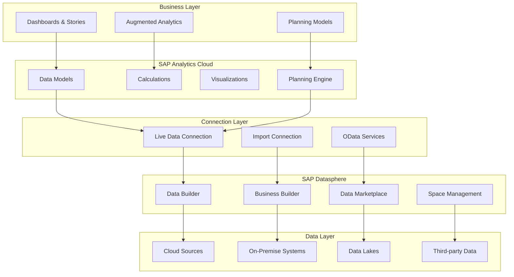

## Introduction

SAP Datasphere and SAP Analytics Cloud form a powerful, integrated analytics ecosystem where Datasphere serves as the intelligent data fabric layer and Analytics Cloud provides world-class visualization, planning, and analytics capabilities. This comprehensive guide explores how to architect, implement, and optimize this integration for maximum business value.

## Architecture Overview

### Integrated Analytics Stack



### Why Datasphere + SAC Together?

| Component | Role | Key Capabilities |
|-----------|------|------------------|
| **SAP Datasphere** | Data Foundation | Data integration, virtualization, modeling, governance, semantic layer |
| **SAP Analytics Cloud** | Analytics & Planning | Visualization, augmented analytics, planning, predictive scenarios |
| **Integration** | Unified Platform | Live data access, single source of truth, governed analytics, seamless UX |

## SAP Datasphere Configuration

### Space Setup and Data Modeling

#### Creating Spaces for Analytics
```sql
-- Space Configuration Script
CREATE SPACE ANALYTICS_PRODUCTION
    WITH MEMORY_ALLOCATION = '256GB'
    DISK_ALLOCATION = '1TB'
    WORKLOAD_CLASS = 'ANALYTICS'
    PRIORITY = 'HIGH';

-- Grant permissions
GRANT SPACE_ADMIN ON SPACE ANALYTICS_PRODUCTION TO USER 'analytics_team';
GRANT DATA_BUILDER ON SPACE ANALYTICS_PRODUCTION TO USER 'data_modelers';
GRANT VIEWER ON SPACE ANALYTICS_PRODUCTION TO USER 'business_users';
```

#### Data Builder - Creating Views for SAC

**Graphical View Example:**
```sql
-- SQL View for Sales Analytics
CREATE VIEW V_SALES_ANALYTICS AS
SELECT 
    -- Time Dimensions
    sd.CalendarYear,
    sd.CalendarQuarter,
    sd.CalendarMonth,
    sd.CalendarWeek,
    sd.CalendarDate,
    
    -- Product Dimensions
    p.ProductID,
    p.ProductName,
    p.ProductCategory,
    p.ProductSubcategory,
    p.ProductBrand,
    
    -- Customer Dimensions  
    c.CustomerID,
    c.CustomerName,
    c.CustomerSegment,
    c.CustomerCountry,
    c.CustomerRegion,
    
    -- Sales Organization
    so.SalesOrg,
    so.DistributionChannel,
    so.Division,
    
    -- Measures
    sf.SalesAmount,
    sf.SalesQuantity,
    sf.CostAmount,
    sf.GrossProfit,
    sf.DiscountAmount,
    
    -- Calculated Measures
    CASE 
        WHEN sf.SalesAmount > 0 
        THEN (sf.GrossProfit / sf.SalesAmount) * 100 
        ELSE 0 
    END AS GrossProfitMargin,
    
    sf.SalesAmount - sf.CostAmount AS NetProfit,
    
    -- Metadata
    sf.CreatedBy,
    sf.CreatedAt,
    sf.ChangedBy,
    sf.ChangedAt
    
FROM SalesFacts sf
INNER JOIN DateDimension sd ON sf.DateID = sd.DateID
INNER JOIN Product p ON sf.ProductID = p.ProductID  
INNER JOIN Customer c ON sf.CustomerID = c.CustomerID
INNER JOIN SalesOrganization so ON sf.SalesOrgID = so.SalesOrgID

WHERE sf.IsDeleted = FALSE
  AND sf.FiscalYear >= YEAR(CURRENT_DATE) - 3

WITH ASSOCIATIONS (
    ASSOCIATION TO Product AS _Product ON $projection.ProductID = _Product.ProductID,
    ASSOCIATION TO Customer AS _Customer ON $projection.CustomerID = _Customer.CustomerID,
    ASSOCIATION TO DateDimension AS _Date ON $projection.CalendarDate = _Date.CalendarDate
);
```

#### Analytic Model Configuration
```json
{
  "analyticModel": {
    "id": "AM_SALES_PERFORMANCE",
    "name": "Sales Performance Analytics",
    "semanticUsage": "ANALYTICAL_DATASET",
    "exposedForConsumption": true,
    "exposedToSAC": true,
    "dataCategory": "CUBE",
    "dimensions": [
      {
        "name": "CalendarDate",
        "dataType": "Date",
        "semanticType": "CALENDAR_DATE",
        "hierarchy": {
          "type": "TIME",
          "levels": ["Year", "Quarter", "Month", "Week", "Day"]
        },
        "defaultMember": "CURRENT_DATE"
      },
      {
        "name": "Product",
        "dataType": "String",
        "semanticType": "PRODUCT",
        "hierarchy": {
          "type": "LEVELED",
          "levels": ["Brand", "Category", "Subcategory", "Product"]
        },
        "attributes": ["ProductName", "ProductID", "ProductCategory"]
      },
      {
        "name": "Customer",
        "dataType": "String",
        "semanticType": "CUSTOMER",
        "hierarchy": {
          "type": "LEVELED",
          "levels": ["Region", "Country", "Segment", "Customer"]
        }
      },
      {
        "name": "SalesOrg",
        "dataType": "String",
        "semanticType": "ORGANIZATION"
      }
    ],
    "measures": [
      {
        "name": "SalesAmount",
        "dataType": "Decimal",
        "aggregation": "SUM",
        "unit": "Currency",
        "semanticType": "AMOUNT"
      },
      {
        "name": "SalesQuantity",
        "dataType": "Integer",
        "aggregation": "SUM",
        "semanticType": "QUANTITY"
      },
      {
        "name": "GrossProfit",
        "dataType": "Decimal",
        "aggregation": "SUM",
        "unit": "Currency"
      },
      {
        "name": "GrossProfitMargin",
        "dataType": "Decimal",
        "aggregation": "CALCULATED",
        "formula": "GrossProfit / SalesAmount * 100",
        "unit": "Percentage"
      }
    ],
    "filters": {
      "mandatory": [],
      "optional": ["CalendarYear", "ProductCategory", "CustomerSegment"]
    },
    "authorization": {
      "enabled": true,
      "restrictionType": "DATA_ACCESS_CONTROL",
      "rules": [
        {
          "role": "SALES_MANAGER",
          "filter": "SalesOrg IN (SELECT SalesOrg FROM UserAssignments WHERE UserID = SESSION_USER)"
        }
      ]
    }
  }
}
```

### Business Builder - Semantic Layer

#### Business Entity Configuration
```yaml
businessEntity:
  name: "Customer360"
  description: "360-degree customer view combining transactional and master data"
  
  attributes:
    - name: "CustomerID"
      label: "Customer Number"
      dataType: "String"
      identifier: true
      
    - name: "CustomerName"
      label: "Customer Name"
      dataType: "String"
      searchable: true
      
    - name: "TotalPurchases"
      label: "Total Purchases (YTD)"
      dataType: "Decimal"
      aggregation: "SUM"
      
    - name: "AverageOrderValue"
      label: "Average Order Value"
      dataType: "Decimal"
      aggregation: "AVG"
      
    - name: "CustomerLifetimeValue"
      label: "Customer Lifetime Value"
      dataType: "Decimal"
      calculation: "SUM(OrderValue) * RetentionRate * AvgLifespan"
      
  associations:
    - target: "SalesOrders"
      cardinality: "1:N"
      joinCondition: "Customer.CustomerID = SalesOrders.CustomerID"
      
    - target: "ServiceTickets"
      cardinality: "1:N"
      joinCondition: "Customer.CustomerID = ServiceTickets.CustomerID"
      
  kpis:
    - name: "ChurnRisk"
      formula: "CASE WHEN DaysSinceLastPurchase > 180 THEN 'High' 
                      WHEN DaysSinceLastPurchase > 90 THEN 'Medium' 
                      ELSE 'Low' END"
      
    - name: "CustomerSegment"
      formula: "CASE WHEN TotalPurchases > 100000 THEN 'Premium'
                      WHEN TotalPurchases > 50000 THEN 'Gold'
                      WHEN TotalPurchases > 10000 THEN 'Silver'
                      ELSE 'Standard' END"
```

### Data Access Controls

#### Implementing Row-Level Security
```sql
-- Create Data Access Control
CREATE DATA ACCESS CONTROL DAC_SALES_BY_REGION
FOR VIEW V_SALES_ANALYTICS
WHERE CustomerRegion IN (
    SELECT AuthorizedRegion 
    FROM UserRegionAssignments 
    WHERE UserEmail = SESSION_CONTEXT('XS_APPLICATIONUSER')
);

-- Create Role-Based Access
CREATE PRIVILEGE SALES_ANALYST_ACCESS
FOR ANALYTICAL_PRIVILEGE
ON ANALYTIC_VIEW AM_SALES_PERFORMANCE
WITH DIMENSION_RESTRICTIONS (
    CustomerRegion: VALUES FROM AUTHORIZATIONS,
    SalesOrg: VALUES FROM AUTHORIZATIONS,
    FiscalYear: >= CURRENT_YEAR - 2
);

-- Assign to Users
GRANT SALES_ANALYST_ACCESS TO USER 'analyst@company.com';
```

## SAP Analytics Cloud Configuration

### Live Connection Setup

#### Establishing Datasphere Connection
```javascript
// Connection Configuration
const datasphereConnection = {
    connectionType: "LIVE",
    dataSource: "SAP_DATASPHERE",
    connectionDetails: {
        host: "datasphere-instance.cloud.sap",
        port: 443,
        https: true,
        space: "ANALYTICS_PRODUCTION",
        authentication: {
            type: "SAML",
            ssoEnabled: true,
            certificateValidation: true
        }
    },
    advancedSettings: {
        enableVariables: true,
        enableHierarchies: true,
        enableCalculations: true,
        maxResultRows: 1000000,
        timeout: 300,
        compressionEnabled: true
    },
    dataPrivacy: {
        dataRegion: "EU",
        dataResidency: "enforced",
        gdprCompliant: true
    }
};

// Create Connection
async function createDatasphereConnection() {
    try {
        const connection = await SACConnections.create({
            name: "Datasphere Production",
            description: "Live connection to Datasphere analytics space",
            ...datasphereConnection
        });
        
        console.log("Connection created:", connection.id);
        
        // Test connection
        const testResult = await connection.test();
        if (testResult.success) {
            console.log("Connection test successful");
            console.log("Available views:", testResult.availableViews);
        }
        
        return connection;
        
    } catch (error) {
        console.error("Connection creation failed:", error);
        throw error;
    }
}
```

### Model Creation from Datasphere

#### Creating Live Data Model
```javascript
class DatasphereModelBuilder {
    
    async createLiveModel(connectionId, datasphereView) {
        const model = {
            name: `${datasphereView.name}_Model`,
            description: `Live model from Datasphere view: ${datasphereView.name}`,
            type: "LIVE",
            connectionId: connectionId,
            
            sourceConfiguration: {
                spaceName: "ANALYTICS_PRODUCTION",
                viewName: datasphereView.technicalName,
                viewType: datasphereView.type // ANALYTICAL_DATASET, DIMENSION, etc.
            },
            
            dimensions: datasphereView.dimensions.map(dim => ({
                id: dim.id,
                name: dim.name,
                dataType: dim.dataType,
                hierarchies: this.mapHierarchies(dim.hierarchies),
                attributes: dim.attributes,
                displayFormat: this.getDisplayFormat(dim)
            })),
            
            measures: datasphereView.measures.map(measure => ({
                id: measure.id,
                name: measure.name,
                dataType: measure.dataType,
                aggregation: measure.aggregationType,
                unit: measure.unit,
                formatting: this.getNumberFormat(measure),
                exception: measure.exceptionAggregation
            })),
            
            calculatedMeasures: this.createCalculations(datasphereView),
            
            filters: {
                mandatory: datasphereView.mandatoryFilters || [],
                default: this.getDefaultFilters(datasphereView)
            },
            
            variables: datasphereView.variables?.map(v => ({
                name: v.name,
                type: v.type,
                defaultValue: v.defaultValue,
                selectionType: v.selectionType
            }))
        };
        
        try {
            const createdModel = await SACModels.create(model);
            console.log("Model created successfully:", createdModel.id);
            
            // Validate model
            await this.validateModel(createdModel.id);
            
            return createdModel;
            
        } catch (error) {
            console.error("Model creation failed:", error);
            throw new ModelCreationError(error.message);
        }
    }
    
    createCalculations(datasphereView) {
        return [
            {
                name: "YoY_Growth",
                formula: "([SalesAmount] - [SalesAmount].PreviousYear) / [SalesAmount].PreviousYear * 100",
                dataType: "Number",
                formatting: {
                    decimalPlaces: 2,
                    unit: "%"
                }
            },
            {
                name: "Running_Total",
                formula: "CUMULATE([SalesAmount], [CalendarDate])",
                dataType: "Number",
                formatting: {
                    decimalPlaces: 2,
                    scale: "Auto"
                }
            },
            {
                name: "Market_Share",
                formula: "[SalesAmount] / TOTAL([SalesAmount], [Product]) * 100",
                dataType: "Number",
                formatting: {
                    decimalPlaces: 1,
                    unit: "%"
                }
            }
        ];
    }
    
    mapHierarchies(datasphereHierarchies) {
        return datasphereHierarchies?.map(hierarchy => ({
            id: hierarchy.id,
            name: hierarchy.name,
            type: hierarchy.type, // PARENT_CHILD, LEVELED, TIME
            levels: hierarchy.levels?.map(level => ({
                name: level.name,
                attribute: level.attribute,
                order: level.order
            })),
            defaultMember: hierarchy.defaultMember
        })) || [];
    }
    
    async validateModel(modelId) {
        const validation = await SACModels.validate(modelId);
        
        if (!validation.isValid) {
            console.error("Model validation errors:", validation.errors);
            throw new ValidationError(validation.errors);
        }
        
        console.log("Model validation successful");
        return validation;
    }
}
```

### Dashboard and Story Development

#### Creating Responsive Dashboard
```javascript
class SACDashboardBuilder {
    
    async createSalesDashboard(modelId) {
        const dashboard = {
            name: "Sales Performance Dashboard",
            description: "Executive sales dashboard with drill-down capabilities",
            type: "DASHBOARD",
            responsive: true,
            
            layout: {
                type: "GRID",
                columns: 12,
                rows: "auto",
                gap: 16
            },
            
            widgets: [
                // KPI Tiles
                this.createKPITile({
                    position: { col: 0, row: 0, width: 3, height: 2 },
                    title: "Total Revenue",
                    measure: "SalesAmount",
                    comparison: {
                        type: "PREVIOUS_YEAR",
                        showVariance: true,
                        showPercentage: true
                    },
                    threshold: {
                        good: 10000000,
                        critical: 8000000
                    }
                }),
                
                this.createKPITile({
                    position: { col: 3, row: 0, width: 3, height: 2 },
                    title: "Gross Profit Margin",
                    measure: "GrossProfitMargin",
                    unit: "%",
                    comparison: {
                        type: "TARGET",
                        targetValue: 35,
                        showVariance: true
                    }
                }),
                
                // Charts
                this.createColumnChart({
                    position: { col: 0, row: 2, width: 6, height: 4 },
                    title: "Revenue by Product Category",
                    dimensions: ["ProductCategory"],
                    measures: ["SalesAmount", "GrossProfit"],
                    sorting: {
                        by: "SalesAmount",
                        order: "DESC"
                    },
                    trendLine: true,
                    dataLabels: true
                }),
                
                this.createTimeSeriesChart({
                    position: { col: 6, row: 2, width: 6, height: 4 },
                    title: "Monthly Revenue Trend",
                    timeDimension: "CalendarMonth",
                    measures: ["SalesAmount"],
                    forecast: {
                        enabled: true,
                        periods: 3,
                        confidence: 0.95
                    },
                    reference Lines: [
                        { value: "AVERAGE", label: "Average" },
                        { value: 9000000, label: "Target" }
                    ]
                }),
                
                this.createGeoMap({
                    position: { col: 0, row: 6, width: 6, height: 4 },
                    title: "Sales by Region",
                    locationDimension: "CustomerCountry",
                    measure: "SalesAmount",
                    bubbleSize: "SalesQuantity",
                    heatmapEnabled: true
                }),
                
                this.createTable({
                    position: { col: 6, row: 6, width: 6, height: 4 },
                    title: "Top Customers",
                    dimensions: ["CustomerName", "CustomerSegment"],
                    measures: ["SalesAmount", "GrossProfit", "OrderCount"],
                    pagination: true,
                    pageSize: 20,
                    exportEnabled: true,
                    conditionalFormatting: this.getConditionalFormattingRules()
                })
            ],
            
            filters: {
                global: ["CalendarYear", "SalesOrg"],
                page: ["ProductCategory", "CustomerSegment"]
            },
            
            interactions: {
                drillDown: true,
                linkedAnalysis: true,
                dynamicFiltering: true
            }
        };
        
        try {
            const createdDashboard = await SACStories.create(dashboard);
            console.log("Dashboard created:", createdDashboard.id);
            
            // Configure auto-refresh
            await this.configureAutoRefresh(createdDashboard.id, 300); // 5 minutes
            
            return createdDashboard;
            
        } catch (error) {
            console.error("Dashboard creation failed:", error);
            throw error;
        }
    }
    
    createKPITile(config) {
        return {
            type: "KPI",
            ...config,
            styling: {
                fontSize: "large",
                trend: {
                    show: true,
                    icon: "arrow",
                    color: "dynamic"
                },
                comparison: {
                    show: true,
                    position: "bottom"
                }
            }
        };
    }
    
    createColumnChart(config) {
        return {
            type: "COLUMN_CHART",
            ...config,
            chartProperties: {
                orientation: "vertical",
                stacking: "none",
                legend: {
                    position: "bottom",
                    visible: true
                },
                valueAxis: {
                    title: "Sales Amount",
                    gridLines: true,
                    scale: "auto"
                },
                categoryAxis: {
                    title: "",
                    labelRotation: -45
                }
            }
        };
    }
    
    createTimeSeriesChart(config) {
        return {
            type: "TIME_SERIES",
            ...config,
            chartProperties: {
                timeGranularity: "month",
                showDataPoints: true,
                smoothing: true,
                zoom: {
                    enabled: true,
                    type: "x"
                }
            }
        };
    }
    
    getConditionalFormattingRules() {
        return [
            {
                measure: "GrossProfit",
                rules: [
                    {
                        condition: "> 500000",
                        formatting: { backgroundColor: "#28a745", fontColor: "#ffffff" }
                    },
                    {
                        condition: "< 100000",
                        formatting: { backgroundColor: "#dc3545", fontColor: "#ffffff" }
                    }
                ]
            }
        ];
    }
    
    async configureAutoRefresh(dashboardId, intervalSeconds) {
        await SACStories.updateSettings(dashboardId, {
            autoRefresh: {
                enabled: true,
                interval: intervalSeconds,
                refreshOnOpen: true
            }
        });
    }
}
```

### Advanced Analytics Features

#### Augmented Analytics Integration
```javascript
class AugmentedAnalyticsIntegration {
    
    async enableSmartInsights(modelId) {
        return {
            smartInsights: {
                enabled: true,
                features: {
                    smartDiscovery: {
                        enabled: true,
                        influences: ["ProductCategory", "CustomerSegment", "SalesOrg"],
                        target: "SalesAmount",
                        maxContributions: 10
                    },
                    smartGrouping: {
                        enabled: true,
                        dimensions: ["Customer", "Product"],
                        threshold: 0.8
                    },
                    timeSeriesForecasting: {
                        enabled: true,
                        measure: "SalesAmount",
                        algorithm: "AUTO",
                        confidence: 95,
                        periods: 12
                    },
                    outlierDetection: {
                        enabled: true,
                        measures: ["SalesAmount", "GrossProfit"],
                        sensitivity: "medium"
                    }
                }
            },
            searchToInsight: {
                enabled: true,
                naturalLanguageQueries: true,
                suggestions: true
            }
        };
    }
    
    async createPredictiveScenario(modelId) {
        const scenario = {
            name: "Revenue Forecast Q1 2026",
            type: "TIME_SERIES_FORECAST",
            
            trainingData: {
                modelId: modelId,
                historicalPeriods: 36, // 3 years
                dimensions: ["CalendarMonth"],
                measure: "SalesAmount",
                influences: [
                    "ProductCategory",
                    "CustomerSegment",
                    "MarketingSpend"
                ]
            },
            
            algorithm: {
                type: "TRIPLE_EXPONENTIAL_SMOOTHING",
                parameters: {
                    seasonality: "MONTHLY",
                    trendDamping: true,
                    confidenceInterval: 0.95
                }
            },
            
            forecast: {
                periods: 3, // 3 months
                startDate: "2026-01-01",
                includeConfidenceBounds: true
            },
            
            validation: {
                method: "CROSS_VALIDATION",
                holdoutPeriods: 6,
                metrics: ["MAPE", "RMSE", "MAE"]
            }
        };
        
        try {
            const createdScenario = await SACPredictive.create(scenario);
            console.log("Predictive scenario created:", createdScenario.id);
            
            // Train model
            const trainingResult = await createdScenario.train();
            console.log("Model accuracy:", trainingResult.accuracy);
            
            return createdScenario;
            
        } catch (error) {
            console.error("Predictive scenario creation failed:", error);
            throw error;
        }
    }
}
```

## Planning Integration

### Planning Model with Datasphere Data

#### Creating Integrated Planning Model
```javascript
class IntegratedPlanningModel {
    
    async createSalesPlanningModel(datasphereModelId) {
        const planningModel = {
            name: "Annual Sales Plan 2026",
            description: "Integrated planning model with Datasphere actuals",
            type: "PLANNING",
            
            dataIntegration: {
                actualsSource: {
                    type: "LIVE_DATA",
                    modelId: datasphereModelId,
                    dimensions: ["Product", "Customer", "SalesOrg", "CalendarMonth"],
                    measures: ["SalesAmount", "SalesQuantity"],
                    version: "ACTUAL"
                },
                planSource: {
                    type: "PLANNING_TABLE",
                    createNew: true
                }
            },
            
            dimensions: [
                {
                    id: "Version",
                    type: "VERSION",
                    members: ["ACTUAL", "PLAN", "FORECAST", "BUDGET"]
                },
                {
                    id: "CalendarMonth",
                    type: "TIME",
                    range: "2024-01 to 2026-12",
                    granularity: "MONTH"
                },
                {
                    id: "Product",
                    type: "DIMENSION",
                    source: "FROM_MODEL",
                    modelId: datasphereModelId,
                    hierarchy: true
                },
                {
                    id: "Customer",
                    type: "DIMENSION",
                    source: "FROM_MODEL",
                    modelId: datasphereModelId
                }
            ],
            
            measures: [
                {
                    id: "PlannedSales",
                    dataType: "Number",
                    aggregation: "SUM",
                    plannable: true,
                    unit: "Currency"
                },
                {
                    id: "ActualSales",
                    dataType: "Number",
                    aggregation: "SUM",
                    plannable: false,
                    formula: "FROM_DATASPHERE([SalesAmount])"
                },
                {
                    id: "Variance",
                    dataType: "Number",
                    aggregation: "CALCULATED",
                    formula: "[PlannedSales] - [ActualSales]"
                },
                {
                    id: "VariancePercent",
                    dataType: "Number",
                    aggregation: "CALCULATED",
                    formula: "([PlannedSales] - [ActualSales]) / [ActualSales] * 100",
                    unit: "%"
                }
            ],
            
            calculations: this.defineCalculations(),
            
            dataActions: this.defineDataActions(),
            
            versionManagement: {
                enabled: true,
                publicVersions: ["ACTUAL", "PLAN"],
                privateVersions: ["FORECAST_USER1", "SCENARIO_A"]
            },
            
            security: {
                dataSecurity: {
                    enabled: true,
                    rules: this.getDataSecurityRules()
                }
            }
        };
        
        try {
            const model = await SACPlanning.createModel(planningModel);
            console.log("Planning model created:", model.id);
            
            // Initialize with actuals
            await this.initializeActuals(model.id, datasphereModelId);
            
            return model;
            
        } catch (error) {
            console.error("Planning model creation failed:", error);
            throw error;
        }
    }
    
    defineCalculations() {
        return [
            {
                name: "GrowthRate",
                formula: "([PlannedSales] / LAG([ActualSales], 12) - 1) * 100",
                scope: "GLOBAL"
            },
            {
                name: "RunningTotal",
                formula: "CUMULATE([PlannedSales], [CalendarMonth])",
                scope: "DIMENSION",
                dimension: "CalendarMonth"
            },
            {
                name: "Allocation",
                formula: "[TotalBudget] * [HistoricalShare]",
                scope: "DATA_ACTION"
            }
        ];
    }
    
    defineDataActions() {
        return [
            {
                name: "AllocateBudget",
                description: "Allocate total budget across products",
                steps: [
                    {
                        type: "CALCULATION",
                        formula: "[HistoricalShare] = [ActualSales] / TOTAL([ActualSales], [Product])"
                    },
                    {
                        type: "COPY",
                        source: "[Allocation]",
                        target: "[PlannedSales]"
                    }
                ],
                parameters: [
                    { name: "TotalBudget", type: "Number" }
                ]
            },
            {
                name: "CopyPreviousYear",
                description: "Copy previous year actuals as plan baseline",
                steps: [
                    {
                        type: "COPY",
                        source: "[ActualSales]",
                        target: "[PlannedSales]",
                        timeSshift: -12,
                        applyGrowth: 0.05 // 5% growth assumption
                    }
                ]
            }
        ];
    }
    
    getDataSecurityRules() {
        return [
            {
                role: "SALES_PLANNER",
                restriction: {
                    dimension: "SalesOrg",
                    filter: "FROM_USER_ATTRIBUTE('AssignedSalesOrgs')"
                }
            },
            {
                role: "PRODUCT_MANAGER",
                restriction: {
                    dimension: "Product",
                    filter: "FROM_USER_ATTRIBUTE('ResponsibleProducts')"
                }
            }
        ];
    }
    
    async initializeActuals(planningModelId, datasphereModelId) {
        await SACPlanning.importData(planningModelId, {
            source: "LIVE_CONNECTION",
            modelId: datasphereModelId,
            mapping: {
                "SalesAmount": "ActualSales",
                "CalendarMonth": "CalendarMonth",
                "Product": "Product",
                "Customer": "Customer"
            },
            filter: {
                "Version": "ACTUAL",
                "CalendarYear": ["2024", "2025"]
            }
        });
    }
}
```

## Security and Governance

### Single Sign-On Configuration

#### SAML Integration
```xml
<!-- SAML Configuration for Datasphere + SAC -->
<EntityDescriptor xmlns="urn:oasis:names:tc:SAML:2.0:metadata">
    <SPSSODescriptor 
        AuthnRequestsSigned="true" 
        WantAssertionsSigned="true"
        protocolSupportEnumeration="urn:oasis:names:tc:SAML:2.0:protocol">
        
        <KeyDescriptor use="signing">
            <KeyInfo xmlns="http://www.w3.org/2000/09/xmldsig#">
                <X509Data>
                    <X509Certificate>MIID...</X509Certificate>
                </X509Data>
            </KeyInfo>
        </KeyDescriptor>
        
        <SingleLogoutService 
            Binding="urn:oasis:names:tc:SAML:2.0:bindings:HTTP-POST"
            Location="https://sac.cloud.sap/logout"/>
        
        <NameIDFormat>urn:oasis:names:tc:SAML:1.1:nameid-format:emailAddress</NameIDFormat>
        
        <AssertionConsumerService 
            Binding="urn:oasis:names:tc:SAML:2.0:bindings:HTTP-POST"
            Location="https://sac.cloud.sap/api/v1/sso/saml"
            index="1"
            isDefault="true"/>
            
        <AttributeConsumingService index="1">
            <ServiceName>SAP Analytics Cloud</ServiceName>
            <RequestedAttribute Name="email" isRequired="true"/>
            <RequestedAttribute Name="firstName" isRequired="true"/>
            <RequestedAttribute Name="lastName" isRequired="true"/>
            <RequestedAttribute Name="groups" isRequired="false"/>
            <RequestedAttribute Name="datasphereSpaces" isRequired="false"/>
        </AttributeConsumingService>
    </SPSSODescriptor>
</EntityDescriptor>
```

### Data Governance Framework

#### Implementing Data Lineage
```python
class DataLineageTracker:
    
    def __init__(self, datasphere_api, sac_api):
        self.datasphere = datasphere_api
        self.sac = sac_api
        self.lineage_graph = nx.DiGraph()
    
    def track_end_to_end_lineage(self, sac_story_id):
        """Track complete data lineage from source to dashboard"""
        
        # Get SAC story dependencies
        story = self.sac.get_story(sac_story_id)
        models = story.get_connected_models()
        
        lineage = {
            'story': {
                'id': story.id,
                'name': story.name,
                'type': 'DASHBOARD'
            },
            'models': [],
            'datasphere_views': [],
            'source_systems': []
        }
        
        for model in models:
            # Track model lineage
            model_lineage = self.track_model_lineage(model.id)
            lineage['models'].append(model_lineage)
            
            # Get Datasphere views
            if model.connection_type == 'LIVE':
                ds_views = self.get_datasphere_views(model.connection_id)
                
                for view in ds_views:
                    view_lineage = self.track_datasphere_view(view.id)
                    lineage['datasphere_views'].append(view_lineage)
                    
                    # Track to source systems
                    sources = self.get_source_systems(view.id)
                    lineage['source_systems'].extend(sources)
        
        # Build lineage graph
        self.build_lineage_graph(lineage)
        
        return lineage
    
    def track_datasphere_view(self, view_id):
        """Track Datasphere view dependencies"""
        
        view = self.datasphere.get_view(view_id)
        
        return {
            'id': view.id,
            'name': view.name,
            'type': view.type,
            'space': view.space,
            'dependencies': {
                'tables': view.get_source_tables(),
                'views': view.get_source_views(),
                'connections': view.get_remote_connections()
            },
            'transformations': self.extract_transformations(view),
            'last_refresh': view.last_refresh_time,
            'data_volume': view.row_count
        }
    
    def extract_transformations(self, view):
        """Extract transformation logic from view"""
        
        transformations = []
        
        if view.has_sql():
            transformations.append({
                'type': 'SQL',
                'logic': view.get_sql(),
                'operations': self.parse_sql_operations(view.get_sql())
            })
        
        if view.has_calculated_columns():
            for calc in view.get_calculated_columns():
                transformations.append({
                    'type': 'CALCULATED_COLUMN',
                    'name': calc.name,
                    'formula': calc.formula
                })
        
        return transformations
    
    def generate_lineage_report(self, lineage):
        """Generate comprehensive lineage documentation"""
        
        report = {
            'summary': {
                'total_layers': 4,
                'dashboards': len([lineage['story']]),
                'models': len(lineage['models']),
                'datasphere_views': len(lineage['datasphere_views']),
                'source_systems': len(set([s['system'] for s in lineage['source_systems']]))
            },
            'data_flow': self.visualize_data_flow(lineage),
            'transformation_inventory': self.inventory_transformations(lineage),
            'dependencies': self.map_dependencies(lineage),
            'impact_analysis': self.perform_impact_analysis(lineage)
        }
        
        return report
```

## Performance Optimization

### Query Performance Tuning

#### Datasphere Optimization
```sql
-- Create Optimized View with Materialization
CREATE VIEW V_SALES_ANALYTICS_OPTIMIZED AS
SELECT 
    /* Selective column projection */
    CalendarYear,
    CalendarMonth,
    ProductCategory,
    CustomerSegment,
    SUM(SalesAmount) AS TotalSales,
    SUM(GrossProfit) AS TotalProfit,
    COUNT(DISTINCT OrderID) AS OrderCount
FROM SalesFacts
WHERE FiscalYear >= YEAR(CURRENT_DATE) - 2
GROUP BY 
    CalendarYear,
    CalendarMonth,
    ProductCategory,
    CustomerSegment

/* Enable materialization for performance */
WITH MATERIALIZED_VIEW (
    REFRESH_MODE = 'AUTO',
    REFRESH_SCHEDULE = 'DAILY 02:00',
    ENABLE_QUERY_REWRITE = TRUE
);

-- Create indexes for common filter patterns
CREATE INDEX IDX_SALES_DATE ON SalesFacts(CalendarDate);
CREATE INDEX IDX_SALES_PRODUCT ON SalesFacts(ProductID, CalendarDate);
CREATE INDEX IDX_SALES_CUSTOMER ON SalesFacts(CustomerID, CalendarDate);
```

#### SAC Model Optimization
```javascript
class PerformanceOptimizer {
    
    async optimizeModel(modelId) {
        const optimizations = {
            // Enable result caching
            caching: {
                enabled: true,
                duration: 3600, // 1 hour
                strategy: "AGGRESSIVE"
            },
            
            // Optimize dimensions
            dimensions: {
                indexing: true,
                compressionEnabled: true,
                hierarchyOptimization: true
            },
            
            // Query optimization
            queries: {
                predefinedFilters: [
                    { dimension: "CalendarYear", value: "CURRENT_YEAR" },
                    { dimension: "Version", value: "ACTUAL" }
                ],
                resultSizeLimit: 100000,
                timeoutSeconds: 60
            },
            
            // Data reduction
            dataReduction: {
                aggregationLevel: "MONTH", // Pre-aggregate to monthly
                retentionPeriod: 36, // Keep 3 years
                archiveOlderData: true
            }
        };
        
        await SACModels.applyOptimizations(modelId, optimizations);
        
        // Monitor performance
        const metrics = await this.monitorPerformance(modelId);
        console.log("Performance metrics:", metrics);
        
        return metrics;
    }
    
    async monitorPerformance(modelId) {
        return {
            avgQueryTime: await SACModels.getAvgQueryTime(modelId),
            cacheHitRate: await SACModels.getCacheHitRate(modelId),
            dataVolume: await SACModels.getDataVolume(modelId),
            userConcurrency: await SACModels.getConcurrentUsers(modelId)
        };
    }
}
```

## Best Practices and Patterns

### Architecture Patterns

#### Layered Data Architecture
```yaml
architecture:
  layer1_raw:
    location: "Datasphere"
    purpose: "Raw data ingestion"
    components:
      - Remote tables from source systems
      - Data replication flows
      - Initial data quality checks
    refresh: "Real-time / Near real-time"
    
  layer2_harmonized:
    location: "Datasphere"
    purpose: "Data harmonization and standardization"
    components:
      - Graphical views with joins
      - Data transformations
      - Business rules application
    refresh: "Scheduled / On-demand"
    
  layer3_analytical:
    location: "Datasphere"
    purpose: "Analytical data models"
    components:
      - Analytic models
      - Calculated measures
      - Hierarchies and associations
    refresh: "Scheduled"
    exposed_to_sac: true
    
  layer4_consumption:
    location: "SAC"
    purpose: "Business user consumption"
    components:
      - Live data models
      - Dashboards and stories
      - Planning models
    user_facing: true
```

### Development Lifecycle

#### CI/CD for Datasphere + SAC
```yaml
# .gitlab-ci.yml
stages:
  - validate
  - deploy_datasphere
  - test_datasphere
  - deploy_sac
  - test_sac
  - promote

validate_datasphere:
  stage: validate
  script:
    - python scripts/validate_datasphere_views.py
    - python scripts/check_dependencies.py
    
deploy_datasphere_dev:
  stage: deploy_datasphere
  environment: development
  script:
    - datasphere-cli deploy --space DEV --artifacts datasphere/
    - datasphere-cli test-connection --space DEV
    
test_datasphere_dev:
  stage: test_datasphere
  script:
    - python tests/test_view_results.py --env DEV
    - python tests/test_performance.py --env DEV
    
deploy_sac_dev:
  stage: deploy_sac
  environment: development
  script:
    - sac-cli import-model --file sac/models/sales_model.json
    - sac-cli import-story --file sac/stories/dashboard.json
    
test_sac_dev:
  stage: test_sac
  script:
    - python tests/test_sac_stories.py --env DEV
    - python tests/validate_calculations.py
    
promote_to_prod:
  stage: promote
  when: manual
  environment: production
  script:
    - ./scripts/promote_to_production.sh
```

## Troubleshooting Guide

### Common Issues and Solutions

#### Connection Issues
```javascript
class TroubleshootingGuide {
    
    async diagnoseConnectionIssues(connectionId) {
        const diagnostics = {
            connectionTest: null,
            networkConnectivity: null,
            authentication: null,
            authorization: null,
            recommendations: []
        };
        
        // Test connection
        try {
            diagnostics.connectionTest = await this.testConnection(connectionId);
        } catch (error) {
            diagnostics.recommendations.push(
                "Connection test failed. Check network connectivity and credentials."
            );
        }
        
        // Check network
        diagnostics.networkConnectivity = await this.checkNetworkPath(connectionId);
        if (!diagnostics.networkConnectivity.accessible) {
            diagnostics.recommendations.push(
                "Datasphere endpoint not accessible. Verify firewall rules and allowlist."
            );
        }
        
        // Verify authentication
        diagnostics.authentication = await this.verifyAuthentication(connectionId);
        if (!diagnostics.authentication.valid) {
            diagnostics.recommendations.push(
                "Authentication failed. Verify SAML configuration and user mappings."
            );
        }
        
        // Check authorizations
        diagnostics.authorization = await this.checkAuthorizations(connectionId);
        if (!diagnostics.authorization.sufficient) {
            diagnostics.recommendations.push(
                `User missing required authorizations: ${diagnostics.authorization.missing.join(', ')}`
            );
        }
        
        return diagnostics;
    }
    
    async diagnosePerformanceIssues(modelId) {
        const analysis = {
            queryPerformance: await this.analyzeQueryPerformance(modelId),
            dataVolume: await this.checkDataVolume(modelId),
            modelComplexity: await this.assessModelComplexity(modelId),
            recommendations: []
        };
        
        if (analysis.queryPerformance.avgTime > 10000) {
            analysis.recommendations.push(
                "Queries taking >10s. Consider: 1) Enabling materialization in Datasphere, 2) Adding filters, 3) Reducing date range"
            );
        }
        
        if (analysis.dataVolume.rows > 10000000) {
            analysis.recommendations.push(
                "Large data volume detected. Consider: 1) Aggregating data in Datasphere, 2) Implementing data reduction, 3) Using  import connection for historical data"
            );
        }
        
        if (analysis.modelComplexity.calculatedMeasures > 20) {
            analysis.recommendations.push(
                "High number of calculated measures. Consider: 1) Moving calculations to Datasphere, 2) Simplifying formulas, 3) Pre-calculating in data layer"
            );
        }
        
        return analysis;
    }
}
```

## Conclusion

The integration of SAP Datasphere and SAP Analytics Cloud creates a powerful, unified analytics platform that combines enterprise-grade data management with world-class analytics and planning capabilities. Success with this integration requires:

1. **Proper Architecture**: Implement layered data architecture with clear separation of concerns
2. **Optimized Data Models**: Design efficient Datasphere views and SAC models
3. **Security & Governance**: Implement comprehensive security and maintain data lineage
4. **Performance Tuning**: Optimize queries, enable caching, and monitor performance
5. **User Adoption**: Create intuitive dashboards and provide adequate training

By following the patterns and best practices outlined in this guide, organizations can build a robust, scalable analytics ecosystem that delivers real-time insights and supports collaborative planning across the enterprise.

---

*Ready to implement Datasphere + SAC integration? Contact Varnika IT Consulting for expert architecture design, implementation services, and best practice guidance tailored to your analytics requirements.*
