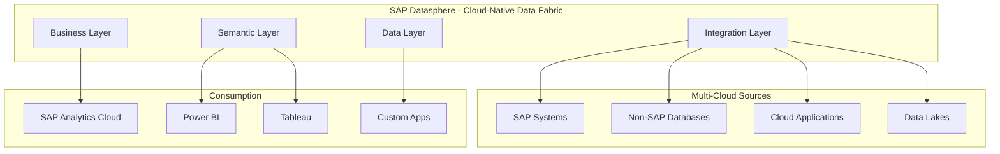
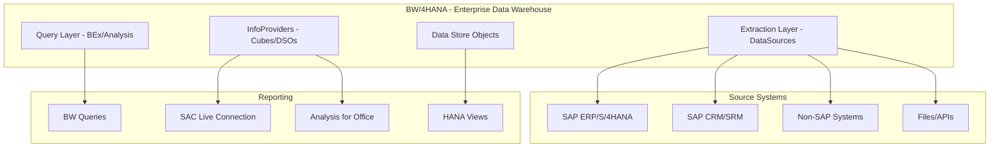
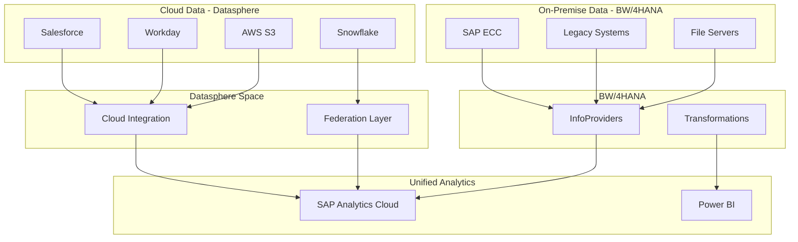

## Introduction

Organizations embarking on data warehouse modernization face a critical decision: SAP Datasphere (cloud-native data fabric) or SAP BW/4HANA (next-generation on-premise/cloud data warehouse). This comprehensive comparison provides the architectural insights, feature analysis, and decision frameworks needed to make the right choice for your enterprise.

## Executive Summary

| Aspect | SAP Datasphere | SAP BW/4HANA |
|--------|----------------|--------------|
| **Deployment** | Cloud-only (SaaS) | On-premise, private cloud, or public cloud |
| **Primary Use Case** | Data fabric, federation, agile analytics | Enterprise data warehouse, complex transformations |
| **Architecture** | Multi-cloud, virtualization-first | HANA-optimized, persistence-focused |
| **Data Modeling** | Graphical, business-user friendly | InfoProviders, advanced DSOs, ADSOs |
| **Integration** | Cloud-native, APIs, pre-built connectors | Classic extractors, ABAP-based, extensive SAP integration |
| **Total Cost** | Subscription-based, lower upfront | License + infrastructure, higher upfront |
| **Time to Value** | Weeks to months | Months to year+ |
| **Target Audience** | Business users, citizen integrators, analysts | IT teams, data engineers, BI developers |

**Key Insight**: These are not mutually exclusive - many organizations use both in complementary roles.

## Architecture Comparison

### SAP Datasphere Architecture



**Key Characteristics:**
- **Virtualization-first**: Data federation without mandatory replication
- **Space-based isolation**: Multi-tenancy with data isolation
- **Cloud-native**: Auto-scaling, managed infrastructure
- **Semantic richness**: Business entities, relationships, hierarchies

### BW/4HANA Architecture



**Key Characteristics:**
- **Persistence-focused**: ETL paradigm with data storage
- **HANA-optimized**: In-memory computing, column store
- **Process chains**: Sophisticated orchestration and scheduling
- **Mature ecosystem**: Decades of enterprise patterns

## Detailed Feature Comparison

### Data Integration Capabilities

#### SAP Datasphere

**Strengths:**
- Pre-built connectors to 100+ cloud and on-premise sources
- Real-time data federation (virtual access)
- Change Data Capture (CDC) for efficient replication
- Self-service data ingestion for business users

**Example: Cloud Connector Configuration**
```json
{
  "connection": {
    "name": "S4HANA_Production",
    "type": "SAP_ABAP",
    "cloudConnector": true,
    "configuration": {
      "host": "s4hana-prod.company.com",
      "systemNumber": "00",
      "client": "100",
      "authentication": "BASIC",
      "credentials": {
        "username": "${secure.username}",
        "password": "${secure.password}"
      }
    },
    "virtualAccess": {
      "enabled": true,
      "tables": ["VBAK", "VBAP", "KNA1", "MARA"],
      "cdsViews": ["I_SalesDocument", "I_Customer"]
    },
    "replication": {
      "enabled": true,
      "mode": "CDC",
      "schedule": "REAL_TIME",
      "tables": ["BSEG", "BKPF"]
    }
  }
}
```

#### BW/4HANA

**Strengths:**
- Native SAP extractors (thousands of pre-built DataSources)
- Delta mechanisms for all SAP modules
- Complex transformation capabilities with ABAP
- Proven reliability for high-volume batch loads

**Example: Classic DataSource Configuration**
```abap
*&---------------------------------------------------------------------*
*& DataSource Enhancement for Custom Sales Data
*&---------------------------------------------------------------------*
ENHANCEMENT 1  ZXRSAU01.
  DATA: ls_sales_data TYPE zsd_sales_struct.
  
  CASE i_datasource.
    WHEN 'ZSD_SALES_001'.
      " Custom transformation logic
      LOOP AT c_t_data INTO ls_sales_data.
        
        " Calculate derived fields
        ls_sales_data-gross_margin = 
          ( ls_sales_data-sales_amount - ls_sales_data-cost_amount ) /
          ls_sales_data-sales_amount * 100.
        
        " Apply business rules
        IF ls_sales_data-sales_amount > 100000.
          ls_sales_data-customer_segment = 'PREMIUM'.
        ELSEIF ls_sales_data-sales_amount > 50000.
          ls_sales_data-customer_segment = 'GOLD'.
        ELSE.
          ls_sales_data-customer_segment = 'STANDARD'.
        ENDIF.
        
        " Enrich with master data
        SELECT SINGLE region country
          FROM kna1
          INTO (ls_sales_data-region, ls_sales_data-country)
          WHERE kunnr = ls_sales_data-customer.
        
        MODIFY c_t_data FROM ls_sales_data.
      ENDLOOP.
  ENDCASE.
ENDENHANCEMENT.
```

**Comparison Matrix:**

| Feature | Datasphere | BW/4HANA | Winner |
|---------|------------|----------|---------|
| Cloud source connectivity | ⭐⭐⭐⭐⭐ | ⭐⭐⭐ | Datasphere |
| SAP native extractors | ⭐⭐⭐ | ⭐⭐⭐⭐⭐ | BW/4HANA |
| Real-time streaming | ⭐⭐⭐⭐ | ⭐⭐⭐ | Datasphere |
| Complex transformations | ⭐⭐⭐ | ⭐⭐⭐⭐⭐ | BW/4HANA |
| Self-service integration | ⭐⭐⭐⭐⭐ | ⭐⭐ | Datasphere |
| Batch processing scale | ⭐⭐⭐⭐ | ⭐⭐⭐⭐⭐ | BW/4HANA |

### Data Modeling

#### SAP Datasphere: Graphical Data Builder

```sql
-- Datasphere View Example (SQL-like with associations)
CREATE VIEW V_SALES_ORDERS AS
SELECT
    -- Dimensions
    o.OrderID,
    o.OrderDate,
    o.CustomerID,
    c.CustomerName,
    c.Region,
    p.ProductID,
    p.ProductName,
    p.Category,
    
    -- Measures
    SUM(oi.Quantity) AS TotalQuantity,
    SUM(oi.NetAmount) AS TotalAmount,
    SUM(oi.NetAmount - oi.CostAmount) AS GrossProfit,
    
    -- Calculated fields
    CASE 
        WHEN SUM(oi.NetAmount) > 0 
        THEN (SUM(oi.NetAmount - oi.CostAmount) / SUM(oi.NetAmount)) * 100
        ELSE 0
    END AS ProfitMargin

FROM Orders o
INNER JOIN OrderItems oi ON o.OrderID = oi.OrderID
LEFT JOIN Customers c ON o.CustomerID = c.CustomerID
LEFT JOIN Products p ON oi.ProductID = p.ProductID

GROUP BY
    o.OrderID, o.OrderDate, o.CustomerID,
    c.CustomerName, c.Region,
    p.ProductID, p.ProductName, p.Category

-- Associations for drill-down
WITH ASSOCIATIONS (
    TO Customers AS _Customer ON $projection.CustomerID = _Customer.CustomerID,
    TO Products AS _Product ON $projection.ProductID = _Product.ProductID
);
```

**Datasphere Modeling Features:**
- Visual drag-and-drop interface
- Automatic join recommendations
- Built-in data quality checks
- Time-dimension intelligence
- Hierarchy management

#### BW/4HANA: Advanced DSO & CompositeProvider

```abap
*&---------------------------------------------------------------------*
*& Advanced DSO Configuration
*&---------------------------------------------------------------------*

" aDSO: ZSD_SALES_ORDERS
TYPES: BEGIN OF ty_sales_order,
         order_id         TYPE zorder_id,
         order_date       TYPE dats,
         customer_id      TYPE zkunnr,
         sales_amount     TYPE zcurrency,
         cost_amount      TYPE zcurrency,
         quantity         TYPE zmenge,
         change_type      TYPE rsaot_change_type,
         request_id       TYPE rsrequest,
         record_timestamp TYPE timestamp,
       END OF ty_sales_order.

" Activation logic with field-based delta
CLASS lcl_adso_activation DEFINITION.
  PUBLIC SECTION.
    METHODS activate_data
      IMPORTING
        it_inbound_data TYPE STANDARD TABLE OF ty_sales_order
      EXPORTING
        et_active_data  TYPE STANDARD TABLE OF ty_sales_order
        et_changelog    TYPE STANDARD TABLE OF ty_sales_order.
ENDCLASS.

CLASS lcl_adso_activation IMPLEMENTATION.
  METHOD activate_data.
    DATA: lt_existing TYPE STANDARD TABLE OF ty_sales_order,
          ls_inbound  TYPE ty_sales_order,
          ls_active   TYPE ty_sales_order,
          ls_change   TYPE ty_sales_order.
    
    " Read existing active data
    SELECT * FROM zsd_sales_orders_active
      FOR ALL ENTRIES IN it_inbound_data
      WHERE order_id = it_inbound_data-order_id
      INTO TABLE lt_existing.
    
    LOOP AT it_inbound_data INTO ls_inbound.
      " Check if record exists
      READ TABLE lt_existing INTO ls_active
        WITH KEY order_id = ls_inbound-order_id.
      
      IF sy-subrc = 0.
        " Update logic with field-level delta
        IF ls_inbound-sales_amount NE ls_active-sales_amount OR
           ls_inbound-quantity NE ls_active-quantity.
          
          " Create changelog entry
          ls_change = ls_active.
          ls_change-change_type = 'B'. " Before image
          APPEND ls_change TO et_changelog.
          
          " Update active data
          MOVE-CORRESPONDING ls_inbound TO ls_active.
          ls_active-record_timestamp = sy-datum && sy-uzeit.
          MODIFY et_active_data FROM ls_active.
          
          " After image
          ls_change = ls_active.
          ls_change-change_type = 'A'.
          APPEND ls_change TO et_changelog.
        ENDIF.
      ELSE.
        " New record
        ls_active = ls_inbound.
        ls_active-change_type = 'N'.
        ls_active-record_timestamp = sy-datum && sy-uzeit.
        APPEND ls_active TO et_active_data.
      ENDIF.
    ENDLOOP.
  ENDMETHOD.
ENDCLASS.
```

**BW/4HANA Modeling Features:**
- Advanced DSO (aDSO) with delta capabilities
- CompositeProviders for on-the-fly joins
- Open ODS views for external data access
- HANA calculation views integration
- Complex hierarchies and time-dependency

**Modeling Comparison:**

| Capability | Datasphere | BW/4HANA | Best For |
|------------|------------|----------|----------|
| Ease of use | ⭐⭐⭐⭐⭐ | ⭐⭐⭐ | Business users: Datasphere |
| Transformation complexity | ⭐⭐⭐ | ⭐⭐⭐⭐⭐ | Complex logic: BW/4HANA |
| Slowly changing dimensions | ⭐⭐⭐⭐ | ⭐⭐⭐⭐⭐ | Historical tracking: BW/4HANA |
| Federation/virtualization | ⭐⭐⭐⭐⭐ | ⭐⭐⭐ | Real-time access: Datasphere |
| Data lineage | ⭐⭐⭐⭐⭐ | ⭐⭐⭐⭐ | Governance: Datasphere |
| Performance optimization | ⭐⭐⭐⭐ | ⭐⭐⭐⭐⭐ | Large volumes: BW/4HANA |

### Analytics and Reporting

#### SAP Datasphere Analytics

```javascript
// SAC Story with Datasphere Live Connection
class DatasphereAnalytics {
    
    async createExecutiveDashboard(datasphereSpace) {
        const story = {
            name: "Executive Sales Dashboard",
            pages: [
                {
                    name: "Overview",
                    widgets: [
                        {
                            type: "KPI",
                            dataSource: {
                                space: datasphereSpace,
                                view: "V_SALES_PERFORMANCE",
                                measure: "TotalRevenue",
                                dimension: "FiscalYear"
                            },
                            comparison: {
                                type: "PREVIOUS_PERIOD",
                                showTrend: true
                            }
                        },
                        {
                            type: "CHART",
                            chartType: "Column",
                            dataBinding: {
                                dimensions: ["ProductCategory"],
                                measures: ["Revenue", "Profit"],
                                filters: {
                                    FiscalYear: "CURRENT"
                                }
                            },
                            drillDown: {
                                enabled: true,
                                path: ["ProductCategory", "Product", "SKU"]
                            }
                        }
                    ]
                }
            ],
            features: {
                smartInsights: true,
                collaboration: true,
                mobileOptimized: true,
                autoRefresh: 300 // 5 minutes
            }
        };
        
        return await SACStories.create(story);
    }
}
```

#### BW/4HANA Analytics

```abap
*&---------------------------------------------------------------------*
*& BEx Query Definition
*&---------------------------------------------------------------------*
QUERY ZSALES_ANALYSIS
  FOR INFOPROVIDER ZSALES_CUBE
  
  " Free characteristics
  ROWS:
    0FISCYEAR    AS 'Fiscal Year'
    0FISCPER     AS 'Fiscal Period'
    0PROD_CAT    AS 'Product Category'
    0CUSTOMER    AS 'Customer'
    0SALESORG    AS 'Sales Organization'
  
  " Key figures
  COLUMNS:
    ZREV         AS 'Revenue'
      CALCULATED AS 0NETVAL
      PROPERTIES (
        CURRENCY = 0CURRENCY,
        AGGREGATION = SUM,
        EXCEPTION_AGG = MAX
      )
    
    ZPROFIT      AS 'Gross Profit'
      CALCULATED AS 0NETVAL - 0COSTVAL
    
    ZMARGIN      AS 'Profit Margin %'
      FORMULA = (ZPROFIT / ZREV) * 100
      PROPERTIES (
        DECIMALS = 2,
        UNIT = '%'
      )
    
    ZYOY_GROWTH  AS 'YoY Growth %'
      FORMULA = ((ZREV - ZREV.OFFSET(0FISCYEAR,-1)) / ZREV.OFFSET(0FISCYEAR,-1)) * 100
  
  " Variables
  VARIABLES:
    VAR_FISCYEAR  TYPE SINGLE_VALUE
      FOR 0FISCYEAR
      DEFAULT = CURRENT_YEAR
      MANDATORY
    
    VAR_SALESORG  TYPE MULTIPLE_VALUES
      FOR 0SALESORG
      AUTHORIZATION_RELEVANT
  
  " Filters
  FILTER:
    0RECORDMODE = 'F'  " Only active records
  
  " Properties
  PROPERTIES:
    ZERO_SUPPRESSION = ACTIVE
    RESULT_VISIBILITY = ALWAYS
    DRILL_DOWN_BY = HIERARCHY
    
END QUERY.
```

**Analytics Comparison:**

| Aspect | Datasphere | BW/4HANA | Notes |
|--------|------------|----------|-------|
| Primary tool | SAP Analytics Cloud | BEx, SAC, Analysis for Office | Datasphere: cloud-only |
| Query performance | ⭐⭐⭐⭐ | ⭐⭐⭐⭐⭐ | BW/4HANA: better for complex calculations |
| Ad-hoc analysis | ⭐⭐⭐⭐⭐ | ⭐⭐⭐⭐ | Datasphere: more user-friendly |
| Augmented analytics | ⭐⭐⭐⭐⭐ | ⭐⭐⭐ | Datasphere: built-in ML |
| Excel integration | ⭐⭐⭐ | ⭐⭐⭐⭐⭐ | BW/4HANA: Analysis for Office |
| Planning integration | ⭐⭐⭐⭐⭐ | ⭐⭐⭐⭐ | Both support SAC Planning |

### Security and Governance

#### Datasphere Security Model

```json
{
  "spaceConfiguration": {
    "spaceName": "ANALYTICS_PROD",
    "security": {
      "dataAccessControl": {
        "enabled": true,
        "rules": [
          {
            "name": "Regional_Access",
            "type": "ROW_LEVEL",
            "criteria": {
              "dimension": "SalesRegion",
              "operator": "IN",
              "values": "FROM_USER_ATTRIBUTE('AuthorizedRegions')"
            }
          },
          {
            "name": "Confidential_Data_Masking",
            "type": "COLUMN_LEVEL",
            "criteria": {
              "columns": ["CustomerEmail", "CustomerPhone"],
              "maskingType": "HASH",
              "exemptRoles": ["DATA_PROTECTION_OFFICER"]
            }
          }
        ]
      },
      "objectPermissions": {
        "tables": {
          "defaultAccess": "NONE",
          "grants": [
            {
              "role": "ANALYST",
              "permissions": ["READ"]
            },
            {
              "role": "DATA_BUILDER",
              "permissions": ["READ", "WRITE", "CREATE"]
            }
          ]
        },
        "views": {
          "inheritFromSource": true,
          "additionalRestrictions": []
        }
      },
      "auditLogging": {
        "enabled": true,
        "events": ["DATA_ACCESS", "SCHEMA_CHANGES", "PERMISSION_CHANGES"],
        "retentionDays": 90
      }
    }
  }
}
```

#### BW/4HANA Security Model

```abap
*&---------------------------------------------------------------------*
*& Analysis Authorization
*&---------------------------------------------------------------------*

AUTHORIZATION_OBJECT ZAUTH_SALES
  " Characteristic restrictions
  0FISCYEAR:
    AUTHORIZATION_VALUE = '2024' TO '2025'
  
  0SALESORG:
    AUTHORIZATION_VALUE = '1000', '2000', '3000'
    READ_FROM_INFOPROVIDER = 'ZUSORG_MASTER'
    
  0CUSTOMER:
    AUTHORIZATION_VARIABLE = 'VAR_AUTH_CUSTOMERS'
    HIERARCHY_AUTH = '0CUST_HIER/NODE_1000'
    
  0PROD_CAT:
    AUTHORIZATION_VALUE = '*'  " All categories
    EXCEPT = 'CONFIDENTIAL'
  
  " Authorization level
  ACTIVITY:
    DISPLAY = 'X'
    CHANGE = ' '
    
  " Restrictions
  RESTRICTIONS:
    " Row-level security
    CUSTOM_EXIT = 'ZAUTH_SALES_EXIT'
    
    " Field-level security  
    FIELD_AUTHORIZATION:
      0COSTVAL = ROLE_CHECK('Z_COST_VIEWER')
      0MARGIN = ROLE_CHECK('Z_MARGIN_VIEWER')

END AUTHORIZATION.

*&---------------------------------------------------------------------*
*& Custom Authorization Exit
*&---------------------------------------------------------------------*
CLASS lcl_auth_exit IMPLEMENTATION.
  METHOD if_rsa_auth_exit~execute.
    DATA: lt_auth_values TYPE TABLE OF rsec_auth_value.
    
    " Get user's authorized sales organizations from HR
    SELECT salesorg FROM pa0001
      INTO TABLE lt_auth_values
      WHERE pernr IN (SELECT pernr FROM usr21
                      WHERE bname = sy-uname).
    
    " Return authorization values
    ct_auth_values = lt_auth_values.
  ENDMETHOD.
ENDCLASS.
```

**Security Comparison:**

| Feature | Datasphere | BW/4HANA | Winner |
|---------|------------|----------|---------|
| Row-level security | ⭐⭐⭐⭐⭐ | ⭐⭐⭐⭐⭐ | Tie |
| Column-level masking | ⭐⭐⭐⭐⭐ | ⭐⭐⭐⭐ | Datasphere |
| Attribute-based access | ⭐⭐⭐⭐⭐ | ⭐⭐⭐⭐⭐ | Tie |
| Audit capabilities | ⭐⭐⭐⭐⭐ | ⭐⭐⭐⭐ | Datasphere |
| Hierarchy authorization | ⭐⭐⭐⭐ | ⭐⭐⭐⭐⭐ | BW/4HANA |
| Custom auth exits | ⭐⭐⭐ | ⭐⭐⭐⭐⭐ | BW/4HANA |

## Use Case Analysis

### When to Choose SAP Datasphere

#### Ideal Scenarios:

1. **Cloud-First Strategy**
   - Organization committed to cloud transformation
   - Minimal on-premise infrastructure
   - SaaS application ecosystem

2. **Agile Analytics Requirements**
   - Fast time-to-value needed
   - Self-service analytics culture
   - Business user empowerment

3. **Multi-Cloud Data Integration**
   - Data across AWS, Azure, GCP
   - Hybrid cloud architecture
   - Need for data federation

4. **Modern Data Fabric**
   - Data virtualization priority
   - Minimize data movement
   - Real-time access requirements

**Example Architecture:**
```yaml
datasphere_use_case:
  company: "Global Retail Chain"
  scenario: "Unified customer analytics"
  
  data_sources:
    - SAP S/4HANA Cloud (ERP)
    - Salesforce (CRM)
    - Shopify (E-commerce)
    - Google Analytics (Web)
    - Snowflake (Data Lake)
  
  implementation:
    approach: "Federation + selective replication"
    timeline: "8 weeks"
    
    phases:
      - Connect cloud sources (Week 1-2)
      - Build semantic layer (Week 3-4)
      - Create SAC dashboards (Week 5-6)
      - User training & rollout (Week 7-8)
    
    results:
      - 360° customer view
      - Real-time inventory visibility
      - Reduced TCO by 40% vs traditional DW
```

### When to Choose BW/4HANA

#### Ideal Scenarios:

1. **Complex SAP Landscapes**
   - Multiple SAP ERP systems
   - Heavy reliance on standard SAP extractors
   - Complex consolidation requirements

2. **Enterprise Data Warehouse**
   - Centralized, single source of truth
   - Historical data retention (10+ years)
   - Complex transformation logic

3. **Regulatory Compliance**
   - Strict data residency requirements
   - Audit trail mandates
   - On-premise preference

4. **High-Volume Processing**
   - Billions of records
   - Complex aggregations
   - Batch processing windows

**Example Architecture:**
```yaml
bw4hana_use_case:
  company: "Manufacturing Conglomerate"
  scenario: "Global financial consolidation"
  
  data_sources:
    - 15x SAP ECC systems (divisions)
    - 3x S/4HANA systems (new acquisitions)
    - Non-SAP: Hyperion, TM1
  
  implementation:
    approach: "Persistent data warehouse"
    timeline: "12 months"
    
    phases:
      - Infrastructure setup (Month 1-2)
      - DataSource development (Month 3-6)
      - Modeling & transformations (Month 7-9)
      - Testing & validation (Month 10-11)
      - Production cutover (Month 12)
    
    results:
      - Consolidated P&L across 50 countries
      - Support for 500+ BEx queries
      - 99.9% data quality
      - Audit-compliant reporting
```

## Migration Strategies

### From BW/4HANA to Datasphere

#### Assessment Framework
```python
class MigrationAssessment:
    
    def analyze_bw_landscape(self, bw_system):
        """Assess BW/4HANA landscape for Datasphere migration"""
        
        analysis = {
            'metadata': self.extract_metadata(bw_system),
            'complexity': self.assess_complexity(bw_system),
            'dependencies': self.map_dependencies(bw_system),
            'recommendation': None
        }
        
        # Analyze InfoProviders
        infoproviders = bw_system.get_infoproviders()
        analysis['metadata']['infoproviders'] = {
            'total': len(infoproviders),
            'by_type': self.categorize_by_type(infoproviders),
            'by_complexity': self.categorize_by_complexity(infoproviders)
        }
        
        # Analyze transformations
        transformations = bw_system.get_transformations()
        analysis['metadata']['transformations'] = {
            'total': len(transformations),
            'with_abap': sum(1 for t in transformations if t.has_abap_code()),
            'standard_rules': sum(1 for t in transformations if not t.has_abap_code())
        }
        
        # Calculate migration score
        migration_score = self.calculate_migration_score(analysis)
        
        if migration_score > 80:
            analysis['recommendation'] = 'FULL_MIGRATION'
        elif migration_score > 50:
            analysis['recommendation'] = 'HYBRID_APPROACH'
        else:
            analysis['recommendation'] = 'KEEP_BW4HANA'
        
        return analysis
    
    def calculate_migration_score(self, analysis):
        """Calculate feasibility score (0-100)"""
        
        score = 100
        
        # Deduct for ABAP complexity
        abap_ratio = (analysis['metadata']['transformations']['with_abap'] / 
                     analysis['metadata']['transformations']['total'])
        score -= abap_ratio * 30
        
        # Deduct for custom code
        if analysis['complexity']['custom_code_lines'] > 10000:
            score -= 20
        
        # Deduct for complex hierarchies
        if analysis['complexity']['hierarchy_count'] > 50:
            score -= 15
        
        # Bonus for standard extractors
        if analysis['metadata']['standard_extractors_ratio'] > 0.8:
            score += 10
        
        return max(0, min(100, score))
```

#### Migration Patterns

**Pattern 1: Lift and Shift (Basic)**
```yaml
lift_and_shift:
  suitable_for:
    - Simple InfoCubes
    - Standard transformations
    - Basic hierarchies
  
  steps:
    1: "Export BW metadata"
    2: "Map to Datasphere objects"
       mapping:
         InfoCube → Analytical Dataset
         DSO → Data Flow
         Transformation → Data Flow transformations
    3: "Recreate in Datasphere"
    4: "Validate data consistency"
    5: "Switch reporting layer"
  
  automation: "70% automated with tools"
  timeline: "2-4 months"
```

**Pattern 2: Selective Modernization**
```yaml
selective_modernization:
  approach: "Keep BW/4HANA for complex logic, extend with Datasphere"
  
  datasphere_migration:
    - Simple aggregations
    - Cloud source integration
    - Real-time analytics
    - Self-service models
  
  keep_in_bw:
    - Complex transformations with ABAP
    - Heavy batch processing
    - Regulatory compliance reports
    - Legacy integrations
  
  integration:
    method: "Datasphere consumes BW/4HANA via OData"
    benefits:
      - Best of both worlds
      - Incremental migration
      - Risk mitigation
```

### From Datasphere to BW/4HANA

**Rare but valid scenarios:**
- Performance requirements exceed Datasphere capabilities
- Need for complex ABAP transformations
- Data residency mandates
- Integration with legacy BW landscape

## Total Cost of Ownership

### 5-Year TCO Comparison

```python
class TCOCalculator:
    
    def calculate_datasphere_tco(self, requirements):
        """Calculate 5-year TCO for Datasphere"""
        
        # Subscription costs
        subscription = {
            'capacity_units': requirements['data_volume_tb'] * 10,  # 10 CU per TB
            'user_licenses': requirements['users'],
            'annual_cost_per_cu': 1200,  # Approximate
            'annual_cost_per_user': 600
        }
        
        annual_subscription = (
            subscription['capacity_units'] * subscription['annual_cost_per_cu'] +
            subscription['user_licenses'] * subscription['annual_cost_per_user']
        )
        
        # Implementation costs
        implementation = {
            'consulting_days': 60,
            'daily_rate': 1500,
            'training': 20000,
            'migration': 50000
        }
        
        total_implementation = (
            implementation['consulting_days'] * implementation['daily_rate'] +
            implementation['training'] +
            implementation['migration']
        )
        
        # Operating costs (minimal for SaaS)
        annual_operations = {
            'support': 10000,
            'enhancements': 30000,
            'monitoring': 5000
        }
        
        total_annual_ops = sum(annual_operations.values())
        
        # 5-year total
        tco_5year = (
            total_implementation +
            (annual_subscription + total_annual_ops) * 5
        )
        
        return {
            'total_5year': tco_5year,
            'breakdown': {
                'implementation': total_implementation,
                'subscription': annual_subscription * 5,
                'operations': total_annual_ops * 5
            }
        }
    
    def calculate_bw4hana_tco(self, requirements):
        """Calculate 5-year TCO for BW/4HANA"""
        
        # License costs
        licenses = {
            'bw_license': requirements['cores'] * 15000,  # Per core
            'hana_license': requirements['memory_gb'] * 300,  # Per GB
            'user_licenses': requirements['users'] * 500
        }
        
        total_licenses = sum(licenses.values())
        
        # Infrastructure
        infrastructure = {
            'hardware': 500000,  # Upfront
            'annual_maintenance': 75000,
            'annual_hosting': 100000  # If hosted
        }
        
        # Implementation
        implementation = {
            'consulting_days': 180,  # More complex
            'daily_rate': 1800,  # Specialized
            'training': 50000,
            'migration': 150000,
            'custom_development': 100000
        }
        
        total_implementation = (
            implementation['consulting_days'] * implementation['daily_rate'] +
            implementation['training'] +
            implementation['migration'] +
            implementation['custom_development']
        )
        
        # Operating costs
        annual_operations = {
            'admin_staff': 120000,  # 1.5 FTE
            'support_contract': 40000,
            'enhancements': 80000,
            'infrastructure_ops': 60000
        }
        
        total_annual_ops = sum(annual_operations.values())
        
        # 5-year total
        tco_5year = (
            total_licenses +
            infrastructure['hardware'] +
            total_implementation +
            (infrastructure['annual_maintenance'] + 
             infrastructure['annual_hosting'] +
             total_annual_ops) * 5
        )
        
        return {
            'total_5year': tco_5year,
            'breakdown': {
                'licenses': total_licenses,
                'infrastructure': (infrastructure['hardware'] +
                                 (infrastructure['annual_maintenance'] +
                                  infrastructure['annual_hosting']) * 5),
                'implementation': total_implementation,
                'operations': total_annual_ops * 5
            }
        }
```

**TCO Comparison Example (Medium Enterprise):**

| Component | Datasphere | BW/4HANA | Difference |
|-----------|------------|----------|------------|
| **Year 0** |
| Implementation | $160,000 | $524,000 | -$364,000 |
| Licenses | $0 | $500,000 | -$500,000 |
| Infrastructure | $0 | $500,000 | -$500,000 |
| **Year 1-5 (Annual)** |
| Subscription | $300,000 | $0 | +$300,000 |
| Maintenance | $0 | $175,000 | -$175,000 |
| Operations | $45,000 | $300,000 | -$255,000 |
| **5-Year Total** | **$1,885,000** | **$3,024,000** | **-$1,139,000** |

**Key Insights:**
- Datasphere: Lower TCO, faster time-to-value
- BW/4HANA: Higher upfront, but predictable long-term costs
- Break-even: ~Year 3 for Datasphere subscription model

## Decision Framework

### Selection Criteria Matrix

```yaml
decision_framework:
  
  choose_datasphere_if:
    strategic:
      - Cloud-first IT strategy
      - Rapid innovation priority
      - Self-service culture
      - Modern tech stack
    
    technical:
      - Predominantly cloud data sources
      - Need for data federation
      - Real-time analytics priority
      - Limited IT resources for DW management
    
    organizational:
      - Small to medium analytics team
      - Business-user driven
      - Agile development approach
      - Limited ABAP skills
  
  choose_bw4hana_if:
    strategic:
      - Data warehouse consolidation
      - Long-term historical data mandate
      - Regulatory compliance focus
      - SAP-centric landscape
    
    technical:
      - Complex SAP source systems
      - Heavy transformation requirements
      - Large data volumes (100+ TB)
      - Existing BW investment
    
    organizational:
      - Established BW team
      - IT-led analytics
      - Waterfall development
      - Strong ABAP capabilities
  
  hybrid_approach_if:
    - Transitioning from on-premise to cloud
    - Different needs across business units
    - Risk-averse migration strategy
    - Want best-of-breed approach
```

### Recommendation Engine

```python
def recommend_solution(requirements):
    """Intelligent recommendation based on requirements"""
    
    score_datasphere = 0
    score_bw4hana = 0
    
    # Data volume scoring
    if requirements['data_volume_tb'] < 10:
        score_datasphere += 3
    elif requirements['data_volume_tb'] < 50:
        score_datasphere += 1
        score_bw4hana += 1
    else:
        score_bw4hana += 3
    
    # Source system scoring
    if requirements['cloud_sources_ratio'] > 0.7:
        score_datasphere += 3
    elif requirements['sap_sources_count'] > 5:
        score_bw4hana += 3
    
    # Complexity scoring
    if requirements['transformation_complexity'] == 'low':
        score_datasphere += 2
    elif requirements['transformation_complexity'] == 'high':
        score_bw4hana += 2
    
    # Timeline scoring
    if requirements['timeline_months'] < 6:
        score_datasphere += 2
    else:
        score_bw4hana += 1
    
    # Team capability
    if requirements['abap_skills'] == 'limited':
        score_datasphere += 2
    elif requirements['abap_skills'] == 'strong':
        score_bw4hana += 2
    
    # Budget scoring
    if requirements['upfront_budget'] < 500000:
        score_datasphere += 2
    else:
        score_bw4hana += 1
    
    # Determine recommendation
    if abs(score_datasphere - score_bw4hana) <= 2:
        return "HYBRID_APPROACH"
    elif score_datasphere > score_bw4hana:
        return "SAP_DATASPHERE"
    else:
        return "BW/4HANA"
```

## Hybrid Architecture Patterns

### Pattern 1: Datasphere for Cloud + BW/4HANA for On-Premise



### Pattern 2: Datasphere as Federation Layer over BW/4HANA

```javascript
// Datasphere consuming BW/4HANA via OData
const hybridConfiguration = {
    datasphere: {
        connections: [
            {
                name: "BW_Production",
                type: "BW4HANA_ODATA",
                endpoint: "https://bw4hana.company.com:44300/sap/opu/odata/sap/",
                authentication: "SAML_SSO",
                
                consumedObjects: [
                    {
                        type: "HANA_CALCULATION_VIEW",
                        name: "/BIC/ZSALES_CV",
                        datasphereView: "V_BW_SALES_DATA"
                    },
                    {
                        type: "COMPOSITE_PROVIDER",
                        name: "ZFIN_COMPOSITE",
                        datasphereView: "V_BW_FINANCIAL_DATA"
                    }
                ],
                
                federationStrategy: {
                    // Virtual access for real-time queries
                    virtualAccess: {
                        enabled: true,
                        views: ["V_BW_SALES_DATA"]
                    },
                    
                    // Replication for performance
                    replication: {
                        enabled: true,
                        schedule: "DAILY_02:00",
                        views: ["V_BW_FINANCIAL_DATA"]
                    }
                }
            }
        ],
        
        valueAdd: {
            // Combine BW data with cloud sources
            federatedViews: [
                {
                    name: "V_UNIFIED_SALES",
                    sources: [
                        "V_BW_SALES_DATA",      // BW/4HANA
                        "V_SALESFORCE_OPPS",    // Salesforce
                        "V_ECOMMERCE_ORDERS"    // Shopify
                    ]
                }
            ],
            
            // Add cloud analytics
            mlModels: [
                {
                    name: "Sales_Forecast",
                    input: "V_UNIFIED_SALES",
                    algorithm: "TIME_SERIES"
                }
            ]
        }
    }
};
```

## Conclusion

**SAP Datasphere** and **BW/4HANA** serve different, often complementary roles in modern data architectures:

**Choose Datasphere when:**
- ✅ Cloud-first strategy
- ✅ Agile, self-service analytics
- ✅ Multi-cloud data integration
- ✅ Fast time-to-value priority
- ✅ Limited IT resources

**Choose BW/4HANA when:**
- ✅ Complex SAP landscape
- ✅ Enterprise data warehouse
- ✅ Heavy transformation logic
- ✅ On-premise/hybrid requirements
- ✅ Existing BW investment

**Consider Hybrid when:**
- ✅ Transitioning to cloud
- ✅ Best-of-breed approach
- ✅ Different needs across units
- ✅ Risk mitigation priority

The future isn't either/or - it's about leveraging both platforms strategically to build a modern, scalable, and flexible data and analytics architecture.

---

*Need expert guidance on your data warehouse strategy? Contact Varnika IT Consulting for comprehensive assessment, architecture design, and implementation services for Datasphere, BW/4HANA, or hybrid solutions.*
