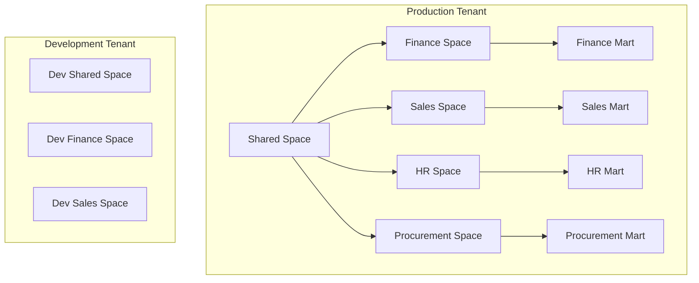

# SAP Datasphere Complete Implementation Guide: From Setup to Production

SAP Datasphere represents the next generation of SAP's data management platform, providing a unified data fabric that combines data warehousing, data lake, and data virtualization capabilities. This comprehensive implementation guide will take you through every step of deploying Datasphere from initial setup to production readiness.

## Table of Contents

1. [Pre-Implementation Planning](#pre-implementation-planning)
2. [Initial Setup and Configuration](#initial-setup-configuration)
3. [Space Architecture and Design](#space-architecture-design)
4. [Data Integration Patterns](#data-integration-patterns)
5. [Data Modeling Strategies](#data-modeling-strategies)
6. [Security and Access Control](#security-access-control)
7. [Performance Optimization](#performance-optimization)
8. [Monitoring and Governance](#monitoring-governance)
9. [Production Deployment](#production-deployment)
10. [Best Practices and Common Pitfalls](#best-practices-pitfalls)

## Pre-Implementation Planning {#pre-implementation-planning}

### Business Requirements Assessment

Before diving into technical implementation, establish clear business objectives:

```javascript
// Business Requirements Framework
const businessRequirements = {
  dataVolume: {
    current: "TB/month",
    projected: "TB/month in 3 years",
    peakLoad: "concurrent users"
  },
  useCase: {
    reporting: ["operational", "strategic", "regulatory"],
    analytics: ["descriptive", "predictive", "prescriptive"],
    integration: ["real-time", "batch", "streaming"]
  },
  compliance: {
    regulations: ["GDPR", "SOX", "HIPAA"],
    dataResidency: "region requirements",
    retention: "years"
  }
};
```

### Technical Architecture Planning

Define your target architecture before implementation:

```yaml
# Architecture Decision Record (ADR)
architecture:
  deployment_model: "Cloud Native"
  integration_pattern: "Hub and Spoke"
  data_storage:
    - type: "Data Lake"
      format: ["Parquet", "Delta"]
    - type: "Data Warehouse" 
      technology: "Column Store"
  connectivity:
    - source: "SAP Systems"
      method: "SLT/CDS"
    - source: "Non-SAP"
      method: "Cloud Connectors"
```

### Sizing and Capacity Planning

Calculate required resources based on data volume and user concurrency:

```python
# Datasphere Sizing Calculator
class DatasphereCapacityPlanner:
    def __init__(self):
        self.base_compute = 4  # Base compute units
        self.storage_factor = 1.5  # Storage overhead factor
        
    def calculate_capacity(self, data_volume_tb, concurrent_users, queries_per_hour):
        # Compute units calculation
        compute_units = max(
            self.base_compute,
            (data_volume_tb * 0.5) + (concurrent_users * 0.2) + (queries_per_hour * 0.01)
        )
        
        # Storage calculation (including replication and temp space)
        storage_gb = data_volume_tb * 1024 * self.storage_factor
        
        # Memory calculation
        memory_gb = compute_units * 8  # 8GB per compute unit
        
        return {
            "compute_units": round(compute_units, 2),
            "storage_gb": round(storage_gb, 2),
            "memory_gb": round(memory_gb, 2),
            "estimated_cost_usd": round((compute_units * 500) + (storage_gb * 0.10), 2)
        }

# Example usage
planner = DatasphereCapacityPlanner()
capacity = planner.calculate_capacity(
    data_volume_tb=10,
    concurrent_users=50,
    queries_per_hour=1000
)
print(f"Recommended capacity: {capacity}")
```

## Initial Setup and Configuration {#initial-setup-configuration}

### Tenant Provisioning

Once you have access to SAP Datasphere, configure your tenant:

```javascript
// Tenant Configuration Script
const tenantConfig = {
  tenant: {
    name: "prod-datasphere",
    region: "us-east-1",
    timezone: "UTC",
    currency: "USD"
  },
  administrators: [
    {
      email: "admin@company.com",
      role: "Tenant Administrator",
      permissions: ["full_access"]
    }
  ],
  globalSettings: {
    defaultRetention: 7, // years
    auditLogging: true,
    dataEncryption: "AES-256",
    backupFrequency: "daily"
  }
};

// Apply configuration via REST API
async function configureTenant(config) {
  const response = await fetch('/api/v1/tenant/configure', {
    method: 'POST',
    headers: {
      'Content-Type': 'application/json',
      'Authorization': `Bearer ${accessToken}`
    },
    body: JSON.stringify(config)
  });
  
  if (!response.ok) {
    throw new Error(`Configuration failed: ${response.statusText}`);
  }
  
  return await response.json();
}
```

### Network and Connectivity Setup

Configure network settings and establish connectivity:

```bash
#!/bin/bash
# Network Configuration Script

# Configure Cloud Connector for on-premise connectivity
echo "Setting up Cloud Connector..."
sudo ./sapcc/go.sh

# Configure VPN tunnel
echo "Configuring VPN tunnel..."
ipsec up company-tunnel

# Test connectivity to source systems
echo "Testing source system connectivity..."
nc -zv sap-system.company.com 3300
nc -zv db-server.company.com 1433

# Configure firewall rules
echo "Configuring firewall rules..."
ufw allow from 10.0.0.0/8 to any port 443
ufw allow from 192.168.0.0/16 to any port 443
```

### User Management and Role Assignment

Set up users and assign appropriate roles:

```sql
-- User Management SQL Scripts
-- Create user groups
CREATE USER_GROUP 'DATA_MODELERS' 
WITH DESCRIPTION 'Data modeling and view creation permissions';

CREATE USER_GROUP 'BUSINESS_ANALYSTS' 
WITH DESCRIPTION 'Read-only access to curated data views';

CREATE USER_GROUP 'SPACE_ADMINISTRATORS' 
WITH DESCRIPTION 'Space management and configuration permissions';

-- Assign roles to groups
GRANT ROLE 'DW_MODELER' TO USER_GROUP 'DATA_MODELERS';
GRANT ROLE 'DW_VIEWER' TO USER_GROUP 'BUSINESS_ANALYSTS';
GRANT ROLE 'DW_SPACE_ADMINISTRATOR' TO USER_GROUP 'SPACE_ADMINISTRATORS';

-- Add users to groups
ALTER USER_GROUP 'DATA_MODELERS' 
ADD USERS ('john.doe@company.com', 'jane.smith@company.com');

ALTER USER_GROUP 'BUSINESS_ANALYSTS' 
ADD USERS ('analyst1@company.com', 'analyst2@company.com');
```

## Space Architecture and Design {#space-architecture-design}

### Space Planning Strategy

Design your space architecture based on business domains:



### Space Creation and Configuration

Create spaces using both UI and API approaches:

```python
# Space Management Python SDK
import requests
from dataclasses import dataclass
from typing import List, Dict

@dataclass
class SpaceConfig:
    name: str
    description: str
    business_domain: str
    data_retention_days: int
    storage_quota_gb: int
    compute_quota_units: int

class DataspaceManager:
    def __init__(self, base_url: str, auth_token: str):
        self.base_url = base_url
        self.headers = {
            'Authorization': f'Bearer {auth_token}',
            'Content-Type': 'application/json'
        }
    
    def create_space(self, config: SpaceConfig) -> Dict:
        """Create a new space with specified configuration"""
        payload = {
            "name": config.name,
            "description": config.description,
            "businessDomain": config.business_domain,
            "settings": {
                "dataRetentionDays": config.data_retention_days,
                "storageQuotaGB": config.storage_quota_gb,
                "computeQuotaUnits": config.compute_quota_units
            }
        }
        
        response = requests.post(
            f"{self.base_url}/api/v1/spaces",
            headers=self.headers,
            json=payload
        )
        
        response.raise_for_status()
        return response.json()
    
    def configure_space_permissions(self, space_id: str, permissions: List[Dict]) -> Dict:
        """Configure permissions for a space"""
        payload = {"permissions": permissions}
        
        response = requests.put(
            f"{self.base_url}/api/v1/spaces/{space_id}/permissions",
            headers=self.headers,
            json=payload
        )
        
        response.raise_for_status()
        return response.json()

# Example space creation
manager = DataspaceManager("https://your-tenant.datasphere.cloud.sap", "your-token")

finance_space = SpaceConfig(
    name="Finance",
    description="Financial data and reporting space",
    business_domain="Finance",
    data_retention_days=2555,  # 7 years
    storage_quota_gb=5000,
    compute_quota_units=20
)

space_result = manager.create_space(finance_space)
print(f"Created space: {space_result['id']}")
```

### Space Relationships and Data Sharing

Configure data sharing between spaces:

```javascript
// Space Data Sharing Configuration
const dataSharing = {
  sourceSpace: "shared-data",
  targetSpaces: ["finance", "sales", "hr"],
  sharedObjects: [
    {
      objectName: "dim_customer",
      objectType: "dimension",
      accessLevel: "read",
      maskingSensitiveFields: true
    },
    {
      objectName: "dim_product", 
      objectType: "dimension",
      accessLevel: "read",
      maskingSensitiveFields: false
    }
  ],
  sharingRules: {
    automaticRefresh: true,
    refreshFrequency: "daily",
    notifyOnChanges: true
  }
};

// Apply sharing configuration
async function configureDataSharing(config) {
  try {
    const response = await fetch('/api/v1/spaces/sharing', {
      method: 'POST',
      headers: {
        'Content-Type': 'application/json',
        'Authorization': `Bearer ${token}`
      },
      body: JSON.stringify(config)
    });
    
    const result = await response.json();
    console.log('Data sharing configured:', result);
    
    return result;
  } catch (error) {
    console.error('Failed to configure data sharing:', error);
    throw error;
  }
}
```

## Data Integration Patterns {#data-integration-patterns}

### Source System Connectivity

Configure connections to various source systems:

```yaml
# connections.yaml - Data Source Configurations
connections:
  sap_s4hana:
    type: "SAP_HANA"
    connection_string: "hana://server:30015"
    authentication:
      method: "certificate"
      certificate_path: "/etc/ssl/certs/s4hana.crt"
    options:
      pool_size: 10
      timeout: 30000
      
  sap_bw:
    type: "SAP_BW"
    connection_string: "bw://server:50000"
    authentication:
      method: "oauth2"
      client_id: "${BW_CLIENT_ID}"
      client_secret: "${BW_CLIENT_SECRET}"
      
  azure_sql:
    type: "AZURE_SQL"
    connection_string: "server.database.windows.net"
    authentication:
      method: "managed_identity"
    options:
      encrypt: true
      trust_server_certificate: false
      
  snowflake:
    type: "SNOWFLAKE"
    account: "company.us-east-1"
    warehouse: "COMPUTE_WH"
    database: "PRODUCTION"
    authentication:
      method: "key_pair"
      private_key_path: "/etc/ssl/keys/snowflake.key"
```

### Real-time Data Integration

Implement real-time data flows using various patterns:

```python
# Real-time Data Integration Framework
import asyncio
import json
from kafka import KafkaConsumer, KafkaProducer
from typing import Dict, Any, Callable

class RealTimeDataProcessor:
    def __init__(self, kafka_config: Dict[str, str]):
        self.kafka_config = kafka_config
        self.producer = KafkaProducer(
            bootstrap_servers=kafka_config['bootstrap_servers'],
            value_serializer=lambda v: json.dumps(v).encode('utf-8')
        )
        
    async def process_cdc_events(self, 
                               source_topic: str, 
                               target_space: str,
                               transformation_func: Callable):
        """Process Change Data Capture events from source systems"""
        
        consumer = KafkaConsumer(
            source_topic,
            bootstrap_servers=self.kafka_config['bootstrap_servers'],
            value_deserializer=lambda m: json.loads(m.decode('utf-8')),
            auto_offset_reset='latest'
        )
        
        async def process_message(message):
            try:
                # Apply transformation
                transformed_data = transformation_func(message.value)
                
                # Send to Datasphere via streaming API
                await self.stream_to_datasphere(target_space, transformed_data)
                
                print(f"Processed CDC event: {message.offset}")
                
            except Exception as e:
                print(f"Failed to process message: {e}")
                # Send to dead letter queue
                await self.send_to_dlq(message.value, str(e))
        
        # Process messages asynchronously
        for message in consumer:
            await process_message(message)
    
    async def stream_to_datasphere(self, space: str, data: Dict[str, Any]):
        """Stream data directly to Datasphere space"""
        # Implementation would use Datasphere streaming API
        print(f"Streaming to space {space}: {len(data)} records")
        
    async def send_to_dlq(self, failed_data: Dict, error: str):
        """Send failed messages to dead letter queue"""
        dlq_message = {
            'original_data': failed_data,
            'error': error,
            'timestamp': asyncio.get_event_loop().time()
        }
        
        self.producer.send('datasphere-dlq', dlq_message)

# Example transformation function
def transform_customer_data(raw_data: Dict) -> Dict:
    """Transform customer data from source system format to Datasphere format"""
    return {
        'customer_id': raw_data['KUNNR'],
        'customer_name': raw_data['NAME1'],
        'country': raw_data['LAND1'],
        'created_date': raw_data['ERDAT'],
        'last_modified': raw_data['AEDAT'],
        'operation': raw_data['operation_type']  # I, U, D
    }
```

### Batch Data Integration

Implement robust batch processing patterns:

```groovy
// Groovy Script for Batch Data Processing
@Grab('org.apache.spark:spark-sql_2.12:3.3.0')
import org.apache.spark.sql.*
import org.apache.spark.sql.functions.*

class BatchDataProcessor {
    private SparkSession spark
    private String datasphereEndpoint
    private String authToken
    
    BatchDataProcessor(String endpoint, String token) {
        this.datasphereEndpoint = endpoint
        this.authToken = token
        
        // Initialize Spark session
        this.spark = SparkSession.builder()
            .appName("DatasphereBatchProcessor")
            .config("spark.sql.adaptive.enabled", "true")
            .config("spark.sql.adaptive.coalescePartitions.enabled", "true")
            .getOrCreate()
    }
    
    def processFinanceData(String sourceTable, String targetSpace) {
        // Read data from source
        def sourceDF = spark.read()
            .format("jdbc")
            .option("url", "jdbc:sap://source-system:30015")
            .option("dbtable", sourceTable)
            .option("user", System.getenv("SAP_USER"))
            .option("password", System.getenv("SAP_PASSWORD"))
            .load()
        
        // Apply business transformations
        def transformedDF = sourceDF
            .filter(col("BUKRS").isNotNull()) // Filter valid company codes
            .withColumn("fiscal_year", year(col("BUDAT"))) // Extract fiscal year
            .withColumn("fiscal_period", month(col("BUDAT"))) // Extract fiscal period
            .withColumn("amount_usd", 
                when(col("WAERS") === "USD", col("WRBTR"))
                .otherwise(col("WRBTR") * col("exchange_rate"))) // Currency conversion
            .select(
                col("BELNR").as("document_number"),
                col("BUKRS").as("company_code"),
                col("fiscal_year"),
                col("fiscal_period"),
                col("amount_usd"),
                col("BLDAT").as("document_date"),
                current_timestamp().as("load_timestamp")
            )
        
        // Data quality checks
        def qualityChecks = [
            ["null_check", transformedDF.filter(col("document_number").isNull()).count() == 0],
            ["duplicate_check", transformedDF.count() == transformedDF.distinct().count()],
            ["amount_range", transformedDF.filter(col("amount_usd") < 0).count() < transformedDF.count() * 0.01]
        ]
        
        qualityChecks.each { check ->
            if (!check[1]) {
                throw new RuntimeException("Data quality check failed: ${check[0]}")
            }
        }
        
        // Write to Datasphere
        writeToDatasphere(transformedDF, targetSpace, "finance_transactions")
        
        return [
            "source_records": sourceDF.count(),
            "target_records": transformedDF.count(),
            "quality_checks": qualityChecks
        ]
    }
    
    private def writeToDatasphere(Dataset<Row> df, String space, String tableName) {
        // Write using Datasphere JDBC connector
        df.write()
            .format("jdbc")
            .option("url", "${datasphereEndpoint}/jdbc")
            .option("dbtable", "${space}.${tableName}")
            .option("user", "api_user")
            .option("password", authToken)
            .mode(SaveMode.Append)
            .save()
    }
}

// Example usage
def processor = new BatchDataProcessor(
    "https://tenant.datasphere.cloud.sap",
    System.getenv("DATASPHERE_TOKEN")
)

def result = processor.processFinanceData("BKPF", "finance_space")
println "Processing completed: ${result}"
```

## Data Modeling Strategies {#data-modeling-strategies}

### Graphical Data Modeling

Use the graphical interface for business-friendly data modeling:

```sql
-- SQL View Creation Template
CREATE VIEW V_CUSTOMER_360 AS
SELECT 
    c.customer_id,
    c.customer_name,
    c.country,
    c.region,
    c.industry,
    SUM(o.order_amount) as total_orders,
    COUNT(o.order_id) as order_count,
    AVG(o.order_amount) as avg_order_value,
    MAX(o.order_date) as last_order_date,
    CASE 
        WHEN SUM(o.order_amount) > 100000 THEN 'Premium'
        WHEN SUM(o.order_amount) > 50000 THEN 'Gold'
        WHEN SUM(o.order_amount) > 10000 THEN 'Silver'
        ELSE 'Bronze'
    END as customer_tier
FROM 
    customer c
LEFT JOIN 
    orders o ON c.customer_id = o.customer_id
WHERE 
    c.active_flag = 'Y'
GROUP BY 
    c.customer_id, c.customer_name, c.country, c.region, c.industry;
```

### SQL View Development

Create advanced analytics views using SQL:

```sql
-- Advanced Analytics View for Sales Performance
CREATE VIEW V_SALES_PERFORMANCE AS
WITH monthly_sales AS (
    SELECT 
        DATE_TRUNC('month', order_date) as sales_month,
        salesperson_id,
        region,
        product_category,
        SUM(order_amount) as monthly_revenue,
        COUNT(DISTINCT customer_id) as unique_customers,
        COUNT(order_id) as transaction_count
    FROM orders 
    WHERE order_date >= ADD_MONTHS(CURRENT_DATE, -24)
    GROUP BY 1, 2, 3, 4
),
rolling_metrics AS (
    SELECT 
        *,
        LAG(monthly_revenue, 1) OVER (
            PARTITION BY salesperson_id, region, product_category 
            ORDER BY sales_month
        ) as prev_month_revenue,
        AVG(monthly_revenue) OVER (
            PARTITION BY salesperson_id, region, product_category 
            ORDER BY sales_month 
            ROWS BETWEEN 2 PRECEDING AND CURRENT ROW
        ) as rolling_3month_avg,
        SUM(monthly_revenue) OVER (
            PARTITION BY salesperson_id, region, product_category 
            ORDER BY sales_month 
            ROWS BETWEEN 11 PRECEDING AND CURRENT ROW
        ) as rolling_12month_total
    FROM monthly_sales
)
SELECT 
    sales_month,
    salesperson_id,
    region,
    product_category,
    monthly_revenue,
    prev_month_revenue,
    rolling_3month_avg,
    rolling_12month_total,
    unique_customers,
    transaction_count,
    monthly_revenue / NULLIF(prev_month_revenue, 0) - 1 as mom_growth_rate,
    monthly_revenue / NULLIF(rolling_3month_avg, 0) - 1 as vs_3month_avg,
    CASE 
        WHEN monthly_revenue >= rolling_3month_avg * 1.1 THEN 'Above Target'
        WHEN monthly_revenue >= rolling_3month_avg * 0.9 THEN 'On Target'
        ELSE 'Below Target'
    END as performance_status
FROM rolling_metrics
ORDER BY sales_month DESC, monthly_revenue DESC;
```

### Analytic Model Creation

Build analytic models for self-service analytics:

```python
# Python SDK for Analytic Model Creation
from dataclasses import dataclass
from typing import List, Dict, Optional
import json

@dataclass
class Dimension:
    name: str
    display_name: str
    data_type: str
    source_column: str
    hierarchy_levels: Optional[List[str]] = None
    
@dataclass
class Measure:
    name: str
    display_name: str
    aggregation_type: str
    source_column: str
    format_string: Optional[str] = None
    calculation: Optional[str] = None

class AnalyticModelBuilder:
    def __init__(self, space_id: str, model_name: str):
        self.space_id = space_id
        self.model_name = model_name
        self.dimensions = []
        self.measures = []
        self.base_view = None
        
    def set_base_view(self, view_name: str):
        """Set the base view for the analytic model"""
        self.base_view = view_name
        
    def add_dimension(self, dimension: Dimension):
        """Add a dimension to the analytic model"""
        self.dimensions.append(dimension)
        
    def add_measure(self, measure: Measure):
        """Add a measure to the analytic model"""
        self.measures.append(measure)
        
    def build_time_dimension(self, date_column: str):
        """Build standard time dimension"""
        time_dimensions = [
            Dimension("date", "Date", "date", date_column),
            Dimension("year", "Year", "integer", f"YEAR({date_column})"),
            Dimension("quarter", "Quarter", "string", f"'Q' || QUARTER({date_column})"),
            Dimension("month", "Month", "integer", f"MONTH({date_column})"),
            Dimension("week", "Week", "integer", f"WEEK({date_column})")
        ]
        
        for dim in time_dimensions:
            self.add_dimension(dim)
            
    def generate_model_definition(self) -> Dict:
        """Generate the JSON definition for the analytic model"""
        return {
            "name": self.model_name,
            "space": self.space_id,
            "baseView": self.base_view,
            "dimensions": [
                {
                    "name": dim.name,
                    "displayName": dim.display_name,
                    "dataType": dim.data_type,
                    "sourceExpression": dim.source_column,
                    "hierarchyLevels": dim.hierarchy_levels or []
                }
                for dim in self.dimensions
            ],
            "measures": [
                {
                    "name": measure.name,
                    "displayName": measure.display_name,
                    "aggregationType": measure.aggregation_type,
                    "sourceExpression": measure.source_column,
                    "formatString": measure.format_string,
                    "calculation": measure.calculation
                }
                for measure in self.measures
            ]
        }

# Example: Sales Analytics Model
sales_model = AnalyticModelBuilder("sales_space", "Sales_Analytics")
sales_model.set_base_view("V_SALES_PERFORMANCE")

# Add dimensions
sales_model.add_dimension(Dimension("region", "Sales Region", "string", "region"))
sales_model.add_dimension(Dimension("product_category", "Product Category", "string", "product_category"))
sales_model.add_dimension(Dimension("salesperson", "Salesperson", "string", "salesperson_id"))

# Add time dimensions
sales_model.build_time_dimension("sales_month")

# Add measures
sales_model.add_measure(Measure("revenue", "Total Revenue", "sum", "monthly_revenue", format_string="$#,##0"))
sales_model.add_measure(Measure("customer_count", "Customer Count", "sum", "unique_customers"))
sales_model.add_measure(Measure("avg_order_value", "Average Order Value", "avg", "monthly_revenue/transaction_count", format_string="$#,##0.00"))

# Generate model definition
model_definition = sales_model.generate_model_definition()
print(json.dumps(model_definition, indent=2))
```

## Security and Access Control {#security-access-control}

### Identity and Access Management

Configure comprehensive security settings:

```yaml
# security-config.yaml
security:
  authentication:
    primary_method: "SAML2"
    fallback_method: "local"
    session_timeout: 480  # minutes
    
  identity_provider:
    saml:
      entity_id: "https://company.okta.com"
      sso_url: "https://company.okta.com/app/sap/datasphere/sso/saml"
      x509_certificate: |
        -----BEGIN CERTIFICATE-----
        MIICXjCCAcegAwIBAgIJAL...
        -----END CERTIFICATE-----
    
  authorization:
    role_based_access: true
    attribute_based_access: true
    dynamic_authorization: true
    
  data_privacy:
    gdpr_compliance: true
    data_anonymization: true
    audit_trail: true
    
  encryption:
    data_at_rest: "AES-256"
    data_in_transit: "TLS 1.3"
    key_management: "HSM"
```

### Role-Based Security Implementation

Implement fine-grained access controls:

```sql
-- Security Role Definitions
-- Create roles for different user types
CREATE ROLE 'DATA_SCIENTIST' WITH DESCRIPTION 'Data science and ML model development';
CREATE ROLE 'BUSINESS_ANALYST' WITH DESCRIPTION 'Business analysis and reporting';
CREATE ROLE 'DATA_ENGINEER' WITH DESCRIPTION 'Data pipeline development and maintenance';
CREATE ROLE 'EXECUTIVE_VIEWER' WITH DESCRIPTION 'Executive dashboards and KPI access';

-- Grant permissions to roles
-- Data Scientist permissions
GRANT SELECT ON SCHEMA 'analytics' TO ROLE 'DATA_SCIENTIST';
GRANT CREATE VIEW ON SPACE 'sandbox' TO ROLE 'DATA_SCIENTIST';
GRANT EXECUTE ON PROCEDURE 'ml_procedures.*' TO ROLE 'DATA_SCIENTIST';

-- Business Analyst permissions
GRANT SELECT ON VIEW 'V_CUSTOMER_360' TO ROLE 'BUSINESS_ANALYST';
GRANT SELECT ON VIEW 'V_SALES_PERFORMANCE' TO ROLE 'BUSINESS_ANALYST';
GRANT CREATE STORY ON SPACE 'analytics' TO ROLE 'BUSINESS_ANALYST';

-- Data Engineer permissions
GRANT CREATE TABLE ON SPACE 'data_engineering' TO ROLE 'DATA_ENGINEER';
GRANT CREATE REMOTE_TABLE ON TENANT TO ROLE 'DATA_ENGINEER';
GRANT MONITOR TASK_FLOWS ON TENANT TO ROLE 'DATA_ENGINEER';

-- Executive Viewer permissions (read-only, high-level views)
GRANT SELECT ON VIEW 'V_EXECUTIVE_DASHBOARD' TO ROLE 'EXECUTIVE_VIEWER';
GRANT SELECT ON VIEW 'V_KPI_SUMMARY' TO ROLE 'EXECUTIVE_VIEWER';
```

### Data Masking and Privacy Controls

Implement data protection mechanisms:

```javascript
// Data Masking Configuration
const dataMaskingRules = {
  tables: {
    "customer_data": {
      "email": {
        maskingType: "partial",
        pattern: "***@domain.com",
        revealFirstN: 2
      },
      "phone_number": {
        maskingType: "format_preserving",
        algorithm: "FPE-AES"
      },
      "ssn": {
        maskingType: "full",
        replacement: "XXX-XX-XXXX"
      },
      "credit_card": {
        maskingType: "tokenization",
        tokenVault: "company_vault"
      }
    },
    "employee_data": {
      "salary": {
        maskingType: "range_bucket",
        buckets: ["<50k", "50k-100k", "100k-150k", ">150k"]
      },
      "address": {
        maskingType: "geographic_blur",
        precision: "city_level"
      }
    }
  },
  
  accessControl: {
    "PII_RESTRICTED": {
      allowedRoles: ["DATA_PROTECTION_OFFICER", "HR_MANAGER"],
      conditions: ["region = 'EU'", "consent_given = 'Y'"]
    },
    "FINANCIAL_SENSITIVE": {
      allowedRoles: ["CFO", "FINANCIAL_ANALYST"],
      conditions: ["department IN ('Finance', 'Audit')"]
    }
  }
};

// Apply masking rules
function applyDataMasking(rules) {
  Object.entries(rules.tables).forEach(([table, columns]) => {
    Object.entries(columns).forEach(([column, maskConfig]) => {
      const sql = generateMaskingSQL(table, column, maskConfig);
      executeMaskingRule(sql);
    });
  });
}

function generateMaskingSQL(table, column, config) {
  switch (config.maskingType) {
    case 'partial':
      return `
        ALTER TABLE ${table} 
        ADD MASK ${column}_masked AS 
        CASE 
          WHEN CURRENT_USER_HAS_ROLE('DATA_PROTECTION_OFFICER') 
          THEN ${column}
          ELSE CONCAT(LEFT(${column}, ${config.revealFirstN}), '${config.pattern}')
        END
      `;
      
    case 'tokenization':
      return `
        ALTER TABLE ${table}
        ADD MASK ${column}_masked AS
        CASE 
          WHEN CURRENT_USER_HAS_ROLE('PII_VIEWER')
          THEN ${column}
          ELSE TOKENIZE(${column}, '${config.tokenVault}')
        END
      `;
      
    case 'range_bucket':
      const bucketConditions = config.buckets.map((bucket, index) => 
        `WHEN ${column} BETWEEN ${index * 50000} AND ${(index + 1) * 50000} THEN '${bucket}'`
      ).join(' ');
      
      return `
        ALTER TABLE ${table}
        ADD MASK ${column}_masked AS
        CASE ${bucketConditions} END
      `;
      
    default:
      return `ALTER TABLE ${table} ADD MASK ${column}_masked AS '***MASKED***'`;
  }
}
```

## Performance Optimization {#performance-optimization}

### Query Performance Tuning

Optimize query performance through various techniques:

```sql
-- Performance Optimization Techniques

-- 1. Partitioning Strategy
CREATE TABLE sales_fact (
    order_id BIGINT,
    customer_id BIGINT,
    product_id BIGINT,
    order_date DATE,
    order_amount DECIMAL(15,2),
    region VARCHAR(50)
)
PARTITION BY RANGE(order_date) (
    PARTITION p2023 VALUES LESS THAN ('2024-01-01'),
    PARTITION p2024 VALUES LESS THAN ('2025-01-01'),
    PARTITION p2025 VALUES LESS THAN ('2026-01-01')
);

-- 2. Indexing Strategy
CREATE INDEX idx_sales_customer_date ON sales_fact(customer_id, order_date);
CREATE INDEX idx_sales_product_region ON sales_fact(product_id, region);
CREATE UNIQUE INDEX idx_sales_order_id ON sales_fact(order_id);

-- 3. Materialized View for Performance
CREATE MATERIALIZED VIEW mv_monthly_sales AS
SELECT 
    DATE_TRUNC('month', order_date) as sales_month,
    region,
    product_category,
    SUM(order_amount) as total_sales,
    COUNT(*) as transaction_count,
    COUNT(DISTINCT customer_id) as unique_customers
FROM sales_fact sf
JOIN product_dim pd ON sf.product_id = pd.product_id
GROUP BY 1, 2, 3;

-- Schedule materialized view refresh
ALTER MATERIALIZED VIEW mv_monthly_sales 
SET REFRESH SCHEDULE 'DAILY AT 02:00';

-- 4. Query Optimization Hints
SELECT /*+ USE_INDEX(sf, idx_sales_customer_date) */
    c.customer_name,
    SUM(sf.order_amount) as total_spent
FROM sales_fact sf /*+ PARTITION(p2024, p2025) */
JOIN customer_dim c ON sf.customer_id = c.customer_id
WHERE sf.order_date >= '2024-01-01'
AND sf.region = 'North America'
GROUP BY c.customer_name
ORDER BY total_spent DESC
LIMIT 100;
```

### Memory and Compute Optimization

Optimize resource usage:

```python
# Resource Optimization Framework
import psutil
import time
from dataclasses import dataclass
from typing import Dict, List

@dataclass
class QueryPerformanceMetrics:
    query_id: str
    execution_time_ms: int
    memory_usage_mb: int
    cpu_usage_percent: float
    rows_processed: int
    data_scanned_mb: int

class PerformanceOptimizer:
    def __init__(self):
        self.metrics_history = []
        
    def analyze_query_performance(self, sql: str) -> Dict:
        """Analyze query performance and suggest optimizations"""
        start_time = time.time()
        start_memory = psutil.Process().memory_info().rss / 1024 / 1024
        
        # Execute query and collect metrics
        result = self.execute_with_monitoring(sql)
        
        end_time = time.time()
        end_memory = psutil.Process().memory_info().rss / 1024 / 1024
        
        metrics = QueryPerformanceMetrics(
            query_id=f"query_{len(self.metrics_history)}",
            execution_time_ms=int((end_time - start_time) * 1000),
            memory_usage_mb=int(end_memory - start_memory),
            cpu_usage_percent=psutil.cpu_percent(interval=1),
            rows_processed=len(result) if result else 0,
            data_scanned_mb=self.estimate_data_scanned(sql)
        )
        
        self.metrics_history.append(metrics)
        
        return {
            "metrics": metrics,
            "optimization_suggestions": self.generate_suggestions(metrics, sql)
        }
    
    def generate_suggestions(self, metrics: QueryPerformanceMetrics, sql: str) -> List[str]:
        """Generate optimization suggestions based on performance metrics"""
        suggestions = []
        
        # High execution time
        if metrics.execution_time_ms > 10000:
            suggestions.append("Consider adding appropriate indexes")
            suggestions.append("Review WHERE clause for selectivity")
            suggestions.append("Consider query result caching")
            
        # High memory usage
        if metrics.memory_usage_mb > 1000:
            suggestions.append("Limit result set size with LIMIT clause")
            suggestions.append("Consider using incremental processing")
            suggestions.append("Review JOIN strategies and order")
            
        # Large data scan
        if metrics.data_scanned_mb > 5000:
            suggestions.append("Consider partitioning large tables")
            suggestions.append("Use column pruning to select only needed fields")
            suggestions.append("Implement data compression")
            
        # SQL pattern analysis
        if "SELECT *" in sql.upper():
            suggestions.append("Avoid SELECT * - specify only needed columns")
            
        if "ORDER BY" in sql.upper() and "LIMIT" not in sql.upper():
            suggestions.append("Add LIMIT clause when using ORDER BY")
            
        return suggestions
    
    def estimate_data_scanned(self, sql: str) -> int:
        """Estimate amount of data scanned (simplified)"""
        # This would integrate with Datasphere query planner in real implementation
        table_sizes = {
            'sales_fact': 10000,  # MB
            'customer_dim': 100,
            'product_dim': 50
        }
        
        total_scan = 0
        for table, size in table_sizes.items():
            if table.upper() in sql.upper():
                total_scan += size
                
        return total_scan
    
    def execute_with_monitoring(self, sql: str):
        """Execute SQL with performance monitoring"""
        # Mock implementation - would use actual Datasphere SQL API
        print(f"Executing: {sql[:100]}...")
        time.sleep(0.1)  # Simulate query execution
        return [{"result": "mock_data"}] * 100

# Usage example
optimizer = PerformanceOptimizer()

sample_query = """
SELECT c.customer_name, p.product_name, SUM(sf.order_amount)
FROM sales_fact sf
JOIN customer_dim c ON sf.customer_id = c.customer_id
JOIN product_dim p ON sf.product_id = p.product_id
WHERE sf.order_date >= '2024-01-01'
GROUP BY c.customer_name, p.product_name
ORDER BY SUM(sf.order_amount) DESC
"""

performance_analysis = optimizer.analyze_query_performance(sample_query)
print("Performance Analysis:")
print(f"Execution time: {performance_analysis['metrics'].execution_time_ms}ms")
print(f"Memory usage: {performance_analysis['metrics'].memory_usage_mb}MB")
print("\nOptimization suggestions:")
for suggestion in performance_analysis['optimization_suggestions']:
    print(f"- {suggestion}")
```

## Production Deployment {#production-deployment}

### Deployment Checklist and Process

Follow this comprehensive checklist for production deployment:

```yaml
# deployment-checklist.yaml
pre_deployment:
  infrastructure:
    - [ ] Network connectivity validated
    - [ ] Security certificates installed
    - [ ] Backup and recovery procedures tested
    - [ ] Monitoring systems configured
    - [ ] Resource capacity validated
    
  data_validation:
    - [ ] Data quality rules defined and tested
    - [ ] Data lineage documented
    - [ ] Performance benchmarks established
    - [ ] Security access controls tested
    - [ ] Compliance requirements verified
    
  application_readiness:
    - [ ] All views and models tested
    - [ ] User acceptance testing completed
    - [ ] Documentation finalized
    - [ ] Training materials prepared
    - [ ] Support procedures established

deployment:
  steps:
    1. "Deploy to staging environment"
    2. "Run full regression test suite"
    3. "Validate data consistency"
    4. "Performance stress testing"
    5. "Security penetration testing"
    6. "User acceptance testing"
    7. "Deploy to production"
    8. "Monitor initial usage"
    9. "Validate production metrics"
    
post_deployment:
  monitoring:
    - [ ] System performance monitoring active
    - [ ] Data quality monitoring active
    - [ ] User activity monitoring active
    - [ ] Cost monitoring active
    - [ ] Security monitoring active
    
  optimization:
    - [ ] Performance tuning based on actual usage
    - [ ] Resource optimization
    - [ ] User feedback collection
    - [ ] Documentation updates
```

### Monitoring and Alerting Setup

Implement comprehensive monitoring:

```typescript
// Monitoring and Alerting Configuration
interface MonitoringConfig {
  systemMetrics: SystemMetric[];
  dataQualityRules: DataQualityRule[];
  performanceThresholds: PerformanceThreshold[];
  alertChannels: AlertChannel[];
}

interface SystemMetric {
  name: string;
  query: string;
  threshold: number;
  operator: 'gt' | 'lt' | 'eq';
  severity: 'critical' | 'warning' | 'info';
}

interface DataQualityRule {
  name: string;
  table: string;
  rule: string;
  expectedValue: number;
  tolerance: number;
}

class DatasphereMontior {
  private config: MonitoringConfig;
  
  constructor(config: MonitoringConfig) {
    this.config = config;
  }
  
  async setupSystemMonitoring(): Promise<void> {
    const systemMetrics: SystemMetric[] = [
      {
        name: "CPU Usage",
        query: "SELECT AVG(cpu_usage) FROM system_metrics WHERE timestamp > NOW() - INTERVAL 5 MINUTE",
        threshold: 80,
        operator: 'gt',
        severity: 'warning'
      },
      {
        name: "Memory Usage", 
        query: "SELECT AVG(memory_usage) FROM system_metrics WHERE timestamp > NOW() - INTERVAL 5 MINUTE",
        threshold: 90,
        operator: 'gt',
        severity: 'critical'
      },
      {
        name: "Query Response Time",
        query: "SELECT AVG(response_time_ms) FROM query_metrics WHERE timestamp > NOW() - INTERVAL 10 MINUTE",
        threshold: 5000,
        operator: 'gt',
        severity: 'warning'
      },
      {
        name: "Failed Connections",
        query: "SELECT COUNT(*) FROM connection_logs WHERE status = 'failed' AND timestamp > NOW() - INTERVAL 5 MINUTE",
        threshold: 10,
        operator: 'gt',
        severity: 'critical'
      }
    ];
    
    for (const metric of systemMetrics) {
      await this.createMetricAlert(metric);
    }
  }
  
  async setupDataQualityMonitoring(): Promise<void> {
    const qualityRules: DataQualityRule[] = [
      {
        name: "Customer Data Completeness",
        table: "customer_dim",
        rule: "SELECT (COUNT(*) - COUNT(customer_name)) * 100.0 / COUNT(*) FROM customer_dim",
        expectedValue: 0,
        tolerance: 1
      },
      {
        name: "Sales Amount Validity", 
        table: "sales_fact",
        rule: "SELECT COUNT(*) * 100.0 / (SELECT COUNT(*) FROM sales_fact) FROM sales_fact WHERE order_amount <= 0",
        expectedValue: 0,
        tolerance: 0.1
      },
      {
        name: "Date Consistency",
        table: "sales_fact",
        rule: "SELECT COUNT(*) FROM sales_fact WHERE order_date > CURRENT_DATE",
        expectedValue: 0,
        tolerance: 0
      }
    ];
    
    for (const rule of qualityRules) {
      await this.createDataQualityAlert(rule);
    }
  }
  
  private async createMetricAlert(metric: SystemMetric): Promise<void> {
    const alertConfig = {
      name: metric.name,
      query: metric.query,
      schedule: "*/5 * * * *", // Every 5 minutes
      condition: `value ${metric.operator === 'gt' ? '>' : '<'} ${metric.threshold}`,
      severity: metric.severity,
      channels: this.getAlertChannels(metric.severity)
    };
    
    // Create alert using Datasphere monitoring API
    console.log(`Creating alert: ${metric.name}`);
    // await this.monitoringAPI.createAlert(alertConfig);
  }
  
  private async createDataQualityAlert(rule: DataQualityRule): Promise<void> {
    const alertConfig = {
      name: rule.name,
      query: rule.rule,
      schedule: "0 2 * * *", // Daily at 2 AM
      condition: `ABS(value - ${rule.expectedValue}) > ${rule.tolerance}`,
      severity: 'warning',
      channels: ['email', 'slack']
    };
    
    console.log(`Creating data quality alert: ${rule.name}`);
    // await this.monitoringAPI.createAlert(alertConfig);
  }
  
  private getAlertChannels(severity: string): string[] {
    switch (severity) {
      case 'critical':
        return ['email', 'slack', 'pagerduty'];
      case 'warning':
        return ['email', 'slack'];
      default:
        return ['email'];
    }
  }
}

// Initialize monitoring
const monitoringConfig: MonitoringConfig = {
  systemMetrics: [],
  dataQualityRules: [],
  performanceThresholds: [],
  alertChannels: [
    { type: 'email', endpoint: 'alerts@company.com' },
    { type: 'slack', endpoint: 'https://hooks.slack.com/...' },
    { type: 'pagerduty', endpoint: 'https://api.pagerduty.com/...' }
  ]
};

const monitor = new DatasphereMontior(monitoringConfig);
await monitor.setupSystemMonitoring();
await monitor.setupDataQualityMonitoring();
```

## Best Practices and Common Pitfalls {#best-practices-pitfalls}

### Implementation Best Practices

Key recommendations for successful implementation:

```markdown
## Data Architecture Best Practices

### 1. Space Design Patterns
- **Single Source of Truth**: Establish one authoritative source for each data domain
- **Layered Architecture**: Implement Bronze -> Silver -> Gold data layers
- **Domain Segregation**: Separate spaces by business domain, not technical function
- **Shared Dimensions**: Create reusable dimension objects across spaces

### 2. Data Modeling Guidelines
- **Start Simple**: Begin with basic views, evolve to complex analytic models
- **Consistent Naming**: Use clear, business-friendly naming conventions
- **Documentation**: Document all views and models with business context
- **Version Control**: Implement change management for model definitions

### 3. Performance Optimization
- **Partition Strategy**: Partition large tables by date or key business dimensions
- **Indexing**: Create indexes on frequently queried columns
- **Materialized Views**: Use for frequently accessed aggregated data
- **Query Optimization**: Regular review and optimization of slow queries

### 4. Security Implementation  
- **Least Privilege**: Grant minimum required permissions
- **Regular Reviews**: Quarterly access reviews and certification
- **Data Classification**: Classify data by sensitivity level
- **Audit Trail**: Enable comprehensive audit logging

### 5. Change Management
- **Environment Strategy**: Maintain dev -> test -> prod promotion path
- **Testing Framework**: Automated data quality and regression testing
- **Rollback Plan**: Always have rollback procedures ready
- **Communication**: Clear communication of changes to stakeholders
```

### Common Implementation Pitfalls

Avoid these frequent mistakes:

```java
// Common Pitfalls and Solutions (Java examples for data validation)
import java.util.*;
import java.util.regex.Pattern;

public class DataspherePitfallsPrevention {
    
    // PITFALL 1: Poor data quality controls
    public static class DataQualityValidator {
        private static final Pattern EMAIL_PATTERN = 
            Pattern.compile("^[A-Za-z0-9+_.-]+@(.+)$");
        
        public static List<String> validateCustomerData(Map<String, Object> customer) {
            List<String> errors = new ArrayList<>();
            
            // Check required fields
            if (customer.get("customer_id") == null || 
                customer.get("customer_id").toString().trim().isEmpty()) {
                errors.add("Customer ID is required");
            }
            
            // Email validation
            String email = (String) customer.get("email");
            if (email != null && !EMAIL_PATTERN.matcher(email).matches()) {
                errors.add("Invalid email format");
            }
            
            // Business rules validation
            Double creditLimit = (Double) customer.get("credit_limit");
            if (creditLimit != null && creditLimit < 0) {
                errors.add("Credit limit cannot be negative");
            }
            
            return errors;
        }
    }
    
    // PITFALL 2: Inefficient query patterns
    public static class QueryOptimizationGuide {
        
        // BAD: Using SELECT * and unnecessary JOINs
        public static final String BAD_QUERY = """
            SELECT *
            FROM sales_fact sf
            JOIN customer_dim cd ON sf.customer_id = cd.customer_id
            JOIN product_dim pd ON sf.product_id = pd.product_id
            JOIN date_dim dd ON sf.order_date = dd.date_key
            ORDER BY sf.order_amount DESC
            """;
        
        // GOOD: Specific columns and optimized JOINs
        public static final String GOOD_QUERY = """
            SELECT 
                sf.order_id,
                cd.customer_name,
                pd.product_name,
                sf.order_amount,
                sf.order_date
            FROM sales_fact sf
            JOIN customer_dim cd ON sf.customer_id = cd.customer_id
            JOIN product_dim pd ON sf.product_id = pd.product_id
            WHERE sf.order_date >= '2024-01-01'
            AND sf.order_amount > 100
            ORDER BY sf.order_amount DESC
            LIMIT 1000
            """;
    }
    
    // PITFALL 3: Inadequate error handling
    public static class ErrorHandlingFramework {
        
        public static void processDataWithErrorHandling(String tableName, List<Map<String, Object>> data) {
            int successCount = 0;
            int errorCount = 0;
            List<String> errorMessages = new ArrayList<>();
            
            for (Map<String, Object> record : data) {
                try {
                    // Validate data
                    List<String> validationErrors = DataQualityValidator.validateCustomerData(record);
                    if (!validationErrors.isEmpty()) {
                        errorCount++;
                        errorMessages.addAll(validationErrors);
                        continue;
                    }
                    
                    // Process record
                    processRecord(tableName, record);
                    successCount++;
                    
                } catch (Exception e) {
                    errorCount++;
                    errorMessages.add("Processing error for record " + record.get("id") + ": " + e.getMessage());
                    
                    // Log error for debugging
                    System.err.println("Error processing record: " + e.getMessage());
                    e.printStackTrace();
                }
            }
            
            // Report processing results
            System.out.println(String.format(
                "Processing completed: %d successful, %d errors",
                successCount, errorCount
            ));
            
            if (!errorMessages.isEmpty()) {
                System.out.println("Error summary:");
                errorMessages.forEach(msg -> System.out.println("- " + msg));
            }
        }
        
        private static void processRecord(String tableName, Map<String, Object> record) {
            // Mock record processing
            System.out.println("Processing record for table " + tableName + ": " + record.get("id"));
        }
    }
    
    // PITFALL 4: Poor resource management
    public static class ResourceManagement {
        
        public static void demonstrateResourceOptimization() {
            // Configure connection pooling
            Map<String, Object> connectionConfig = Map.of(
                "initial_pool_size", 5,
                "max_pool_size", 20,
                "connection_timeout", 30000,
                "idle_timeout", 600000,
                "max_lifetime", 1800000
            );
            
            // Configure query result caching
            Map<String, Object> cacheConfig = Map.of(
                "enable_result_cache", true,
                "cache_size_mb", 1024,
                "cache_ttl_minutes", 60,
                "cache_compression", true
            );
            
            // Configure batch processing
            Map<String, Object> batchConfig = Map.of(
                "batch_size", 10000,
                "commit_interval", 1000,
                "parallel_workers", 4,
                "memory_limit_mb", 2048
            );
            
            System.out.println("Resource optimization configured:");
            System.out.println("- Connection pooling: " + connectionConfig);
            System.out.println("- Result caching: " + cacheConfig);
            System.out.println("- Batch processing: " + batchConfig);
        }
    }
}
```

## Conclusion

Implementing SAP Datasphere successfully requires careful planning, proper architecture design, and adherence to best practices. This comprehensive guide has covered all essential aspects from initial setup through production deployment.

### Key Takeaways:

1. **Plan Before Implementation**: Invest time in requirements gathering and architecture design
2. **Start Simple**: Begin with basic use cases and gradually increase complexity  
3. **Focus on Data Quality**: Implement robust data validation and quality controls
4. **Optimize for Performance**: Design with performance in mind from the beginning
5. **Implement Strong Security**: Security should be built-in, not bolted-on
6. **Monitor Continuously**: Establish comprehensive monitoring and alerting
7. **Document Everything**: Maintain thorough documentation for maintainability
8. **Plan for Scale**: Design architecture that can handle future growth

### Next Steps:

1. **Assessment**: Evaluate your current data landscape and requirements
2. **Pilot Project**: Start with a small, well-defined use case
3. **Team Training**: Ensure your team has proper Datasphere training
4. **Incremental Rollout**: Gradually expand implementation across business domains
5. **Continuous Improvement**: Regular reviews and optimization based on usage patterns

SAP Datasphere offers powerful capabilities for modern data management. With proper implementation following this guide, organizations can build a robust, scalable, and secure data fabric that enables advanced analytics and data-driven decision making.

---

*For more SAP implementation guides and best practices, visit [Varnika IT Consulting](https://www.varnikaitconsulting.com) or contact our SAP experts for personalized consultation.*
